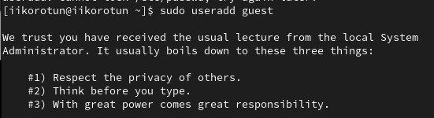
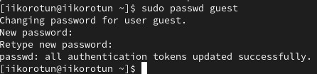
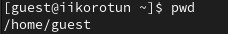
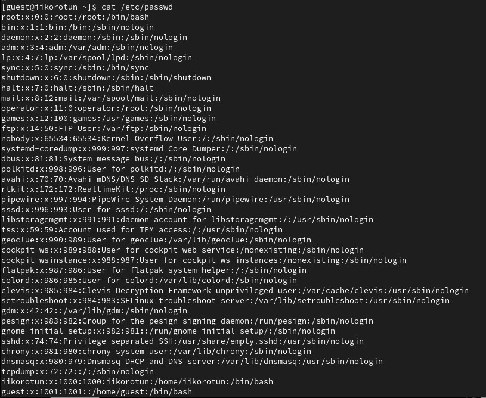
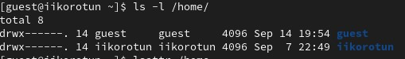
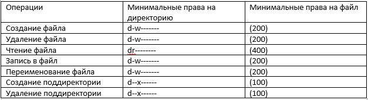

---
## Front matter
lang: ru-RU
title: Structural approach to the deep learning method
author: |
	Leonid A. Sevastianov\inst{1,3}
	\and
	Anton L. Sevastianov\inst{1}
	\and
	Edik A. Ayrjan\inst{2}
	\and
	Anna V. Korolkova\inst{1}
	\and
	Dmitry S. Kulyabov\inst{1,2}
	\and
	Imrikh Pokorny\inst{4}
institute: |
	\inst{1}RUDN University, Moscow, Russian Federation
	\and
	\inst{2}LIT JINR, Dubna, Russian Federation
	\and
	\inst{3}BLTP JINR, Dubna, Russian Federation
	\and
	\inst{4}Technical University of Košice, Košice, Slovakia
date: NEC--2019, 30 September -- 4 October, 2019 Budva, Montenegro

## Formatting
toc: false
slide_level: 2
theme: metropolis
header-includes: 
 - \metroset{progressbar=frametitle,sectionpage=progressbar,numbering=fraction}
 - '\makeatletter'
 - '\beamer@ignorenonframefalse'
 - '\makeatother'
aspectratio: 43
section-titles: true
---

# Лабораторная работа 2

## Коротун Илья Игоревич

## НКНбд-01-21

## Москва 2024г.

# Цели

Целью данной работы является получение практических навыков работы в консоли с атрибутами файлов, закрепление теоретических основ дискреционного разграничения доступа в современных системах с открытым кодом на базе ОС Linux1.

# Задание

Выполнить все поставленные задачи в методичке.

# Ход работы 

1) В установленной при выполнении предыдущей лабораторной работы операционной системе создаю учётную запись пользователя guest (использую учётную запись администратора):

2) Задаю пароль для пользователя.

3) Вхожу в систему. 

4) Определяю директорию, в которой я нахожусь, командой pwd. Сравниваю её с приглашением командной строки. Узнаю, что она является домашней директорией.

5) Уточняю имя пользователя командой whoami

6) Уточняю имя пользователя, его группу, а также группы, куда входит пользователь, командой id.

7) Сравниваю полученную информацию об имени пользователя с данными, выводимыми в приглашении командной строки.

8) Просматриваю файл /etc/passwd командой cat /etc/passwd

9) Определяю существующие в системе директории командой ls -l /home/

10) Проверяю, какие расширенные атрибуты установлены на поддиректориях, находящихся в директории /home, командой: lsattr /home

11) Создаю в домашней директории поддиректорию dir1 командой mkdir dir1
Определяю командами ls -l и lsattr, какие права доступа и расширенные атрибуты были выставлены на директорию dir1.

12) Снимаю с директории dir1 все атрибуты командой chmod 000 dir1 и проверьте с её помощью правильность выполнения команды ls -l
    

13) Попытался создать в директории dir1 файл file1 командой echo "test" > /home/guest/dir1/file1

14) Заполнил таблицу «Установленные права и разрешённые действия»

15) Заполнил таблицу «Минимальные права для совершения операци»

# Выводы

Я приорел навыки работы в консоли с атрибутами файлов и закрепил теоретические основы дискреционного разграничения доступа в современных системах с открытым кодом на базе ОС Linux1.
