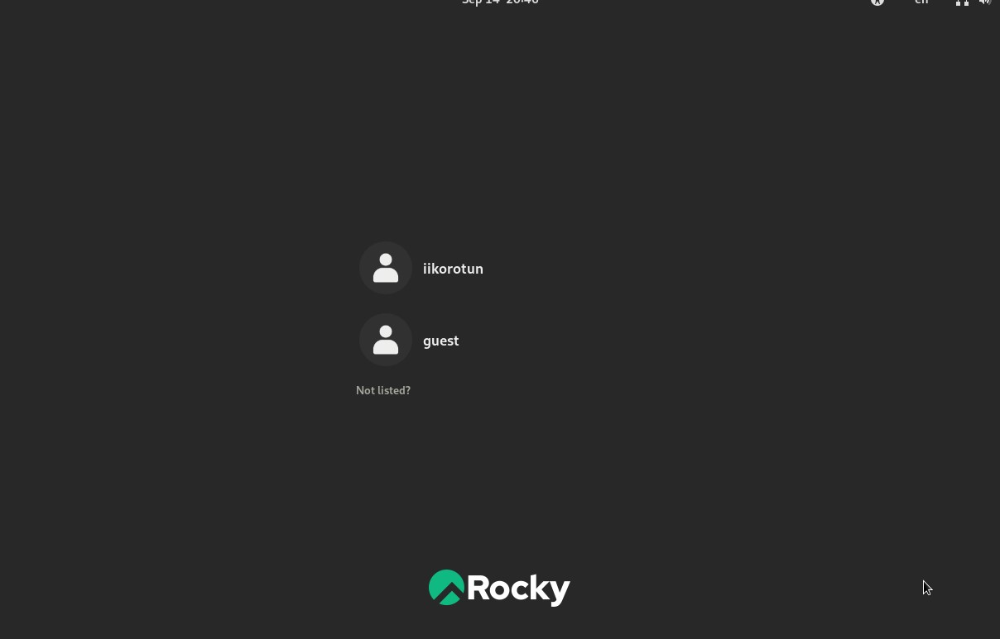
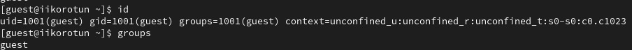
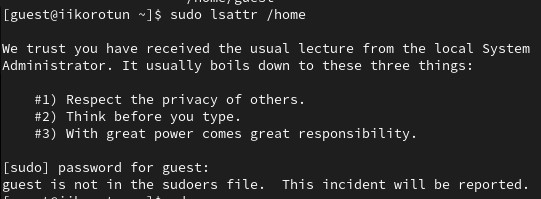
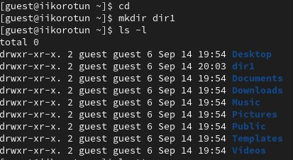
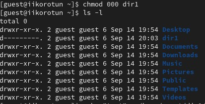
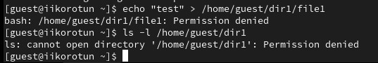
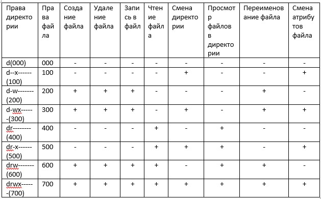

## Front matter
title: "Лабораторная работа 2"
author: "Коротун Илья Игоревич"

## Generic otions
lang: ru-RU
toc-title: "Содержание"

## Bibliography
bibliography: bib/cite.bib
csl: pandoc/csl/gost-r-7-0-5-2008-numeric.csl

## Pdf output format
toc: true # Table of contents
toc-depth: 2
lof: true # List of figures
lot: true # List of tables
fontsize: 12pt
linestretch: 1.5
papersize: a4
documentclass: scrreprt
## I18n polyglossia
polyglossia-lang:
  name: russian
  options:
	- spelling=modern
	- babelshorthands=true
polyglossia-otherlangs:
  name: english
## I18n babel
babel-lang: russian
babel-otherlangs: english
## Fonts
mainfont: PT Serif
romanfont: PT Serif
sansfont: PT Sans
monofont: PT Mono
mainfontoptions: Ligatures=TeX
romanfontoptions: Ligatures=TeX
sansfontoptions: Ligatures=TeX,Scale=MatchLowercase
monofontoptions: Scale=MatchLowercase,Scale=0.9
## Biblatex
biblatex: true
biblio-style: "gost-numeric"
biblatexoptions:
  - parentracker=true
  - backend=biber
  - hyperref=auto
  - language=auto
  - autolang=other*
  - citestyle=gost-numeric
## Pandoc-crossref LaTeX customization
figureTitle: "Рис."
tableTitle: "Таблица"
listingTitle: "Листинг"
lofTitle: "Список иллюстраций"
lotTitle: "Список таблиц"
lolTitle: "Листинги"
## Misc options
indent: true
header-includes:
  - \usepackage{indentfirst}
  - \usepackage{float} # keep figures where there are in the text
  - \floatplacement{figure}{H} # keep figures where there are in the text
---

# Цель работы

Целью данной работы является получение практических навыков работы в консоли с атрибутами файлов, закрепление теоретических основ дискреционного разграничения доступа в современных системах с открытым кодом на базе ОС Linux1.

# Задание
Выполнить все поставленные задачи в методичке.

# Теоретическое введение

Дискреционное управление доступом
Права доступа состоят из трех компонентов: владелец файла, группа владельца и остальные пользователи. Каждому компоненту присваивается разрешение на чтение (r), запись (w) и выполнение (x). Для управления правами доступа в Linux используются команды chmod, chown и chgrp.

# Выполнение лабораторной работы

1) В установленной при выполнении предыдущей лабораторной работы операционной системе создаю учётную запись пользователя guest (использую учётную запись администратора):

2) Задаю пароль для пользователя.

3) Вхожу в систему. 

4) Определяю директорию, в которой я нахожусь, командой pwd. Сравниваю её с приглашением командной строки. Узнаю, что она является домашней директорией.

5) Уточняю имя пользователя командой whoami

6) Уточняю имя пользователя, его группу, а также группы, куда входит пользователь, командой id.

7) Сравниваю полученную информацию об имени пользователя с данными, выводимыми в приглашении командной строки.

8) Просматриваю файл /etc/passwd командой cat /etc/passwd

9) Определяю существующие в системе директории командой ls -l /home/

10) Проверяю, какие расширенные атрибуты установлены на поддиректориях, находящихся в директории /home, командой: lsattr /home

Увидеть расширенные атрибуты не удалось.

11) Создаю в домашней директории поддиректорию dir1 командой mkdir dir1
Определяю командами ls -l и lsattr, какие права доступа и расширенные атрибуты были выставлены на директорию dir1.

12) Снимаю с директории dir1 все атрибуты командой chmod 000 dir1 и проверьте с её помощью правильность выполнения команды ls -l
    

13) Попытался создать в директории dir1 файл file1 командой echo "test" > /home/guest/dir1/file1

Получил отказ в выполнении операции по созданию файла тк снял с директории все атрибуты. 

14) Заполнил таблицу «Установленные права и разрешённые действия»

15) Заполнил таблицу «Минимальные права для совершения операци»

   
# Выводы
Я приорел навыки работы в консоли с атрибутами файлов и закрепил теоретические основы дискреционного разграничения доступа в современных системах с открытым кодом на базе ОС Linux1.
