---
## Front matter
title: "Лабораторная работа №2"
subtitle: "Задача о погоне"
author: "Коротун Илья Игоревич"

## Generic otions
lang: ru-RU
toc-title: "Содержание"

## Bibliography
bibliography: bib/cite.bib
csl: pandoc/csl/gost-r-7-0-5-2008-numeric.csl

## Pdf output format
toc: true # Table of contents
toc-depth: 2
lof: true # List of figures
lot: true # List of tables
fontsize: 12pt
linestretch: 1.5
papersize: a4
documentclass: scrreprt
## I18n polyglossia
polyglossia-lang:
  name: russian
  options:
	- spelling=modern
	- babelshorthands=true
polyglossia-otherlangs:
  name: english
## I18n babel
babel-lang: russian
babel-otherlangs: english
## Fonts
mainfont: PT Serif
romanfont: PT Serif
sansfont: PT Sans
monofont: PT Mono
mainfontoptions: Ligatures=TeX
romanfontoptions: Ligatures=TeX
sansfontoptions: Ligatures=TeX,Scale=MatchLowercase
monofontoptions: Scale=MatchLowercase,Scale=0.9
## Biblatex
biblatex: true
biblio-style: "gost-numeric"
biblatexoptions:
  - parentracker=true
  - backend=biber
  - hyperref=auto
  - language=auto
  - autolang=other*
  - citestyle=gost-numeric
## Pandoc-crossref LaTeX customization
figureTitle: "Рис."
tableTitle: "Таблица"
listingTitle: "Листинг"
lofTitle: "Список иллюстраций"
lotTitle: "Список таблиц"
lolTitle: "Листинги"
## Misc options
indent: true
header-includes:
  - \usepackage{indentfirst}
  - \usepackage{float} # keep figures where there are in the text
  - \floatplacement{figure}{H} # keep figures where there are in the text
---

# Цель работы

Ознакомится с материалом и на основе полученных знаний выполнить лабораторную работу №2, которая включает в себя задачу о погоне. Выполнить ее с помощью кода, написанного на языке Julia.

# Задание

Вариант 29

На море в тумане катер береговой охраны преследует лодку браконьеров.
Через определенный промежуток времени туман рассеивается, и лодка
обнаруживается на расстоянии 11,8 км от катера. Затем лодка снова скрывается в
тумане и уходит прямолинейно в неизвестном направлении. Известно, что скорость
катера в 4,2 раза больше скорости браконьерской лодки.

1. Запишите уравнение, описывающее движение катера, с начальными
условиями для двух случаев (в зависимости от расположения катера
относительно лодки в начальный момент времени).

3. Постройте траекторию движения катера и лодки для двух случаев.
   
4. Найдите точку пересечения траектории катера и лодки

# Теоретическое введение

Приведем один из примеров построения математических моделей для выбора правильной стратегии при решении задач поиска.
Например, рассмотрим задачу преследования браконьеров береговой охраной. На море в тумане катер береговой охраны преследует лодку браконьеров. Через определенный промежуток времени туман рассеивается, и лодка
обнаруживается на расстоянии k км от катера. Затем лодка снова скрывается в тумане и уходит прямолинейно в неизвестном направлении. Известно, что скорость катера в 2 раза больше скорости браконьерской лодки.
Необходимо определить по какой траектории необходимо двигаться катеру, чтоб нагнать лодку.

# Выполнение лабораторной работы

Принимает за t0 = 0, xa0 = 0 - место нахождения лодки браконьеров в момент обнаружения,
xk0 = 0 - место нахождения катера береговой охраны.

Введем полярные координаты. Считаем, что полюс - это точка обнаружения лодки браконьеров xл0,а полярная ось r проходит через точку нахождения катера береговой охраны.

Траектория катера должна быть такой, чтобы и катер, и лодка все время были на одном расстоянии от полюса, только в этом случае траектория катера пересечется с траекторией лодки.
Поэтому для начала катер береговой охраны должен двигаться некоторое время прямолинейно, пока не окажется на том же расстоянии от полюса, что и лодка браконьеров. После этого катер береговой охраны должен двигаться
вокруг полюса удаляясь от него с той же скоростью, что и лодка браконьеров.

Чтобы найти расстояние x (расстояние после которого катер начнет двигаться вокруг полюса), необходимо составить простое уравнение: 
Случай первый: 

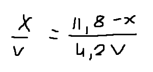

Случай второй: 

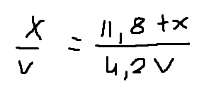

Отсюда мы найдем два значения

X1

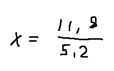

X2

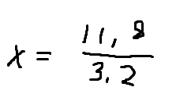

После того, как катер береговой охраны окажется на одном расстоянии от полюса, что и лодка, он должен сменить прямолинейную траекторию и начать двигаться вокруг полюса удаляясь от него со скоростью лодки v.
Для этого скорость катера раскладываем на две составляющие: Vr - радиальная скорость и Vt - тангенциальная скорость. Радиальная скорость - это скорость, с которой катер удаляется от полюса 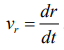,
Нам нужно, чтобы эта скорость была равна скорости лодки, поэтому полагаем 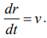.
Тангенциальная скорость – это линейная скорость вращения катера относительно полюса. Она равна произведению угловой скорости 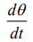 на радиус 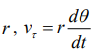

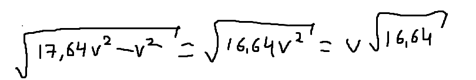

Решение исходной задачи сводится к решению системы из двух дифференциальных уравнений:

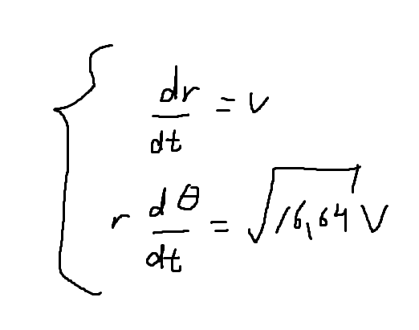

Точки пересечения.
Угол передвижения - 3pi/4
Для первого случая берем угол - 7pi/4, для второго -pi/4.

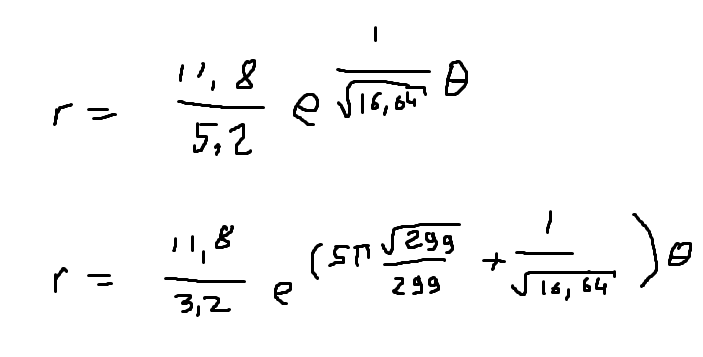

# Код работы

using Plots 
using OrdinaryDiffEq 
s = 11.8 
fi = 3*pi/4

sl_1 = s/5.2 
sl_2 = s/3.2 

tetha1 = (0.0,2*pi)
tetha2 = (-pi,pi)

f(u,p,t) = u/sqrt(16.64) 
f2(t) = tan(fi)*t  

resh1=ODEProblem(f, sl_1, tetha1)
sol1 = solve(resh1, Tsit5(), saveat=0.01) 

resh2=ODEProblem(f, sl_2, tetha2)
sol2 = solve(resh2, Tsit5(), saveat=0.01) 

t = 0:0.01:15
solution1(t) = (sl_1)*exp(1/sqrt(16.64)*t) 
intersection_r1 = solution1(7*pi/4) 

plot!(fill(fi,length(t)), f2.(t))

plot(sol1.t, sol1.u,
proj=:polar,
lims=(0,13)
)

solution2(t) = (sl_2)*exp(5*pi*sqrt(299)/299)*exp(1/sqrt(16.4)*t) 
intersection_r2 = solution2(-pi/4)

plot!(fill(fi,length(t)), f2.(t))

plot(sol2.t, sol2.u,
proj=:polar,
lims=(0,13)
)

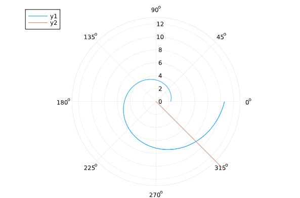

Точка пересечения при 1 случае - 8.733767756285518

Точка пересечения при 2 случае - 7.533979887816658

# Выводы

Я ознакомился с материалом и на основе полученных знаний выполнил лабораторную работу №2, которая включает в себя задачу о погоне. Выполнил ее с помощью кода, написанного на языке Julia.

