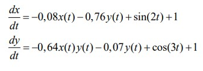
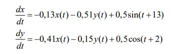
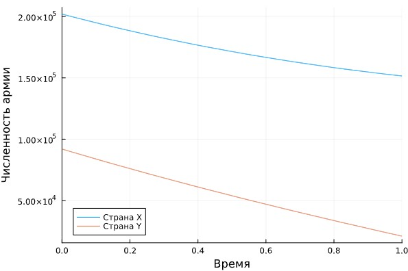
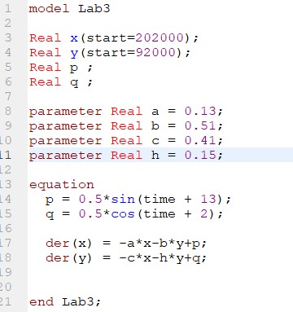
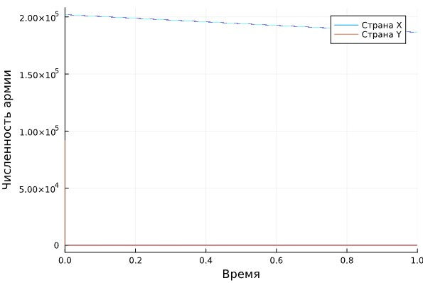

---
## Front matter
lang: ru-RU
title: Structural approach to the deep learning method
author: |
	Leonid A. Sevastianov\inst{1,3}
	\and
	Anton L. Sevastianov\inst{1}
	\and
	Edik A. Ayrjan\inst{2}
	\and
	Anna V. Korolkova\inst{1}
	\and
	Dmitry S. Kulyabov\inst{1,2}
	\and
	Imrikh Pokorny\inst{4}
institute: |
	\inst{1}RUDN University, Moscow, Russian Federation
	\and
	\inst{2}LIT JINR, Dubna, Russian Federation
	\and
	\inst{3}BLTP JINR, Dubna, Russian Federation
	\and
	\inst{4}Technical University of Košice, Košice, Slovakia
date: NEC--2019, 30 September -- 4 October, 2019 Budva, Montenegro

## Formatting
toc: false
slide_level: 2
theme: metropolis
header-includes: 
 - \metroset{progressbar=frametitle,sectionpage=progressbar,numbering=fraction}
 - '\makeatletter'
 - '\beamer@ignorenonframefalse'
 - '\makeatother'
aspectratio: 43
section-titles: true
---

# Лабораторная работа 3

## Коротун Илья Игоревич
## НКНбд-01-21
## Москва 2024г.

# Цели

Цель: рассмотреть некоторые простейшие модели боевых действий – модели Ланчестера. С помощью полученных навыков выполнить Лабораторную работу №3.

# Задание

Между страной Х и страной У идет война. Численность состава войск исчисляется от начала войны, и являются временными функциями x(t) и y(t). В начальный момент времени страна Х имеет армию численностью 202 000 человек, а в распоряжении страны У армия численностью в 92 000 человек. Для упрощения модели считаем, что коэффициенты a, b, c, h постоянны. Также считаем P(t) и Q(t) непрерывные функции.

Постройте графики изменения численности войск армии Х и армии У для следующих случаев:

Модель боевых действий между регулярными войсками

Модель ведение боевых действий с участием регулярных войск и партизанских отрядов

 

# Ход работы

## Система, описывающая противостояние между регулярными войсками X и Y:

Julia : 
Для начала вводим необходимые библиотеки

using Plots
using DifferentialEquations

Задаем начальные значения 

x0 = 202000
y0 = 92000
tspan = [0,1]
p = [0.13, 0.51, 0.41, 0,15]

Задаем функцию и задачачу Коши с помощью ODEProblem и решаем ее с помощью solve

function f(n,p,t)
    x,y = n
    a,b,c,h = p
    dx = -a*x - b*y + 0.5*sin(t+13)
    dy = -c*x - h*y + 0.5*cos(t+2)
    return[dx,dy]
    
end

problem = ODEProblem(f,[x0,y0],tspan,p)
solution = solve(problem,Tsit5())

С помощью Plot строим график 

plot(solution,label = ["Страна X" "Страна Y"], xaxis = "Время", yaxis = "Численность армии")

## Результат 

На графике видно как страна X побеждает страну Y

## Теперь построим такой же график с помощью OpenModelica

## Cистема, с участием регулярных войск и партизанских отрядов:

 

 Julia : 
Для начала вводим необходимые библиотеки

using Plots
using DifferentialEquations

Задаем начальные значения 

x0 = 202000
y0 = 92000
tspan = [0,1]
p = [0.08, 0.76, 0.64, 0,07]

Задаем функцию и задачачу Коши с помощью ODEProblem и решаем ее с помощью solve

function f(n,p,t)
    x,y = n
    a,b,c,h = p
    dx = -a*x - b*y + sin(2t)+1
    dy = -c*x*y - h*y + cos(3t)+1
    return[dx,dy]
    
end

problem = ODEProblem(f,[x0,y0],tspan,p)
solution = solve(problem,Tsit5())

С помощью Plot строим график 

plot(solution,label = ["Страна X" "Страна Y"], xaxis = "Время", yaxis = "Численность армии")

## Результат 

На графике видно как страна Y побеждает страну X

## Теперь построим такой же график с помощью OpenModelica

# Вывод

Я рассмотрел некоторые простейшие модели боевых действий – модели Ланчестера. С помощью полученных навыков выполнил Лабораторную работу №3. 

# Список литературы 

https://ru.wikipedia.org/wiki/%D0%97%D0%B0%D0%BA%D0%BE%D0%BD%D1%8B_%D0%9E%D1%81%D0%B8%D0%BF%D0%BE%D0%B2%D0%B0_%E2%80%94_%D0%9B%D0%B0%D0%BD%D1%87%D0%B5%D1%81%D1%82%D0%B5%D1%80%D0%B0

