---
## Front matter
lang: ru-RU
title: Structural approach to the deep learning method
author: |
	Leonid A. Sevastianov\inst{1,3}
	\and
	Anton L. Sevastianov\inst{1}
	\and
	Edik A. Ayrjan\inst{2}
	\and
	Anna V. Korolkova\inst{1}
	\and
	Dmitry S. Kulyabov\inst{1,2}
	\and
	Imrikh Pokorny\inst{4}
institute: |
	\inst{1}RUDN University, Moscow, Russian Federation
	\and
	\inst{2}LIT JINR, Dubna, Russian Federation
	\and
	\inst{3}BLTP JINR, Dubna, Russian Federation
	\and
	\inst{4}Technical University of Košice, Košice, Slovakia
date: NEC--2019, 30 September -- 4 October, 2019 Budva, Montenegro

## Formatting
toc: false
slide_level: 2
theme: metropolis
header-includes: 
 - \metroset{progressbar=frametitle,sectionpage=progressbar,numbering=fraction}
 - '\makeatletter'
 - '\beamer@ignorenonframefalse'
 - '\makeatother'
aspectratio: 43
section-titles: true
---

# Лабораторная работа 3

## Коротун Илья Игоревич
## НКНбд-01-21
## Москва 2024г.

# Цели

Цель: Основная цель работы — освоить применение циклов функций и сторонних для Julia пакетов для решения задач линейной алгебры и работы с матрицами.

# Задание

1. Используя Jupyter Lab, повторите примеры из раздела 3.2.
2. Выполните задания для самостоятельной работы (раздел 3.4).

# Ход работы

1. Осваиваем новый материал, повторяя примеры из методички.

1.1. Циклы while и for

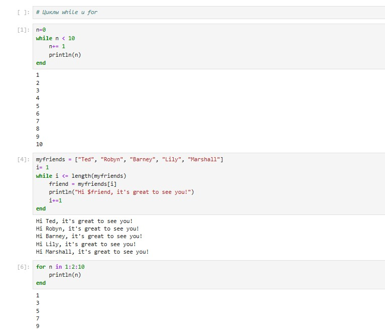

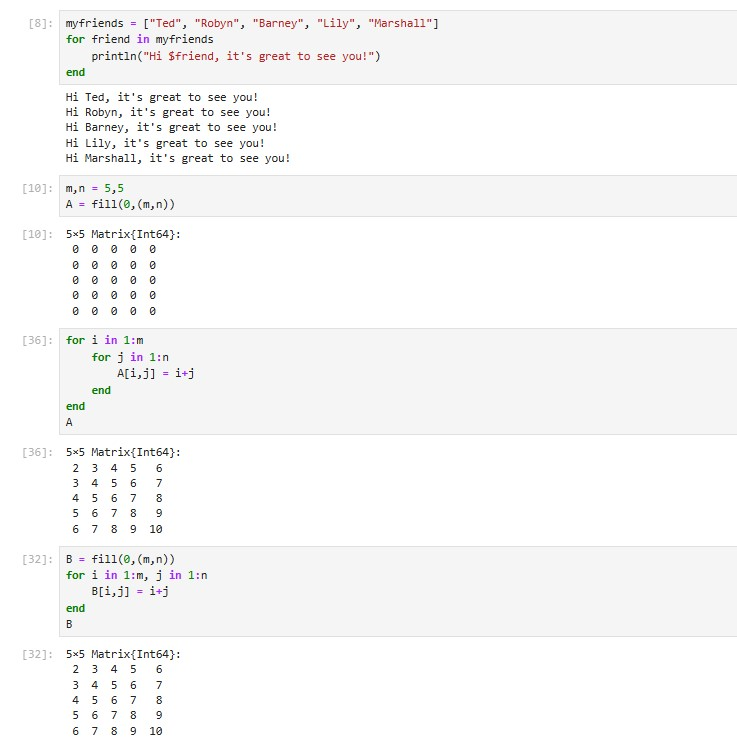

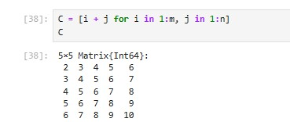

1.2. Условные выражения

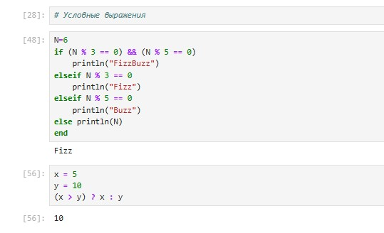

1.3. Функции

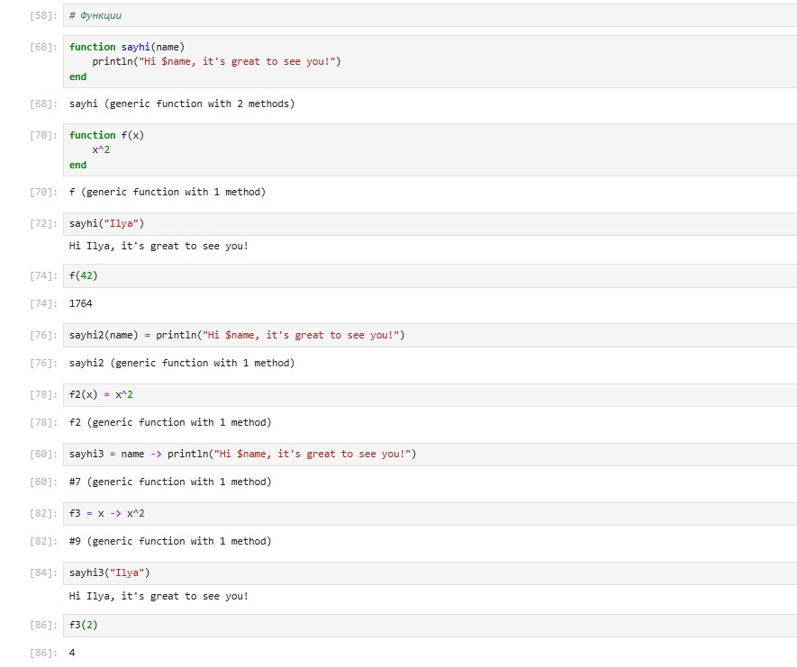

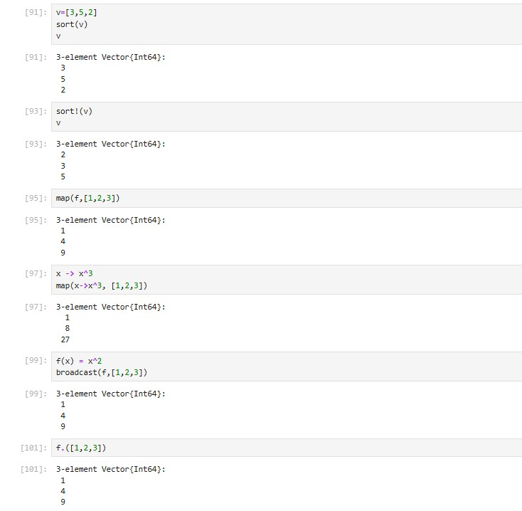

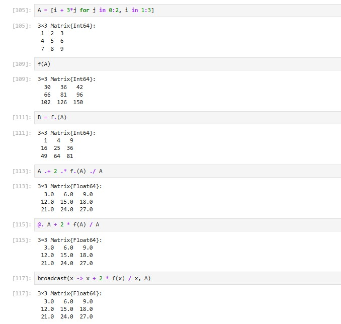

1.4. Сторонние библиотеки (пакеты) в Julia

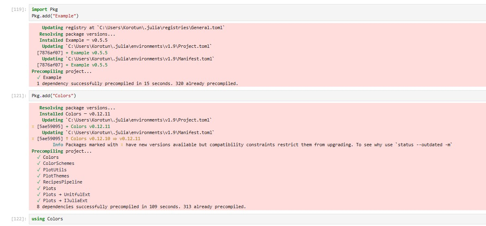

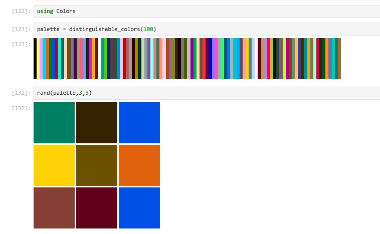

# Задания для самостоятельного выполнения

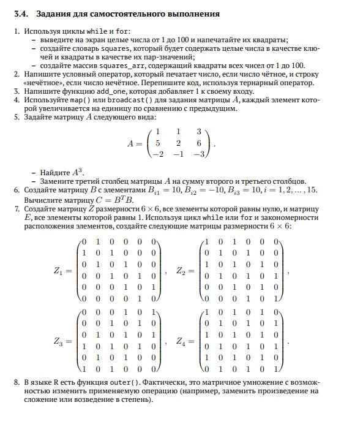

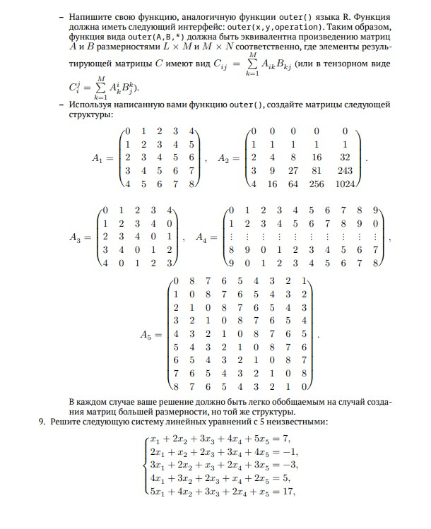

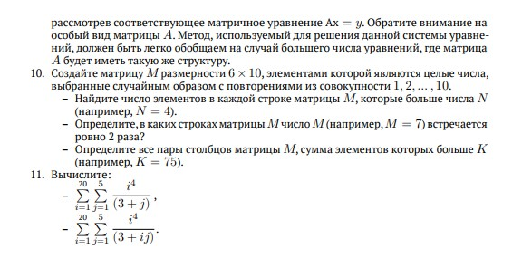

## Задание 1

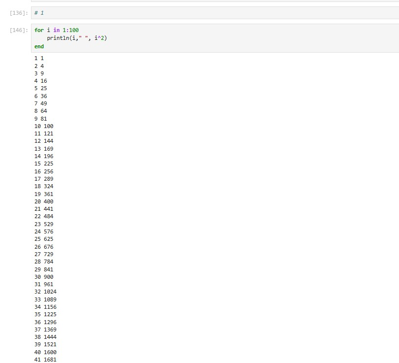

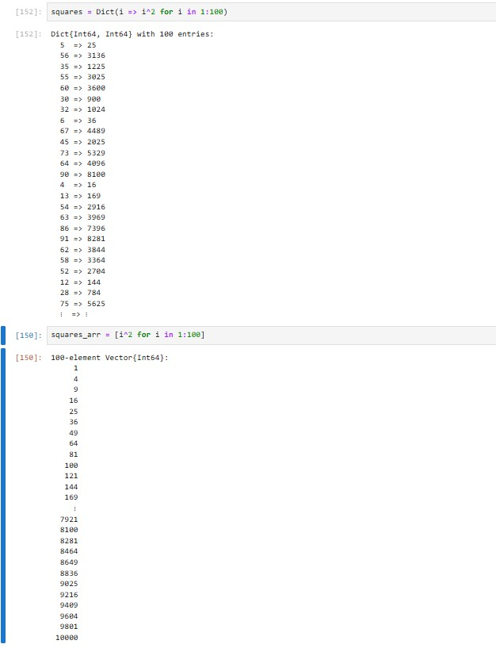

## Задание 2

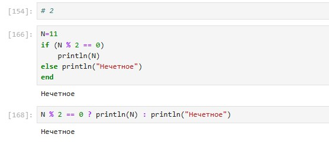

## Задание 3

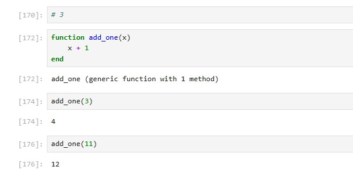

## Задание 4

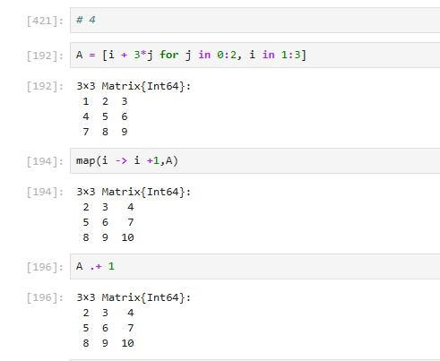

## Задание 5

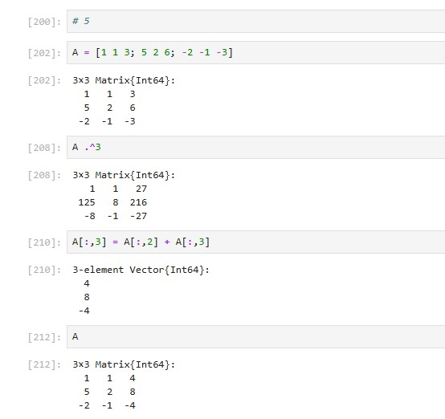

## Задание 6

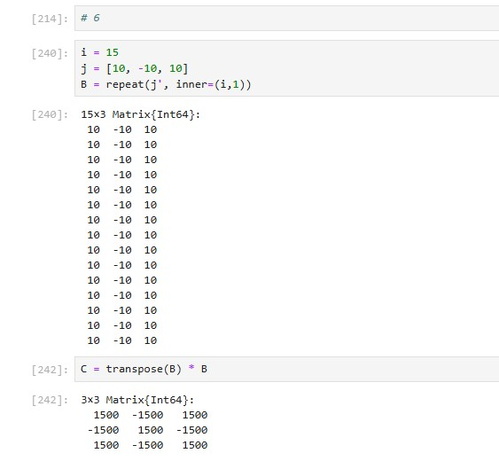

## Задание 7

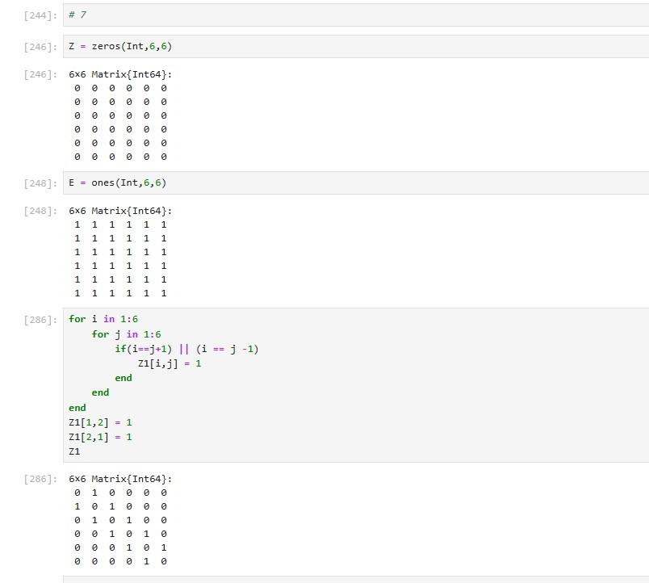

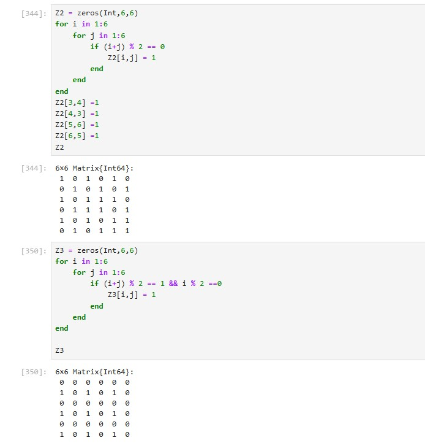

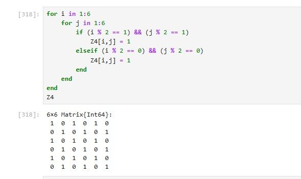

## Задание 8

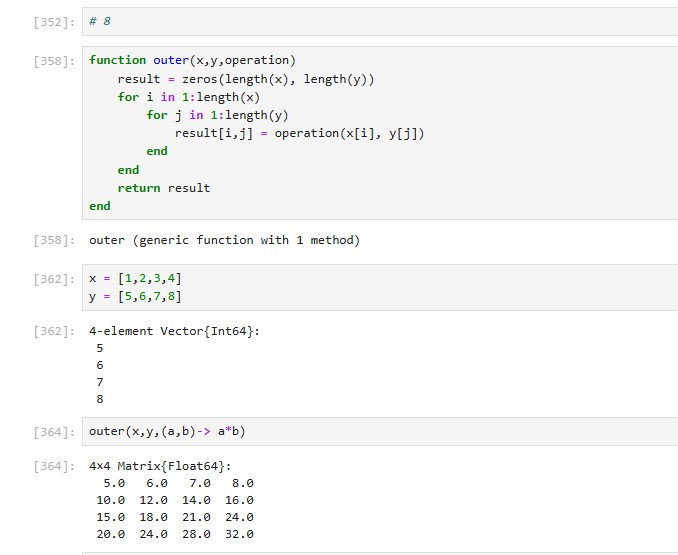

## Задание 9

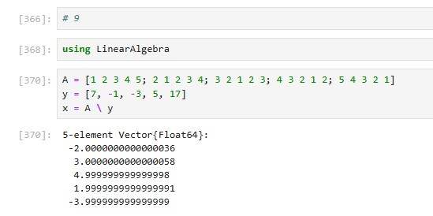

## Задание 10

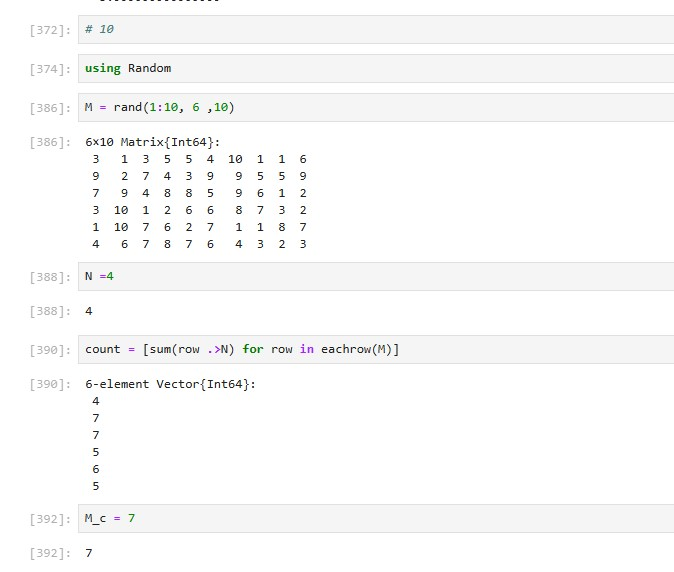

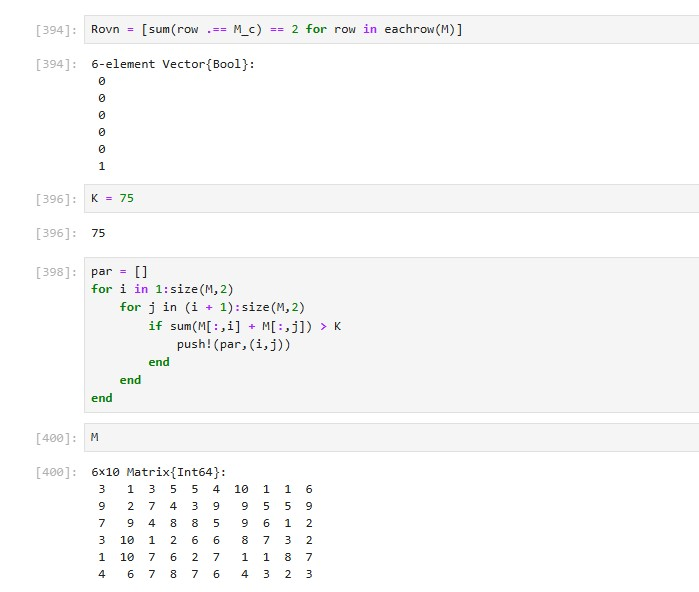

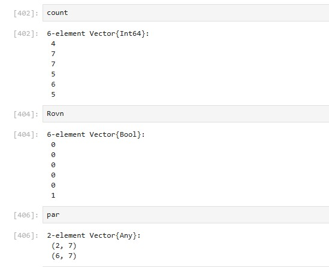

## Задание 11

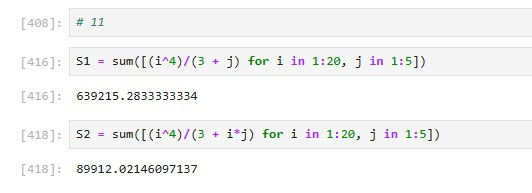

# Выводы

Я освоил применение циклов функций и сторонних для Julia пакетов для решения задач линейной алгебры и работы с матрицами. С помощью полученных навыков выполнил Лабораторную работу №3. 

