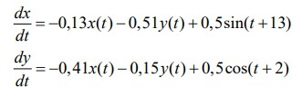
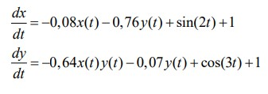
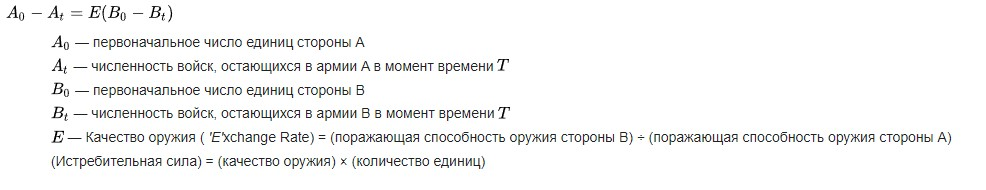
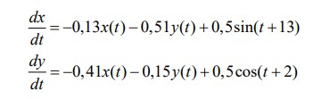
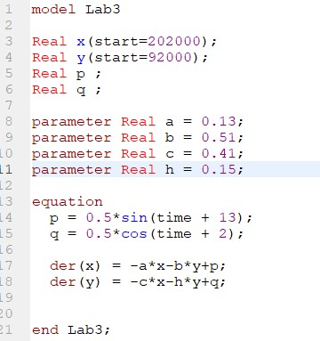

---
## Front matter
title: "Лабораторная работа 3"
subtitle: "Markdown"
author: "Коротун Илья Игоревич"

## Generic otions
lang: ru-RU
toc-title: "Содержание"

## Bibliography
bibliography: bib/cite.bib
csl: pandoc/csl/gost-r-7-0-5-2008-numeric.csl

## Pdf output format
toc: true # Table of contents
toc-depth: 2
lof: true # List of figures
lot: true # List of tables
fontsize: 12pt
linestretch: 1.5
papersize: a4
documentclass: scrreprt
## I18n polyglossia
polyglossia-lang:
name: russian
options:
- spelling=modern
- babelshorthands=true
polyglossia-otherlangs:
name: english
## I18n babel
babel-lang: russian
babel-otherlangs: english
## Fonts
mainfont: PT Serif
romanfont: PT Serif
sansfont: PT Sans
monofont: PT Mono
mainfontoptions: Ligatures=TeX
romanfontoptions: Ligatures=TeX
sansfontoptions: Ligatures=TeX,Scale=MatchLowercase
monofontoptions: Scale=MatchLowercase,Scale=0.9
## Biblatex
biblatex: true
biblio-style: "gost-numeric"
biblatexoptions:
- parentracker=true
- backend=biber
- hyperref=auto
- language=auto
- autolang=other*
- citestyle=gost-numeric
## Pandoc-crossref LaTeX customization
figureTitle: "Рис."
tableTitle: "Таблица"
listingTitle: "Листинг"
lofTitle: "Список иллюстраций"
lotTitle: "Список таблиц"
lolTitle: "Листинги"
## Misc options
indent: true
header-includes:
- \usepackage{indentfirst}
- \usepackage{float} # keep figures where there are in the text
- \floatplacement{figure}{H} # keep figures where there are in the text
---

# Цель работы.

Цель: рассмотреть некоторые простейшие модели боевых действий – модели Ланчестера. С помощью полученных навыков выполнить Лабораторную работу №3. 

# Задание

 Между страной Х и страной У идет война. Численность состава войск
исчисляется от начала войны, и являются временными функциями x(t) и y(t). В начальный момент времени страна Х имеет армию численностью 202 000 человек,
а в распоряжении страны У армия численностью в 92 000 человек. Для упрощения модели считаем, что коэффициенты a, b, c, h постоянны. Также считаем
P(t) и Q(t) непрерывные функции. 

Постройте графики изменения численности войск армии Х и армии У для следующих случаев:

1. Модель боевых действий между регулярными войсками
   
   

2. Модель ведение боевых действий с участием регулярных войск и партизанских отрядов

   

# Теоретическое введение

В древней битве, например между фалангами воинов, вооруженных копьями, один человек может бороться одновременно только с одним человеком. Если каждый человек убивает ровно одного (или погибает от одного) противника, то ожидаемое число воинов, оставшихся в конце сражения, — это просто разница между численностью большей и меньшей армий (при идентичности применяемого оружия).

Линейный закон применяется также к неприцельному огню по территории противника. Коэффициент убыли зависит от плотности имеющихся целей в целевой области, а также от количества стреляющих орудий. Если две группировки, занимающие одинаковую площадь и использующие одинаковые орудия, ведут огонь случайным образом по площадной цели одинакового размера, они будут убывать одинаковыми темпами до тех пор, пока меньшая группировка в конце концов не будет ликвидирована: большая вероятность поражения одним выстрелом какой-либо единицы крупной группировки уравновешивается большим числом выстрелов направленных на мелкую группировку.

Закон «честного боя»

 

 # Выполнение лабораторной работы

 1. Зададим коэффициент смертности, не связанный с боевыми действиями у первой армии 0,13, у второй 0,41. Коэффициенты эффективности первой и второй армии 0,51 и 0,15 соответственно. Функция, описывающая подход подкрепление первой армии, P(t) = 0.5*sin(t+13), подкрепление второй армии описывается функцией Q(t) = 0.5*cos(t+2).
Тогда получим следующую систему, описывающую противостояние между регулярными войсками X и Y:

    
    
Зададим начальные условия:

x0 = 202000
y0 = 92000

Julia : 
Для начала вводим необходимые библиотеки

using Plots
using DifferentialEquations

Задаем начальные значения 

x0 = 202000
y0 = 92000
tspan = [0,1]
p = [0.13, 0.51, 0.41, 0,15]

Задаем функцию и задачачу Коши с помощью ODEProblem и решаем ее с помощью solve

function f(n,p,t)
    x,y = n
    a,b,c,h = p
    dx = -a*x - b*y + 0.5*sin(t+13)
    dy = -c*x - h*y + 0.5*cos(t+2)
    return[dx,dy]
    
end

problem = ODEProblem(f,[x0,y0],tspan,p)
solution = solve(problem,Tsit5())

С помощью Plot строим график 

plot(solution,label = ["Страна X" "Страна Y"], xaxis = "Время", yaxis = "Численность армии")

Результат 

На графике видно как страна X побеждает страну Y

Теперь построим такой же график с помощью OpenModelica

