---
## Front matter
title: "Лабораторная работа 1"
subtitle: "Markdown"
author: "Коротун Илья Игоревич"

## Generic otions
lang: ru-RU
toc-title: "Содержание"

## Bibliography
bibliography: bib/cite.bib
csl: pandoc/csl/gost-r-7-0-5-2008-numeric.csl

## Pdf output format
toc: true # Table of contents
toc-depth: 2
lof: true # List of figures
lot: true # List of tables
fontsize: 12pt
linestretch: 1.5
papersize: a4
documentclass: scrreprt
## I18n polyglossia
polyglossia-lang:
name: russian
options:
- spelling=modern
- babelshorthands=true
polyglossia-otherlangs:
name: english
## I18n babel
babel-lang: russian
babel-otherlangs: english
## Fonts
mainfont: PT Serif
romanfont: PT Serif
sansfont: PT Sans
monofont: PT Mono
mainfontoptions: Ligatures=TeX
romanfontoptions: Ligatures=TeX
sansfontoptions: Ligatures=TeX,Scale=MatchLowercase
monofontoptions: Scale=MatchLowercase,Scale=0.9
## Biblatex
biblatex: true
biblio-style: "gost-numeric"
biblatexoptions:
- parentracker=true
- backend=biber
- hyperref=auto
- language=auto
- autolang=other*
- citestyle=gost-numeric
## Pandoc-crossref LaTeX customization
figureTitle: "Рис."
tableTitle: "Таблица"
listingTitle: "Листинг"
lofTitle: "Список иллюстраций"
lotTitle: "Список таблиц"
lolTitle: "Листинги"
## Misc options
indent: true
header-includes:
- \usepackage{indentfirst}
- \usepackage{float} # keep figures where there are in the text
- \floatplacement{figure}{H} # keep figures where there are in the text
---

# Цель работы.

Целью данной работы является приобретение практических навыков установки операционной системы на виртуальную машину, настройки минимально необходимых для дальнейшей работы сервисов.

# Описание результатов выполнения задания.

1 Создание новой виртуальной машины с помощью программы Virtual Box. (Linux) (Рисунок 1).
СОЗДАЕМ ВИРТУАЛЬНУЮ МАШИНУ ПРИ ПОМОЩИ VIRTUAL BOX.
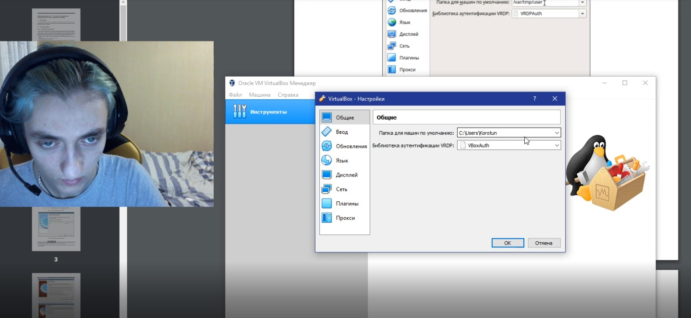
2 Запускаем Virtual Box. Создаем новую виртуальную машину. Указываем имя виртуальной машины ( логин в дисплейном классе), тип операционной системы — Linux, Fedora (Рисунок 2).
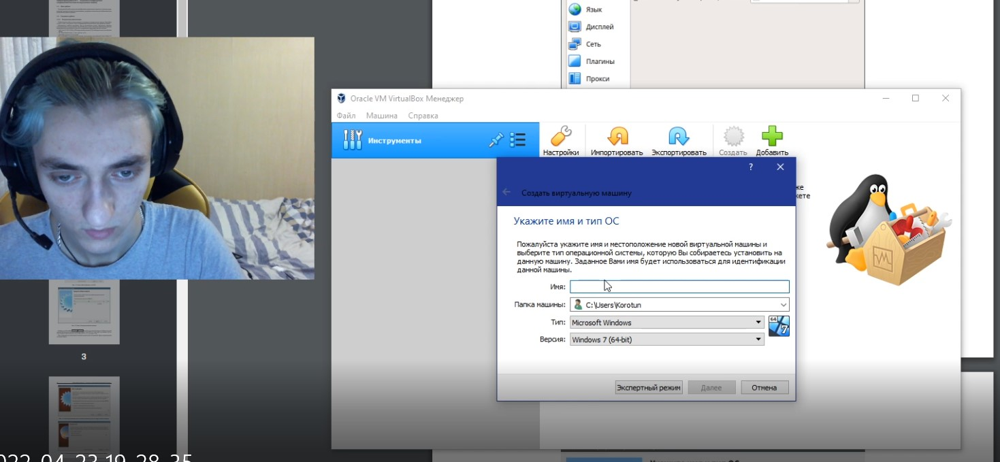
3 Указываем размер основной памяти виртуальной машины — от 2048 МБ (Рисунок 3).
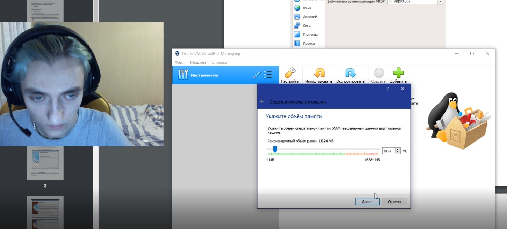
4 Задайте конфигурацию жёсткого диска — загрузочный, VDI (BirtualBox Disk Image), динамический виртуальный диск (Рисунок 4).
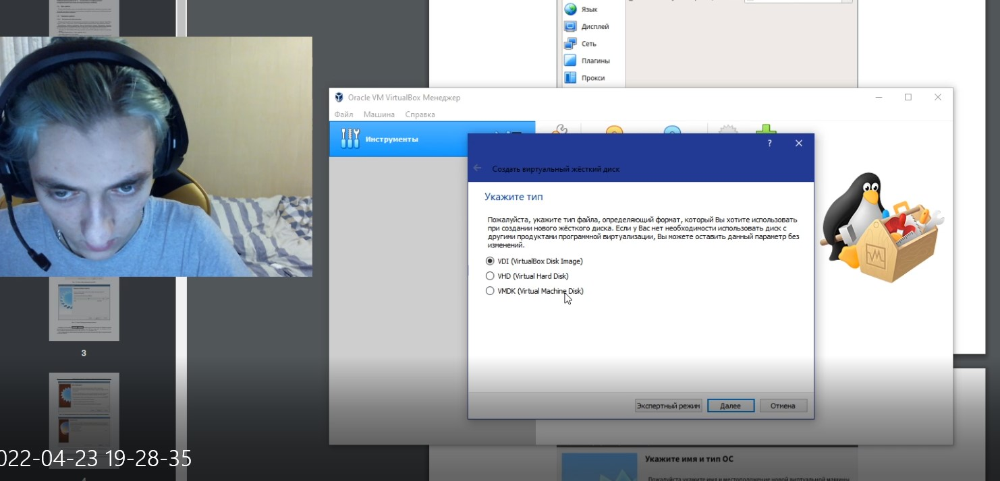
5 Задайте размер диска — 80 ГБ (или больше), его расположение — в данном случае
/var/tmp/имя_пользователя/fedora.vdi (Рисунок 5).
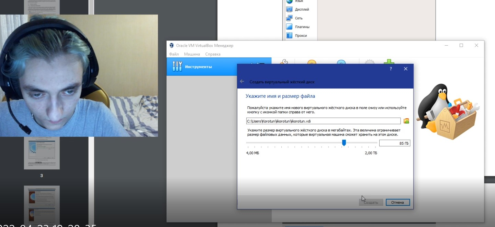
6 Установка настроек системы (Рисунок 6).
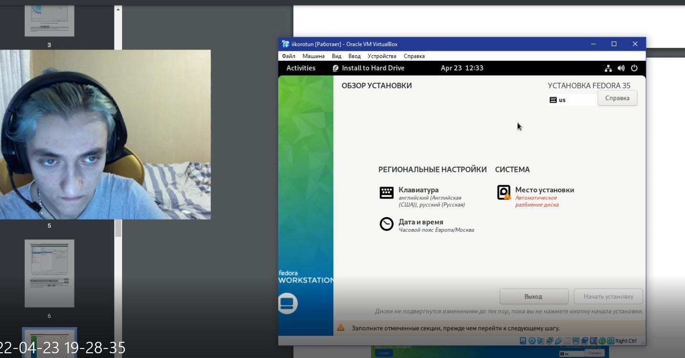
7 Создание логина и пароля для учетной записи (Рисунок 7).
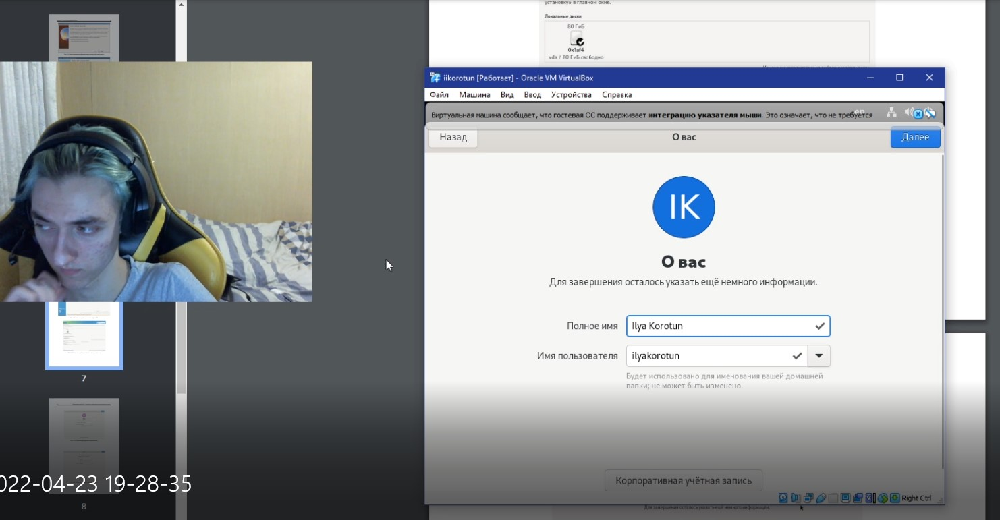
8 Подключение образа диска дополнений гостевой ОС (Рисунок 8).
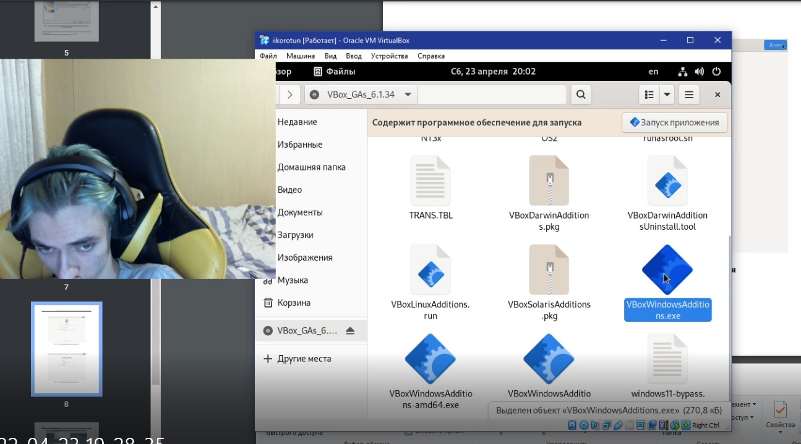
9 Установка и проверка имени хоста в терминале (Рисунок 9). Команды: hostnamectl set-hostname iikorotun - установка
Hostnamectl - проверка
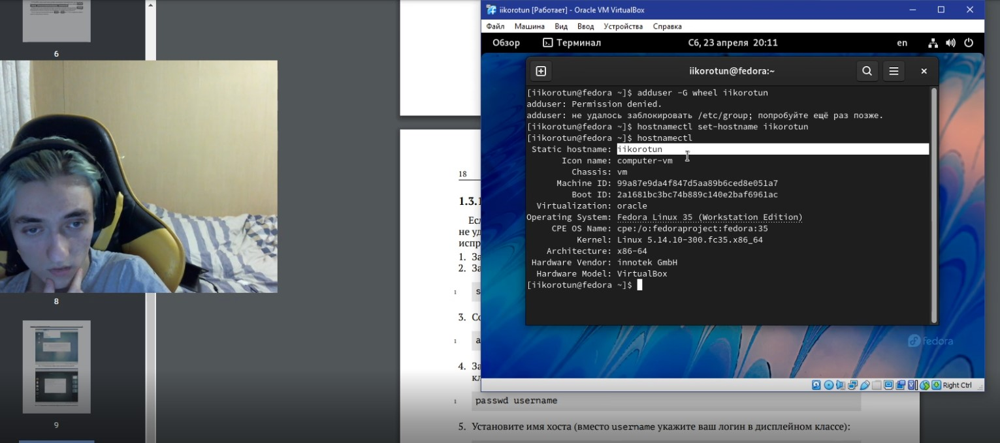
10 Выполнение домашнего задания в терминале(Рисунок 10-18).

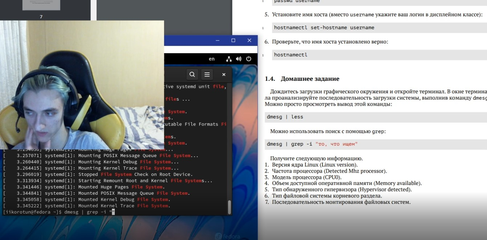
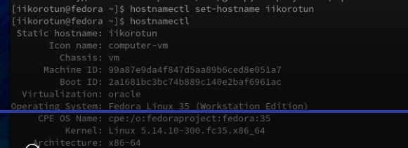

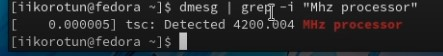

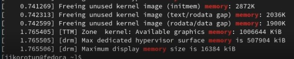
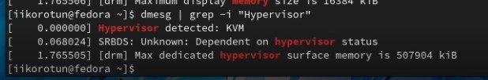
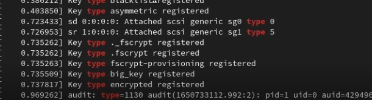
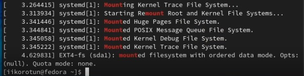
# Выводы

Я приобрел навыки установки операционной системы на виртуальную машину, настройки минимально необходимых для дальнейшей работы сервисов..
