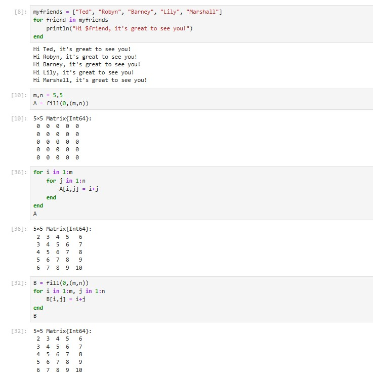
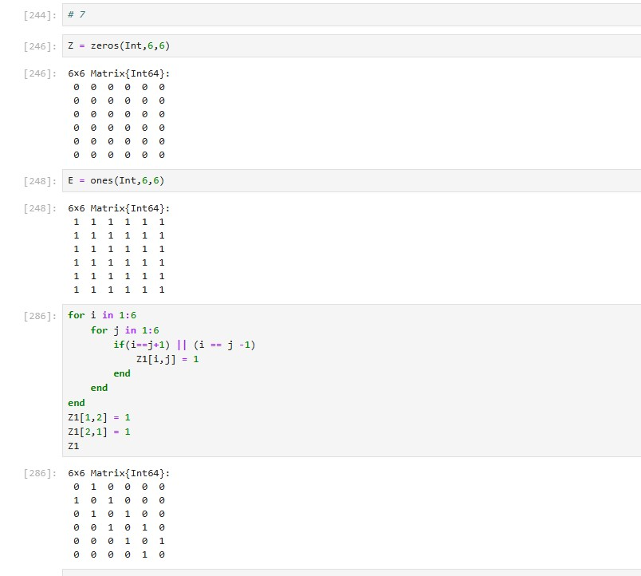

---
## Front matter
title: "Лабораторная работа 3"
subtitle: "Markdown"
author: "Коротун Илья Игоревич"

## Generic otions
lang: ru-RU
toc-title: "Содержание"

## Bibliography
bibliography: bib/cite.bib
csl: pandoc/csl/gost-r-7-0-5-2008-numeric.csl

## Pdf output format
toc: true # Table of contents
toc-depth: 2
lof: true # List of figures
lot: true # List of tables
fontsize: 12pt
linestretch: 1.5
papersize: a4
documentclass: scrreprt
## I18n polyglossia
polyglossia-lang:
name: russian
options:
- spelling=modern
- babelshorthands=true
polyglossia-otherlangs:
name: english
## I18n babel
babel-lang: russian
babel-otherlangs: english
## Fonts
mainfont: PT Serif
romanfont: PT Serif
sansfont: PT Sans
monofont: PT Mono
mainfontoptions: Ligatures=TeX
romanfontoptions: Ligatures=TeX
sansfontoptions: Ligatures=TeX,Scale=MatchLowercase
monofontoptions: Scale=MatchLowercase,Scale=0.9
## Biblatex
biblatex: true
biblio-style: "gost-numeric"
biblatexoptions:
- parentracker=true
- backend=biber
- hyperref=auto
- language=auto
- autolang=other*
- citestyle=gost-numeric
## Pandoc-crossref LaTeX customization
figureTitle: "Рис."
tableTitle: "Таблица"
listingTitle: "Листинг"
lofTitle: "Список иллюстраций"
lotTitle: "Список таблиц"
lolTitle: "Листинги"
## Misc options
indent: true
header-includes:
- \usepackage{indentfirst}
- \usepackage{float} # keep figures where there are in the text
- \floatplacement{figure}{H} # keep figures where there are in the text
---

# Цель работы.

Цель: Основная цель работы — освоить применение циклов функций и сторонних для Julia пакетов для решения задач линейной алгебры и работы с матрицами.

# Задание

1. Используя Jupyter Lab, повторите примеры из раздела 3.2.
2. Выполните задания для самостоятельной работы (раздел 3.4).

# Теоретическое введение

Для различных операций, связанных с перебором индексируемых элементов структур данных, традиционно используются циклы while и for.

Синтаксис while
while <условие>
  <тело цикла>
end

Довольно часто при решении задач требуется проверить выполнение тех или иных условий. Для этого используют условные выражения.
Синтаксис условных выражений с ключевым словом:
if <условие 1>
  <действие 1>
elseif <условие 2>
  <действие 2>
else
  <действие 3>
end

Julia дает нам несколько разных способов написать функцию. Первый требует ключевых слов function и end:
function sayhi(name)
  println("Hi $name, it's great to see you!")
end

Вызов функции осуществляется по её имени с указанием аргументов, например:
sayhi("C-3PO")

По соглашению в Julia функции, сопровождаемые восклицательным знаком, изменяют свое содержимое, а функции без восклицательного знака не делают этого.

Функция sort(v) возвращает отсортированный массив, который содержит те же
элементы, что и массив v, но исходный массив v остаётся без изменений. Если же использовать sort!(v), то отсортировано будет содержимое исходного массива v.
В программировании под функцией высшего порядка понимается функция, принимающая в качестве аргументов другие функции или возвращающая другую функцию в качестве результата. Основная идея состоит в том, что функции имеют тот же статус, что и другие объекты данных. В Julia функция map является функцией высшего порядка, которая принимает функцию в качестве одного из своих входных аргументов и применяет эту функцию к каждому элементу структуры данных, которая ей передаётся также в качестве аргумента.

# Выполнение лабораторной работы

1. Осваиваем новый материал, повторяя примеры из методички.

1.1. Циклы while и for

1.2. Условные выражения

1.3. Функции

1.4. Сторонние библиотеки (пакеты) в Julia

# Задания для самостоятельного выполнения

Задание 1

Задание 2

Задание 3

Задание 4

Задание 5

Задание 6

Задание 7

Задание 8

Задание 9

Задание 10

Задание 11

# Выводы

Я освоил применение циклов функций и сторонних для Julia пакетов для решения задач линейной алгебры и работы с матрицами. С помощью полученных навыков выполнил Лабораторную работу №3. 

# Список литературы

...
