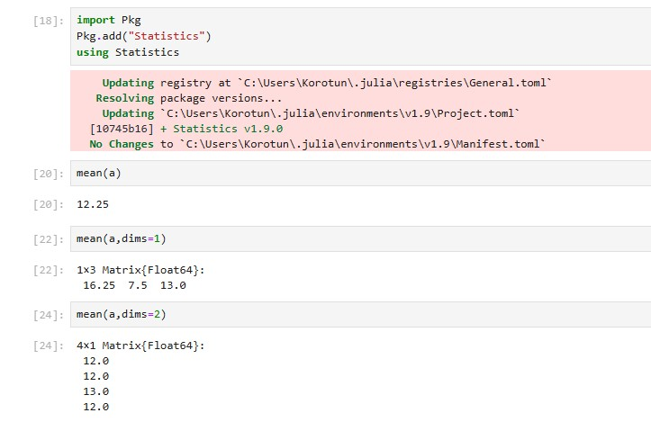
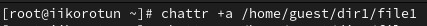
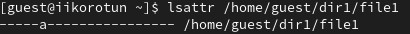
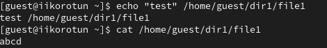
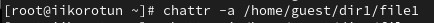

---
## Front matter
lang: ru-RU
title: Structural approach to the deep learning method
author: |
	Leonid A. Sevastianov\inst{1,3}
	\and
	Anton L. Sevastianov\inst{1}
	\and
	Edik A. Ayrjan\inst{2}
	\and
	Anna V. Korolkova\inst{1}
	\and
	Dmitry S. Kulyabov\inst{1,2}
	\and
	Imrikh Pokorny\inst{4}
institute: |
	\inst{1}RUDN University, Moscow, Russian Federation
	\and
	\inst{2}LIT JINR, Dubna, Russian Federation
	\and
	\inst{3}BLTP JINR, Dubna, Russian Federation
	\and
	\inst{4}Technical University of Košice, Košice, Slovakia
date: NEC--2019, 30 September -- 4 October, 2019 Budva, Montenegro

## Formatting
toc: false
slide_level: 2
theme: metropolis
header-includes: 
 - \metroset{progressbar=frametitle,sectionpage=progressbar,numbering=fraction}
 - '\makeatletter'
 - '\beamer@ignorenonframefalse'
 - '\makeatother'
aspectratio: 43
section-titles: true
---

# Лабораторная работа 4

## Коротун Илья Игоревич
## НКНбд-01-21
## Москва 2024г.

# Цели

Получение практических навыков работы в консоли с расширенными атрибутами файлов.

# Задание

Выполнить несколько пунктов согласно методичке.

# Ход работы 

1. От имени пользователя guest определил расширенные атрибуты файла /home/guest/dir1/file1 командой
lsattr /home/guest/dir1/file1

2. Установил командой chmod 600 file1 на файл file1 права, разрешающие чтение и запись для владельца файла.

3. Попробовал установить на файл /home/guest/dir1/file1 расширенный атрибут a от имени пользователя guest:
chattr +a /home/guest/dir1/file1

4. Зашел на третью консоль с правами администратора и попробовал установить расширенный атрибут a на файл /home/guest/dir1/file1 от имени суперпользователя:
chattr +a /home/guest/dir1/file1

5. От пользователя guest проверил правильность установления атрибута:
lsattr /home/guest/dir1/file1

6. Выполнил дозапись в файл file1 слова «test» командой
echo "test" /home/guest/dir1/file1

После этого выполните чтение файла file1 командой
cat /home/guest/dir1/file1

7. Попробовал удалить файл file1 либо стереть имеющуюся в нём информацию командой
echo "abcd" > /home/guest/dirl/file1

Попробовал переименовать файл командой mv 

8. Попробовал с помощью команды chmod 000 file1 установить на файл file1 права, например, запрещающие чтение и запись для владельца файла.

9. Снял расширенный атрибут a с файла /home/guest/dirl/file1 от имени суперпользователя командой
chattr -a /home/guest/dir1/file1

10. Повторил все действия по шагам, заменив атрибут «a» атрибутом «i».

# Выводы

Я получил практические навыки работы в консоли с расширенными атрибутами файлов.

