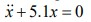
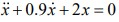
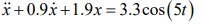
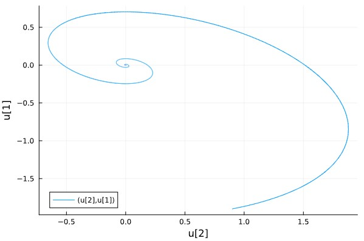
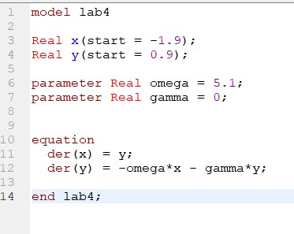
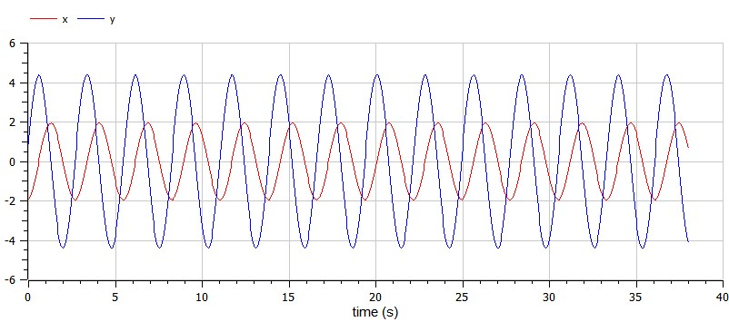
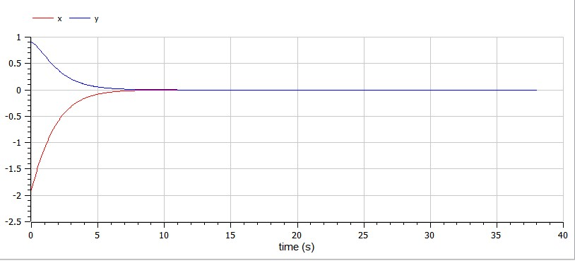
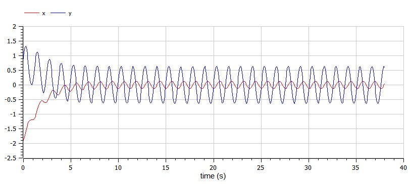
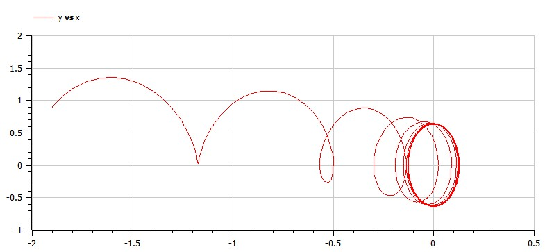

---
## Front matter
lang: ru-RU
title: Structural approach to the deep learning method
author: |
	Leonid A. Sevastianov\inst{1,3}
	\and
	Anton L. Sevastianov\inst{1}
	\and
	Edik A. Ayrjan\inst{2}
	\and
	Anna V. Korolkova\inst{1}
	\and
	Dmitry S. Kulyabov\inst{1,2}
	\and
	Imrikh Pokorny\inst{4}
institute: |
	\inst{1}RUDN University, Moscow, Russian Federation
	\and
	\inst{2}LIT JINR, Dubna, Russian Federation
	\and
	\inst{3}BLTP JINR, Dubna, Russian Federation
	\and
	\inst{4}Technical University of Košice, Košice, Slovakia
date: NEC--2019, 30 September -- 4 October, 2019 Budva, Montenegro

## Formatting
toc: false
slide_level: 2
theme: metropolis
header-includes: 
 - \metroset{progressbar=frametitle,sectionpage=progressbar,numbering=fraction}
 - '\makeatletter'
 - '\beamer@ignorenonframefalse'
 - '\makeatother'
aspectratio: 43
section-titles: true
---

# Лабораторная работа 4

## Коротун Илья Игоревич
## НКНбд-01-21
## Москва 2024г.

# Цели

Цель: ознакомится с материалом по моделям гармонических колебаний и на основе полученных знаний выполнить Лабораторную работу №4.

# Задание

Вариант № 29

Постройте фазовый портрет гармонического осциллятора и решение уравнения гармонического осциллятора для следующих случаев

1. Колебания гармонического осциллятора без затуханий и без действий внешней силы

{ #случай 1 }
   
2. Колебания гармонического осциллятора c затуханием и без действий внешней силы
   
{ #случай 2 }
   
3. Колебания гармонического осциллятора c затуханием и под действием внешней силы

{ #случай 3 }

На интервале t [0;38] (шаг 0.05) с начальными условиями x0 = 0.9, y0 = -1.9

# Ход работы 

## Julia: 

## Для начала введем необходимые библиотеки

using DifferentialEquations

using Plots

## Зададим начальные данные 

p1 = [0, 5.1]

p2 = [0.9, 2.0]

p3 = [0.9, 1.9]

tspan = (0,38)

x0 = [-1.9, 0.9]

## Также зададим значение внешних сил

f(t) = 3.3*cos(5*t)

## Затем введем 2 функции. Первая для колебания без действия внешних сил, а вторая с этим действием.

function funk(dx,x,p,t)

    gamma, w = p
    
    dx[1] = x[2]
    
    dx[2] = -w .* x[1] - gamma .* x[2]
    
end

function funk2(dx,x,p,t)

    gamma, w = p
    
    dx[1] = x[2]
    
    dx[2] = -w .* x[1] - gamma .* x[2] .+ f(t)
    
end

## Затем распишем решение и вывод графиков для трех случаев

problem1 = ODEProblem(funk, x0, tspan, p1)

solution = solve(problem1, dtmax = 0.05)

problem2 = ODEProblem(funk, x0, tspan, p2)

solution2 = solve(problem2, dtmax = 0.05)

problem3 = ODEProblem(funk2, x0, tspan, p3)

solution3 = solve(problem3, dtmax = 0.05)

plot(solution)

{ # Колебания гармонического осциллятора случай 1 }

plot(solution, vars = (2,1))

{ #  Фазовый портрет случай 1 }

plot(solution2)

{ # Колебания гармонического осциллятора случай 2 }

plot(solution2, vars = (2,1))

{ # Фазовый портрет случай 2 }

plot(solution3)

{ # Колебания гармонического осциллятора случай 3 }

plot(solution3, vars = (2,1))

{ # Фазовый портрет случай 3 }

## Теперь построим такой же график в OpenModelica

{ # Случай 1 }

## Результат

{ # Колебания гармонического осциллятора случай 1 }

{ # Фазовый портрет случай 1 }

{ # Случай 2 }

## Результат

{ # Колебания гармонического осциллятора случай 2 }

{ # Фазовый портрет случай 2 }

{ # Случай 3 }

## Результат

{ # Колебания гармонического осциллятора случай 3 }

{ # Фазовый портрет случай 3 }

# Выводы

Я ознакомитлся с материалом и на основе полученных знаний выполнил Лабораторную работу №4 (Построение фазового портрета гармонического осциллятора и решение уравнения гармонического осциллятора).
 

