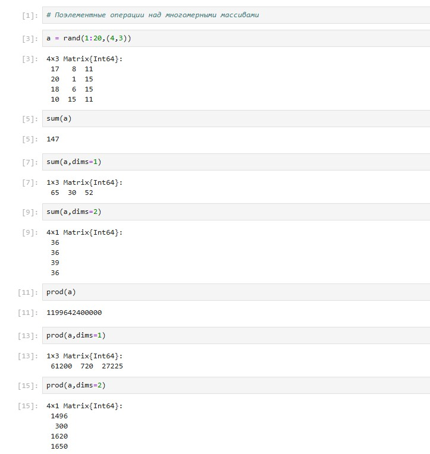
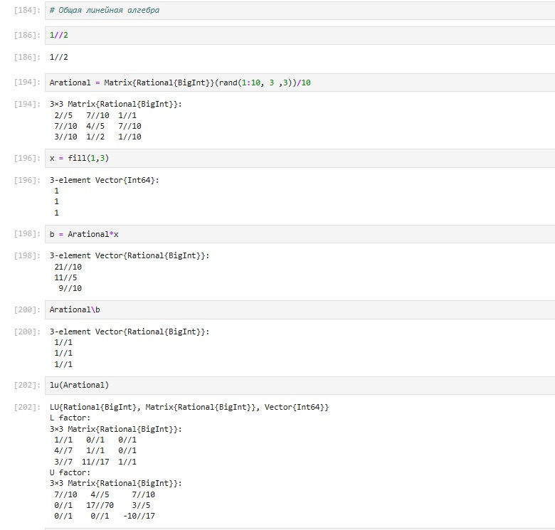
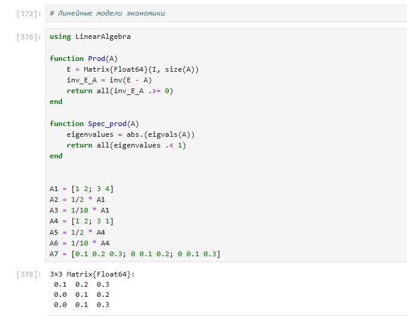

---
## Front matter
lang: ru-RU
title: Structural approach to the deep learning method
author: |
	Leonid A. Sevastianov\inst{1,3}
	\and
	Anton L. Sevastianov\inst{1}
	\and
	Edik A. Ayrjan\inst{2}
	\and
	Anna V. Korolkova\inst{1}
	\and
	Dmitry S. Kulyabov\inst{1,2}
	\and
	Imrikh Pokorny\inst{4}
institute: |
	\inst{1}RUDN University, Moscow, Russian Federation
	\and
	\inst{2}LIT JINR, Dubna, Russian Federation
	\and
	\inst{3}BLTP JINR, Dubna, Russian Federation
	\and
	\inst{4}Technical University of Košice, Košice, Slovakia
date: NEC--2019, 30 September -- 4 October, 2019 Budva, Montenegro

## Formatting
toc: false
slide_level: 2
theme: metropolis
header-includes: 
 - \metroset{progressbar=frametitle,sectionpage=progressbar,numbering=fraction}
 - '\makeatletter'
 - '\beamer@ignorenonframefalse'
 - '\makeatother'
aspectratio: 43
section-titles: true
---

# Лабораторная работа 4

## Коротун Илья Игоревич
## НКНбд-01-21
## Москва 2024г.

# Цели

Основной целью работы является изучение возможностей специализированных пакетов Julia для выполнения и оценки эффективности операций над объектами линейной алгебры.

# Задание

1. Используя Jupyter Lab, повторите примеры из раздела 4.2.
2. Выполните задания для самостоятельной работы (раздел 4.4).

# Ход работы 

## 1. Поэлементные операции над многомерными массивами

## 2. Транспонирование, след, ранг, определитель и инверсия матрицы

## 3. Вычисление нормы векторов и матриц, повороты, вращения

## 4. Матричное умножение, единичная матрица, скалярное произведение

## 5. Факторизация. Специальные матричные структуры

## 6. Общая линейная алгебра

# Задания для самостоятельного выполнения

## Произведение векторов

## Системы линейных уравнений

## Операции с матрицами

## Линейные модели экономики

# Выводы

Я изучил возможности специализированных пакетов Julia для выполнения и оценки эффективности операций над объектами линейной алгебры. С помощью полученных навыков выполнил Лабораторную работу №4. 

