---
## Front matter
title: "Лабораторная работа №4"
subtitle: "Модель гармонических колебаний"
author: "Коротун Илья Игоревич"

## Generic otions
lang: ru-RU
toc-title: "Содержание"

## Bibliography
bibliography: bib/cite.bib
csl: pandoc/csl/gost-r-7-0-5-2008-numeric.csl

## Pdf output format
toc: true # Table of contents
toc-depth: 2
lof: true # List of figures
lot: true # List of tables
fontsize: 12pt
linestretch: 1.5
papersize: a4
documentclass: scrreprt
## I18n polyglossia
polyglossia-lang:
  name: russian
  options:
	- spelling=modern
	- babelshorthands=true
polyglossia-otherlangs:
  name: english
## I18n babel
babel-lang: russian
babel-otherlangs: english
## Fonts
mainfont: PT Serif
romanfont: PT Serif
sansfont: PT Sans
monofont: PT Mono
mainfontoptions: Ligatures=TeX
romanfontoptions: Ligatures=TeX
sansfontoptions: Ligatures=TeX,Scale=MatchLowercase
monofontoptions: Scale=MatchLowercase,Scale=0.9
## Biblatex
biblatex: true
biblio-style: "gost-numeric"
biblatexoptions:
  - parentracker=true
  - backend=biber
  - hyperref=auto
  - language=auto
  - autolang=other*
  - citestyle=gost-numeric
## Pandoc-crossref LaTeX customization
figureTitle: "Рис."
tableTitle: "Таблица"
listingTitle: "Листинг"
lofTitle: "Список иллюстраций"
lotTitle: "Список таблиц"
lolTitle: "Листинги"
## Misc options
indent: true
header-includes:
  - \usepackage{indentfirst}
  - \usepackage{float} # keep figures where there are in the text
  - \floatplacement{figure}{H} # keep figures where there are in the text
---

# Цель работы

Ознакомится с материалом и на основе полученных знаний выполнить Лабораторную работу №4(Построение фазового портрета гармонического осциллятора и решение уравнения гармонического осциллятора).

# Задание

Вариант № 29

Постройте фазовый портрет гармонического осциллятора и решение уравнения гармонического осциллятора для следующих случаев

1. Колебания гармонического осциллятора без затуханий и без действий внешней силы

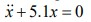{ #случай 1 }
   
2. Колебания гармонического осциллятора c затуханием и без действий внешней силы
   
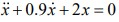{ #случай 2 }
   
3. Колебания гармонического осциллятора c затуханием и под действием внешней силы

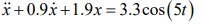{ #случай 3 }

На интервале t [0;38] (шаг 0.05) с начальными условиями x0 = 0.9, y0 = -1.9

# Теоретическое введение

Движение грузика на пружинке, маятника, заряда в электрическом контуре, а также эволюция во времени многих систем в физике, химии, биологии и других
науках при определенных предположениях можно описать одним и тем же дифференциальным уравнением, которое в теории колебаний выступает в качестве
основной модели. Эта модель называется линейным гармоническим осциллятором.

Уравнение свободных колебаний гармонического осциллятора имеет следующий вид:

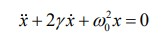{ # уравнение }

где x – переменная, описывающая состояние системы (смещение грузика, заряд конденсатора и т.д.), γ – параметр, характеризующий потери энергии (трение в
механической системе, сопротивление в контуре), ω0– собственная частот колебаний, t – время

# Выполнение лабораторной работы

Julia: 

Для начала введем необходимые библиотеки

using DifferentialEquations
using Plots

Зададим начальные данные 

p1 = [0, 5.1]
p2 = [0.9, 2.0]
p3 = [0.9, 1.9]

tspan = (0,38)
x0 = [-1.9, 0.9]

Также зададим значение внешних сил

f(t) = 3.3*cos(5*t)

Затем введем 2 функции. Первая для колебания без действия внешних сил, а вторая с этим действием.

function funk(dx,x,p,t)
    gamma, w = p
    dx[1] = x[2]
    dx[2] = -w .* x[1] - gamma .* x[2]
end

function funk2(dx,x,p,t)
    gamma, w = p
    dx[1] = x[2]
    dx[2] = -w .* x[1] - gamma .* x[2] .+ f(t)
end

Затем распишем решение и вывод графиков для трех случаев

problem1 = ODEProblem(funk, x0, tspan, p1)
solution = solve(problem1, dtmax = 0.05)

problem2 = ODEProblem(funk, x0, tspan, p2)
solution2 = solve(problem2, dtmax = 0.05)

problem3 = ODEProblem(funk2, x0, tspan, p3)
solution3 = solve(problem3, dtmax = 0.05)

plot(solution)

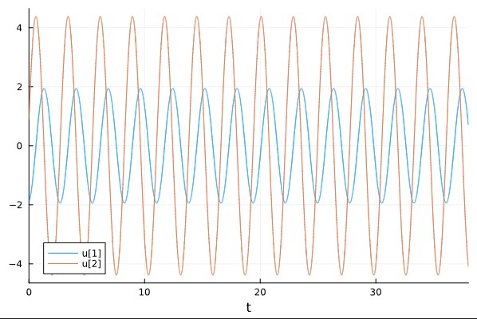{ # Колебания гармонического осциллятора случай 1 }

plot(solution, vars = (2,1))

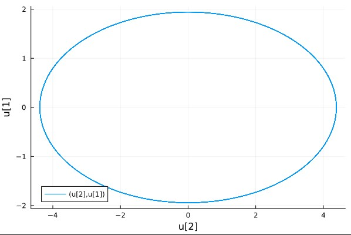{ #  Фазовый портрет случай 1 }

plot(solution2)

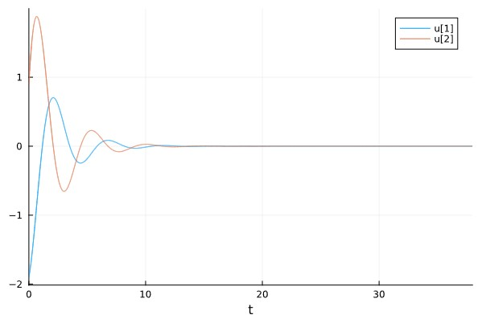{ # Колебания гармонического осциллятора случай 2 }

plot(solution2, vars = (2,1))

{ # Фазовый портрет случай 2 }

plot(solution3)

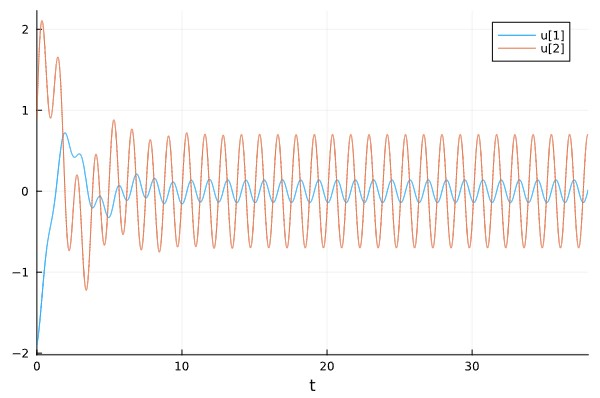{ # Колебания гармонического осциллятора случай 3 }

plot(solution3, vars = (2,1))

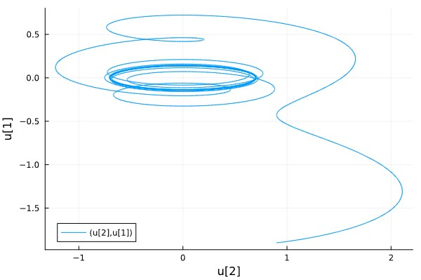{ # Фазовый портрет случай 3 }

## Теперь построим такой же график в OpenModelica

{ # Случай 1 }

## Результат

{ # Колебания гармонического осциллятора случай 1 }

{ # Фазовый портрет случай 1 }

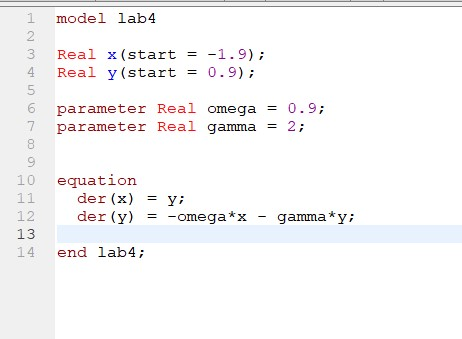{ # Случай 2 }

## Результат

{ # Колебания гармонического осциллятора случай 2 }

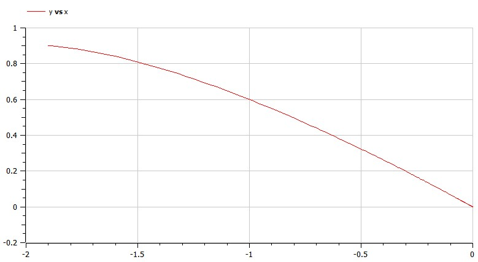{ # Фазовый портрет случай 2 }

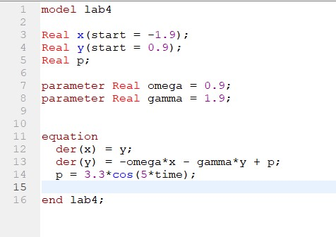{ # Случай 3 }

## Результат

{ # Колебания гармонического осциллятора случай 3 }

{ # Фазовый портрет случай 3 }

# Выводы

Я ознакомитлся с материалом и на основе полученных знаний выполнил Лабораторную работу №4 (Построение фазового портрета гармонического осциллятора и решение уравнения гармонического осциллятора).

# Список литературы{.unnumbered}

::: {#refs}
:::
