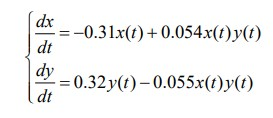
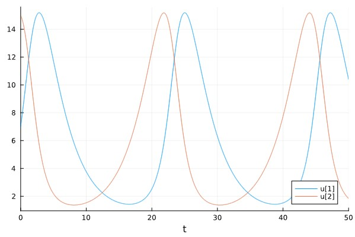
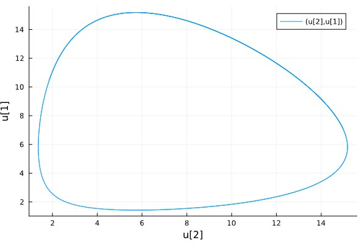
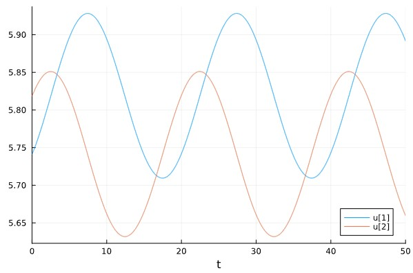
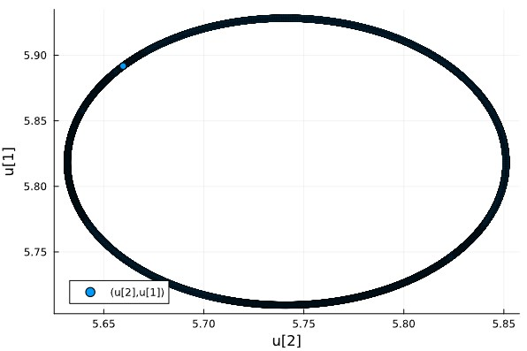
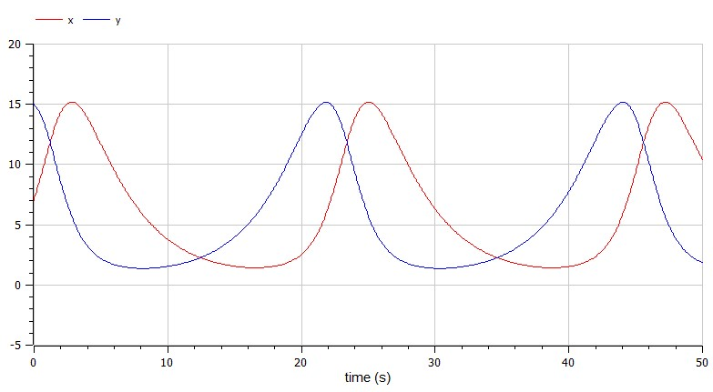
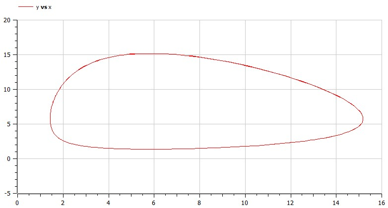
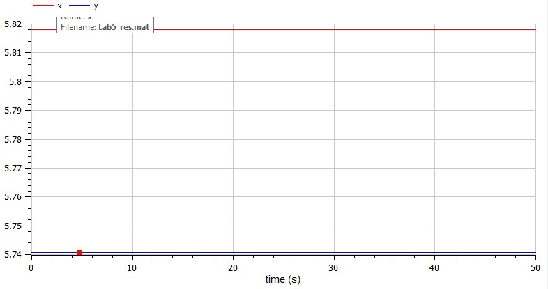
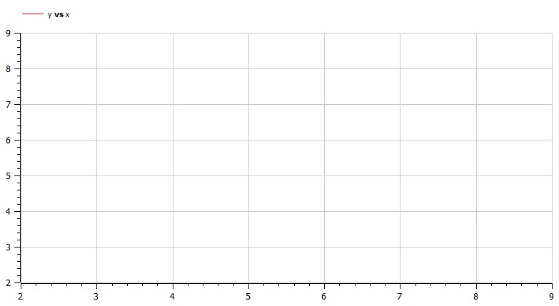

---
## Front matter
lang: ru-RU
title: Structural approach to the deep learning method
author: |
	Leonid A. Sevastianov\inst{1,3}
	\and
	Anton L. Sevastianov\inst{1}
	\and
	Edik A. Ayrjan\inst{2}
	\and
	Anna V. Korolkova\inst{1}
	\and
	Dmitry S. Kulyabov\inst{1,2}
	\and
	Imrikh Pokorny\inst{4}
institute: |
	\inst{1}RUDN University, Moscow, Russian Federation
	\and
	\inst{2}LIT JINR, Dubna, Russian Federation
	\and
	\inst{3}BLTP JINR, Dubna, Russian Federation
	\and
	\inst{4}Technical University of Košice, Košice, Slovakia
date: NEC--2019, 30 September -- 4 October, 2019 Budva, Montenegro

## Formatting
toc: false
slide_level: 2
theme: metropolis
header-includes: 
 - \metroset{progressbar=frametitle,sectionpage=progressbar,numbering=fraction}
 - '\makeatletter'
 - '\beamer@ignorenonframefalse'
 - '\makeatother'
aspectratio: 43
section-titles: true
---

# Лабораторная работа 5

## Коротун Илья Игоревич
## НКНбд-01-21
## Москва 2024г.

# Цели

Ознакомится с материалом по простейшей модели взаимодействия двух видов типа «хищник — жертва» - модели Лотки-Вольтерра и на основе полученных знаний выполнить Лабораторную работу №5.

# Задание

Вариант 29

Для модели «хищник-жертва»:

{ # условие }

Постройте график зависимости численности хищников от численности жертв, а также графики изменения численности хищников и численности жертв при
следующих начальных условиях: x0 = 7, y0 = 15. Найдите стационарное состояние системы.

# Ход работы 

## Julia: 

## Для начала введем необходимые библиотеки

using DifferentialEquations

using Plots

## Зададим начальные данные

p = [0.31, 0.054, 0.32, 0.055]

x0 = 7

y0 = 15

tspan = (0,50)

## Введем функцию

function funk(u, p, t)

    x,y = u
    
    a,b,c,d = p
    
    dx = -a*x + b*x*y 

    dy = c*y - d*x*y
    
    return [dx, dy]
    
    
end

x1 = p[1]/p[2]

y1 = p[3]/p[4]

## Распишем решение и ввод графиков

problem1 = ODEProblem(funk, [x0,y0], tspan, p)

problem2 = ODEProblem(funk, [x1,y1], tspan, p)

solution1 = solve(problem1, Tsit5(), dtmax = 0.05)

solution2 = solve(problem2, Tsit5(), dtmax = 0.05)

plot(solution1)

plot(solution1, vars = (2,1))

plot(solution2)

scatter(solution2, vars = (2,1))

## Результат

## График колебаний 

{ # График колебаний  }

{ # Фазовый портрет  }

## Стационарная точка

{ # График колебаний токи }

{ # Фазовый портрет  }

## Теперь построим такой же график в OpenModelica

## Первый случай

model Lab5

Real x(start = 7);
Real y(start = 15);

parameter Real a = 0.31;
parameter Real b = 0.054;
parameter Real c = 0.32;
parameter Real d = 0.055;

equation
  der(x) = -a*x + b*x*y;
  der(y) = c*y - d*x*y;

end Lab5;

## Результат 

{ # График колебаний }

{ # Фазовый портрет  }

## Второй случай

model Lab5

Real x(start = c/d);
Real y(start = a/b);

parameter Real a = 0.31;
parameter Real b = 0.054;
parameter Real c = 0.32;
parameter Real d = 0.055;

equation
  der(x) = -a*x + b*x*y;
  der(y) = c*y - d*x*y;

end Lab5;

## Результат 

{ # График колебаний }

{ # Фазовый портрет  }

# Выводы
Я ознакомился с материалом по простейшей модели взаимодействия двух видов типа «хищник — жертва» - модели Лотки-Вольтерра и на основе полученных знаний выполнил Лабораторную работу №5.
