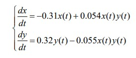
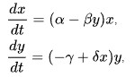
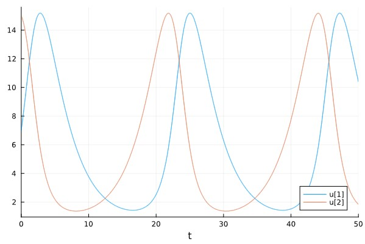
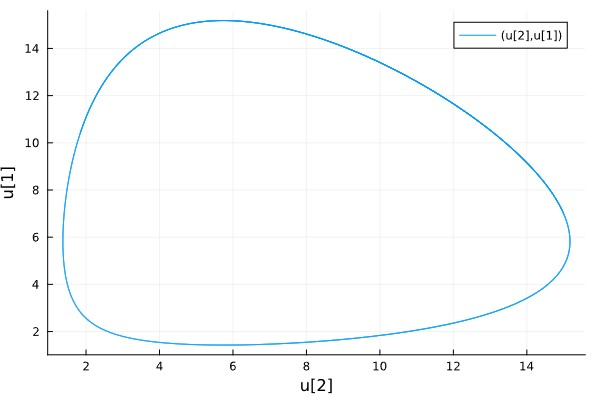
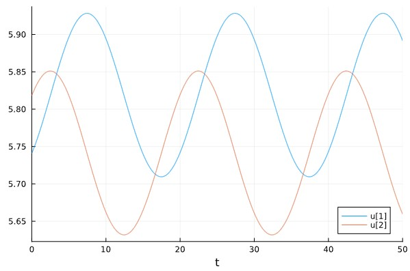
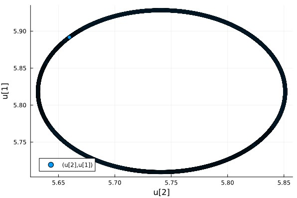
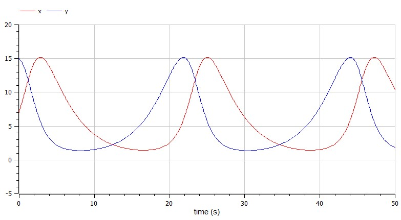
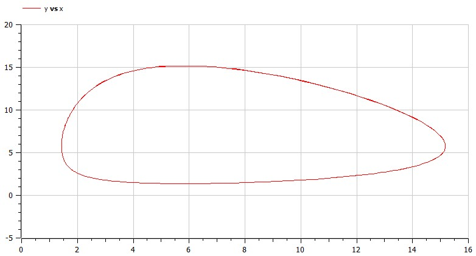
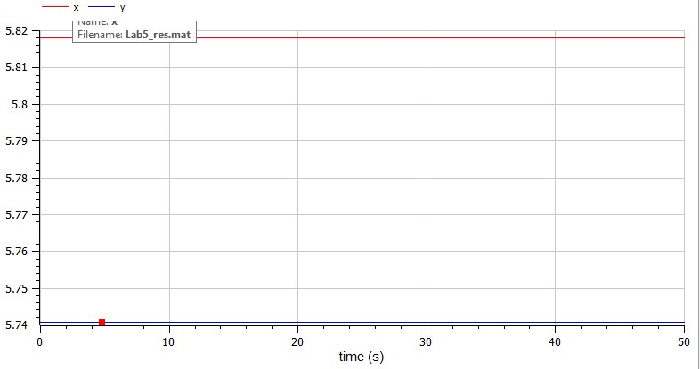
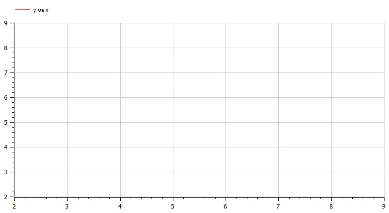

---
## Front matter
title: "Лабораторная работа №5"
subtitle: "Модель хищник-жертва"
author: "Коротун Илья Игоревич"

## Generic otions
lang: ru-RU
toc-title: "Содержание"

## Bibliography
bibliography: bib/cite.bib
csl: pandoc/csl/gost-r-7-0-5-2008-numeric.csl

## Pdf output format
toc: true # Table of contents
toc-depth: 2
lof: true # List of figures
lot: true # List of tables
fontsize: 12pt
linestretch: 1.5
papersize: a4
documentclass: scrreprt
## I18n polyglossia
polyglossia-lang:
  name: russian
  options:
	- spelling=modern
	- babelshorthands=true
polyglossia-otherlangs:
  name: english
## I18n babel
babel-lang: russian
babel-otherlangs: english
## Fonts
mainfont: PT Serif
romanfont: PT Serif
sansfont: PT Sans
monofont: PT Mono
mainfontoptions: Ligatures=TeX
romanfontoptions: Ligatures=TeX
sansfontoptions: Ligatures=TeX,Scale=MatchLowercase
monofontoptions: Scale=MatchLowercase,Scale=0.9
## Biblatex
biblatex: true
biblio-style: "gost-numeric"
biblatexoptions:
  - parentracker=true
  - backend=biber
  - hyperref=auto
  - language=auto
  - autolang=other*
  - citestyle=gost-numeric
## Pandoc-crossref LaTeX customization
figureTitle: "Рис."
tableTitle: "Таблица"
listingTitle: "Листинг"
lofTitle: "Список иллюстраций"
lotTitle: "Список таблиц"
lolTitle: "Листинги"
## Misc options
indent: true
header-includes:
  - \usepackage{indentfirst}
  - \usepackage{float} # keep figures where there are in the text
  - \floatplacement{figure}{H} # keep figures where there are in the text
---

# Цель работы
Ознакомится с материалом по простейшей модели взаимодействия двух видов типа «хищник — жертва» -
модели Лотки-Вольтерра и на основе полученных знаний выполнить Лабораторную работу №5.

# Задание

Вариант 29
Для модели «хищник-жертва»:

{ # условие }

Постройте график зависимости численности хищников от численности жертв, а также графики изменения численности хищников и численности жертв при
следующих начальных условиях: x0 = 7, y0 = 15. Найдите стационарное состояние системы.

# Теоретическое введение
Моде́ль Ло́тки — Вольте́рры (модель Ло́тки — Вольтерра́) — модель взаимодействия двух видов типа «хищник — жертва», названная в честь своих авторов (Лотка, 1925; Вольтерра 1926), которые предложили модельные уравнения независимо друг от друга.

Такие уравнения можно использовать для моделирования систем «хищник — жертва», «паразит — хозяин», конкуренции и других видов взаимодействия между двумя видами[2].

В математической форме предложенная система имеет следующий вид:

{ # система }

где 
x — количество жертв, 
y — количество хищников, 
t — время, 
α, β, γ, δ — коэффициенты, отражающие взаимодействия между видами

# Выполнение лабораторной работы

## Julia: 

Для начала введем необходимые библиотеки

using DifferentialEquations

using Plots

## Зададим начальные данные

p = [0.31, 0.054, 0.32, 0.055]

x0 = 7

y0 = 15

tspan = (0,50)

## Введем функцию

function funk(u, p, t)

    x,y = u
    
    a,b,c,d = p
    
    dx = -a*x + b*x*y 

    dy = c*y - d*x*y
    
    return [dx, dy]
    
    
end

x1 = p[1]/p[2]

y1 = p[3]/p[4]

## Распишем решение и ввод графиков

problem1 = ODEProblem(funk, [x0,y0], tspan, p)

problem2 = ODEProblem(funk, [x1,y1], tspan, p)

solution1 = solve(problem1, Tsit5(), dtmax = 0.05)

solution2 = solve(problem2, Tsit5(), dtmax = 0.05)

plot(solution1)

plot(solution1, vars = (2,1))

plot(solution2)

scatter(solution2, vars = (2,1))

## Результат
График колебаний 

{ # График колебаний  }

{ # Фазовый портрет  }

Стационарная точка

{ # График колебаний токи }

{ # Фазовый портрет  }

## Теперь построим такой же график в OpenModelica

Первый случай

model Lab5

Real x(start = 7);
Real y(start = 15);

parameter Real a = 0.31;
parameter Real b = 0.054;
parameter Real c = 0.32;
parameter Real d = 0.055;

equation
  der(x) = -a*x + b*x*y;
  der(y) = c*y - d*x*y;

end Lab5;

## Результат 

{ # График колебаний }

{ # Фазовый портрет  }

Второй случай

model Lab5

Real x(start = c/d);
Real y(start = a/b);

parameter Real a = 0.31;
parameter Real b = 0.054;
parameter Real c = 0.32;
parameter Real d = 0.055;

equation
  der(x) = -a*x + b*x*y;
  der(y) = c*y - d*x*y;

end Lab5;

## Результат 

{ # График колебаний }

{ # Фазовый портрет  }

# Выводы

# Список литературы{.unnumbered}
::: {#refs}
:::

