---
## Front matter
lang: ru-RU
title: Structural approach to the deep learning method
author: |
	Leonid A. Sevastianov\inst{1,3}
	\and
	Anton L. Sevastianov\inst{1}
	\and
	Edik A. Ayrjan\inst{2}
	\and
	Anna V. Korolkova\inst{1}
	\and
	Dmitry S. Kulyabov\inst{1,2}
	\and
	Imrikh Pokorny\inst{4}
institute: |
	\inst{1}RUDN University, Moscow, Russian Federation
	\and
	\inst{2}LIT JINR, Dubna, Russian Federation
	\and
	\inst{3}BLTP JINR, Dubna, Russian Federation
	\and
	\inst{4}Technical University of Košice, Košice, Slovakia
date: NEC--2019, 30 September -- 4 October, 2019 Budva, Montenegro

## Formatting
toc: false
slide_level: 2
theme: metropolis
header-includes: 
 - \metroset{progressbar=frametitle,sectionpage=progressbar,numbering=fraction}
 - '\makeatletter'
 - '\beamer@ignorenonframefalse'
 - '\makeatother'
aspectratio: 43
section-titles: true
---

# Лабораторная работа 6

## Коротун Илья Игоревич
## НКНбд-01-21
## Москва 2024г.

# Цели

Основной целью работы является освоение специализированных пакетов для решения задач в непрерывном и дискретном времени.

# Задание

1. Используя Jupyter Lab, повторите примеры из раздела 6.2.
2. Выполните задания для самостоятельной работы (раздел 6.4).

# Ход работы 

Повторил примеры из методички

1. Модель экспоненциального роста

2.  Система Лоренца

3. Модель Лотки–Вольтерры

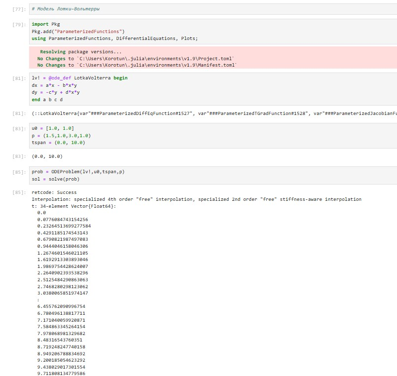

# Задания для самостоятельного выполнения

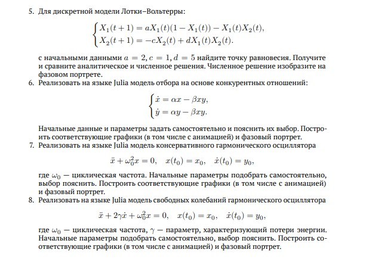

## №1 Модель Мальтуса

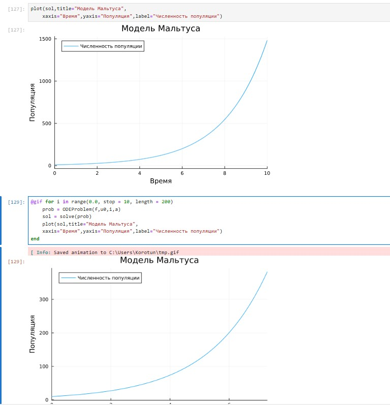

## №2 Модель роста популяции

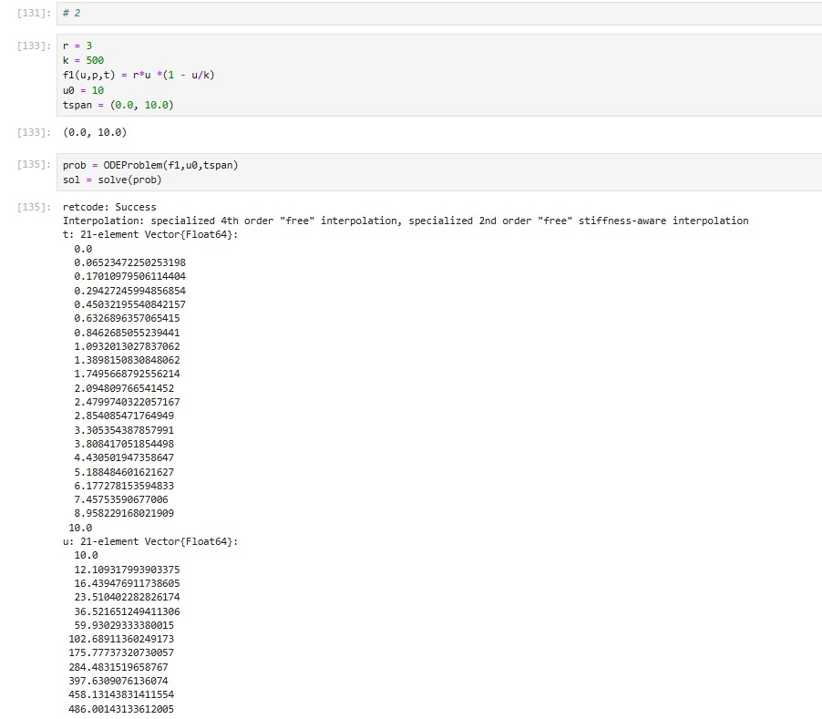

## №3 Модель эпидемии Кермака–Маккендрика (SIR модель)

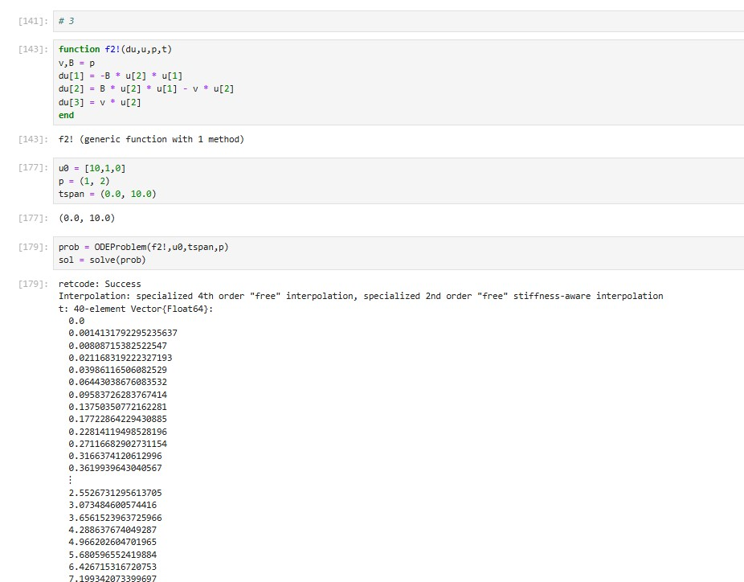

## №4 SEIR Модель

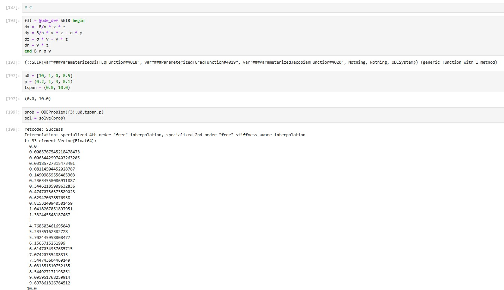

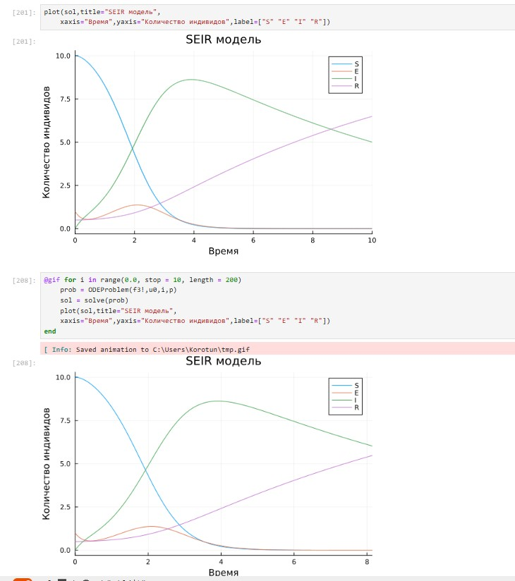

## №5 Дискретная модель Лотки–Вольтерры

## Аналитичнское решение и фазовый портрет

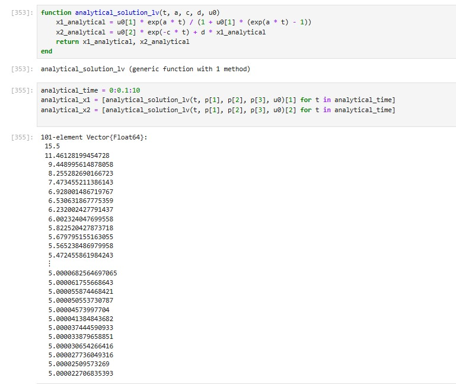

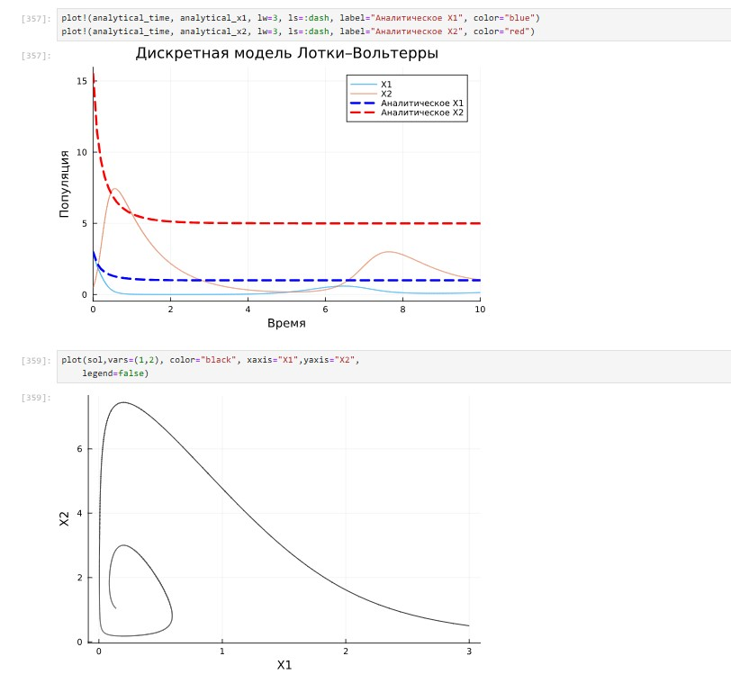

## №6 Модель отбора на основе конкурентных отношений

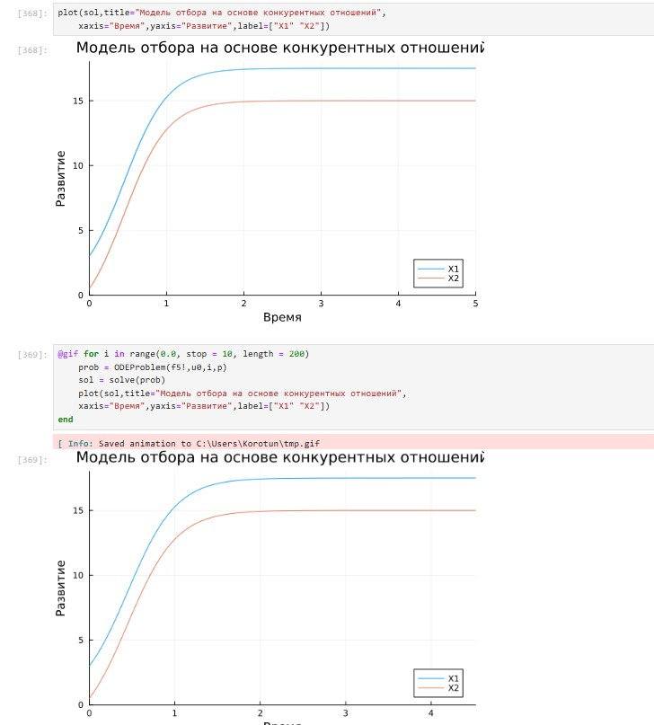

## Фазовый портрет

## №7 Модель консервативного гармонического осциллятора

## Фазовый портрет

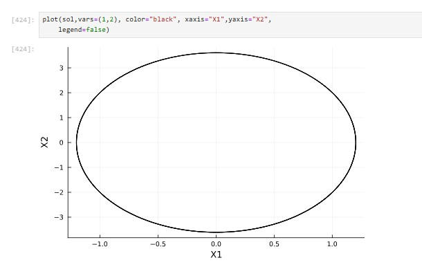

## №8 Модель свободных колебаний гармонического осциллятора

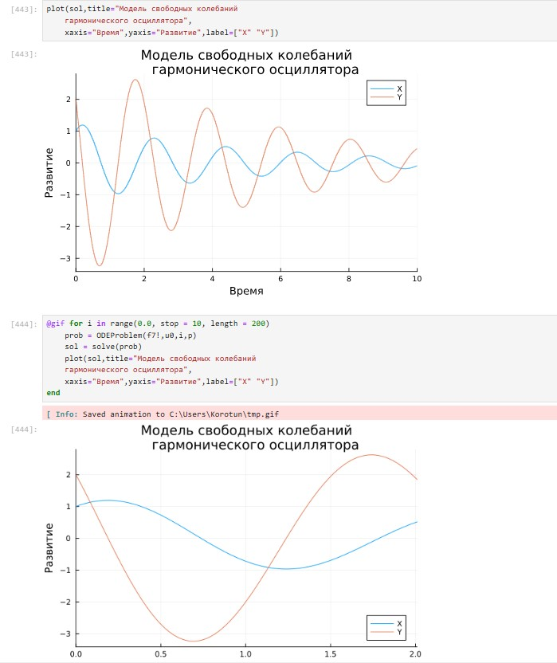

## Фазовый портрет

# Выводы

Я освоил специализированные пакеты для решения задач в непрерывном и дискретном времени. С помощью полученных навыков выполнил Лабораторную работу №6.
