---
## Front matter
lang: ru-RU
title: Structural approach to the deep learning method
author: |
	Leonid A. Sevastianov\inst{1,3}
	\and
	Anton L. Sevastianov\inst{1}
	\and
	Edik A. Ayrjan\inst{2}
	\and
	Anna V. Korolkova\inst{1}
	\and
	Dmitry S. Kulyabov\inst{1,2}
	\and
	Imrikh Pokorny\inst{4}
institute: |
	\inst{1}RUDN University, Moscow, Russian Federation
	\and
	\inst{2}LIT JINR, Dubna, Russian Federation
	\and
	\inst{3}BLTP JINR, Dubna, Russian Federation
	\and
	\inst{4}Technical University of Košice, Košice, Slovakia
date: NEC--2019, 30 September -- 4 October, 2019 Budva, Montenegro

## Formatting
toc: false
slide_level: 2
theme: metropolis
header-includes: 
 - \metroset{progressbar=frametitle,sectionpage=progressbar,numbering=fraction}
 - '\makeatletter'
 - '\beamer@ignorenonframefalse'
 - '\makeatother'
aspectratio: 43
section-titles: true
---

# Лабораторная работа 6

## Коротун Илья Игоревич
## НКНбд-01-21
## Москва 2024г.

# Цели

Развить навыки администрирования ОС Linux. Получить первое практическое знакомство с технологией SELinux1. Проверить работу SELinx на практике совместно с веб-сервером Apache.

# Задание

Выполнить все пункты согласно методичке.

# Ход работы 

1. Вошел в систему с полученными учётными данными и убедился, что SELinux работает в режиме enforcing политики targeted с помощью команд getenforce и sestatus.

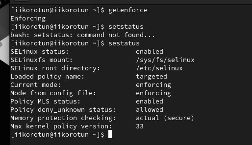

2. Обратился с помощью браузера к веб-серверу, запущенному на моем компьютере, и убедился, что последний работает:
service httpd status или /etc/rc.d/init.d/httpd status

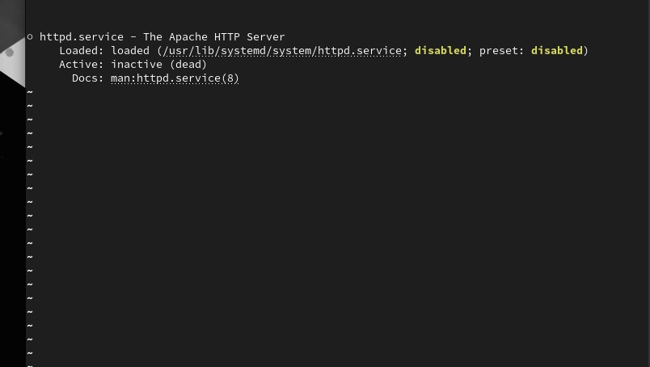

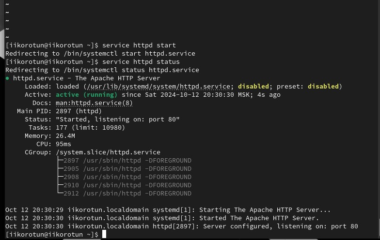

3. Нашел веб-сервер Apache в списке процессов, определил его контекст безопасности. Команды ps auxZ | grep httpd или ps -eZ | grep httpd

4. Посмотрел текущее состояние переключателей SELinux для Apache с помощью команды sestatus -bigrep httpd

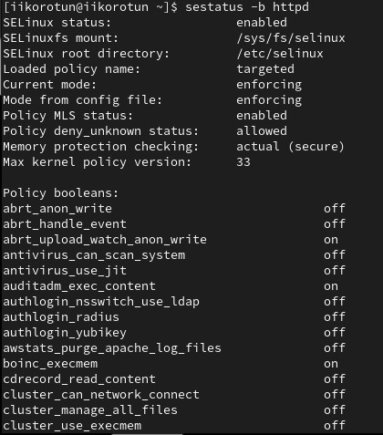

5. Посмотрел статистику по политике с помощью команды seinfo, также определил множество пользователей, ролей, типов.

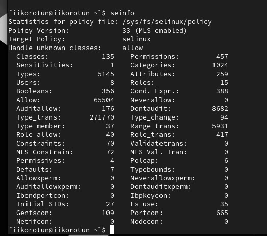

6. Определил тип файлов и поддиректорий, находящихся в директории /var/www, с помощью команды ls -lZ /var/www

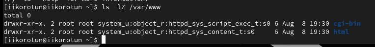

7. Определил тип файлов, находящихся в директории /var/www/html: ls -lZ /var/www/html

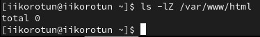

8. Определил круг пользователей, которым разрешено создание файлов вдиректории /var/www/html.

9. Создайте от имени суперпользователя (так как в дистрибутиве после установки только ему разрешена запись в директорию) html-файл /var/www/html/test.html следующего содержания:
    
<html>
<body>test</body>
</html>

10. Проверил контекст созданного файла.

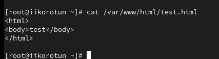

11. Обратился к файлу через веб-сервер, введя в браузере адрес http://127.0.0.1/test.html.

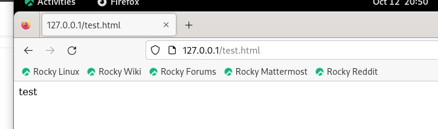

12. Изучил справку man httpd_selinux и выяснил, какие контексты файлов определены для httpd. Проверил контекст файла ls -Z /var/www/html/test.html

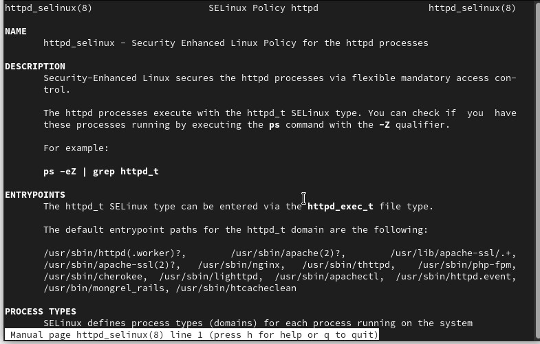

13. Изменил контекст файла /var/www/html/test.html с httpd_sys_content_t на любой другой, к которому процесс httpd не имеет доступа, например, на samba_share_t:
chcon -t samba_share_t /var/www/html/test.htm

14. Попробовал ещё раз получить доступ к файлу через веб-сервер, введя в
браузере адрес http://127.0.0.1/test.html. Получил сообщение об ошибке:
Forbidden
You don't have permission to access /test.html on this server.

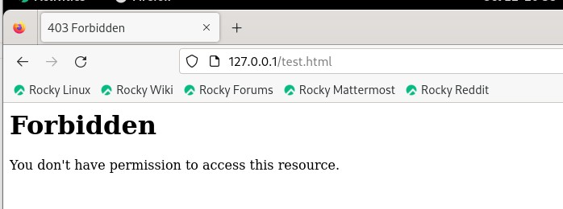

15. Проанализировал ситуацию.
ls -l /var/www/html/test.html

Просмотрел log-файлы веб-сервера Apache. Также просмотрел системный лог-файл:
tail /var/log/messages

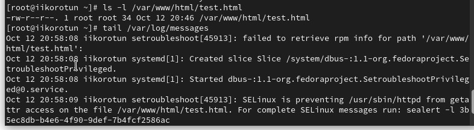

16. Попробовал запустить веб-сервер Apache на прослушивание ТСР-порта
81 (а не 80, как рекомендует IANA и прописано в /etc/services). Для
этого в файле /etc/httpd/httpd.conf нашел строчку Listen 80 и
заменил её на Listen 81.

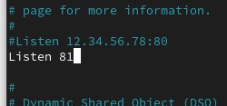

17. Выполнил перезапуск веб-сервера Apache. Произошёл сбой.

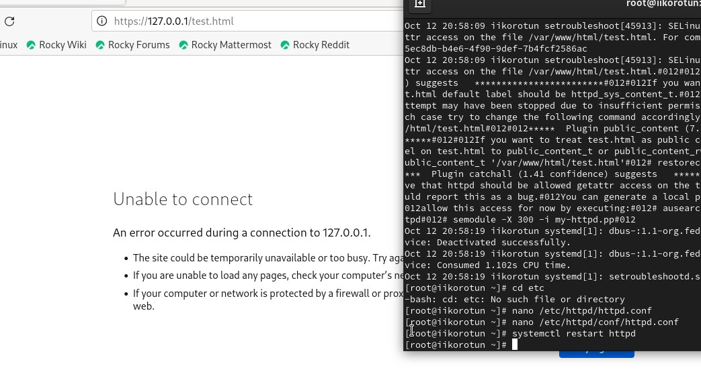

18. Проанализировал лог-файлы:
tail -nl /var/log/messages
Просмотрите файлы /var/log/http/error_log,
/var/log/http/access_log и /var/log/audit/audit.log и
выясните, в каких файлах появились записи.

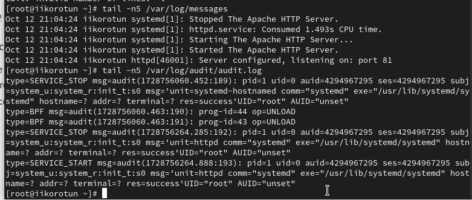

19. Выполнил команду
semanage port -a -t http_port_t -р tcp 81
После этого проверил список портов командой
semanage port -l | grep http_port_t
Убедился, что порт 81 появился в списке.

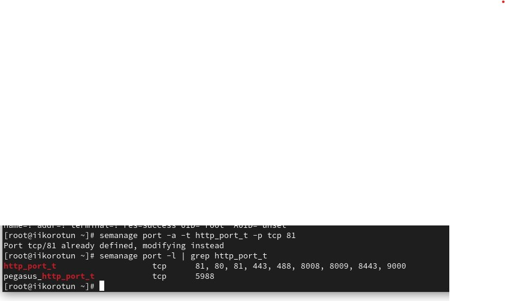

20. Попробовал запустить веб-сервер Apache ещё раз. Запустился.

21. Вернул контекст httpd_sys_cоntent__t к файлу /var/www/html/ test.html:
chcon -t httpd_sys_content_t /var/www/html/test.html
После этого попробовал получить доступ к файлу через веб-сервер, введя в браузере адрес http://127.0.0.1:81/test.html.
Получил слово test

22. Исправил обратно конфигурационный файл apache, вернув Listen 80.

23. Удалил привязку http_port_t к 81 порту: semanage port -d -t http_port_t -p tcp 81 и проверил, что порт 81 удалён.

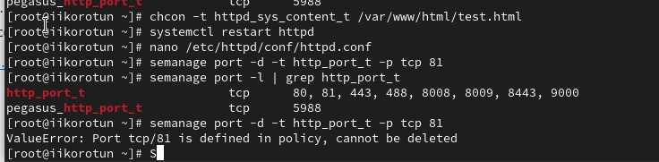

26. Удалил файл /var/www/html/test.html: rm /var/www/html/test.html

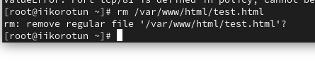

# Выводы

Я развил навыки администрирования ОС Linux. Получил первое практическое знакомство с технологией SELinux1. Проверил работу SELinx на практике совместно с веб-сервером Apache.
