---
## Front matter
title: "Лабораторная работа №6"
subtitle: "Решение моделей в непрерывном и дискретном времени"
author: "Коротун Илья Игоревич"

## Generic otions
lang: ru-RU
toc-title: "Содержание"

## Bibliography
bibliography: bib/cite.bib
csl: pandoc/csl/gost-r-7-0-5-2008-numeric.csl

## Pdf output format
toc: true # Table of contents
toc-depth: 2
lof: true # List of figures
lot: true # List of tables
fontsize: 12pt
linestretch: 1.5
papersize: a4
documentclass: scrreprt
## I18n polyglossia
polyglossia-lang:
  name: russian
  options:
	- spelling=modern
	- babelshorthands=true
polyglossia-otherlangs:
  name: english
## I18n babel
babel-lang: russian
babel-otherlangs: english
## Fonts
mainfont: PT Serif
romanfont: PT Serif
sansfont: PT Sans
monofont: PT Mono
mainfontoptions: Ligatures=TeX
romanfontoptions: Ligatures=TeX
sansfontoptions: Ligatures=TeX,Scale=MatchLowercase
monofontoptions: Scale=MatchLowercase,Scale=0.9
## Biblatex
biblatex: true
biblio-style: "gost-numeric"
biblatexoptions:
  - parentracker=true
  - backend=biber
  - hyperref=auto
  - language=auto
  - autolang=other*
  - citestyle=gost-numeric
## Pandoc-crossref LaTeX customization
figureTitle: "Рис."
tableTitle: "Таблица"
listingTitle: "Листинг"
lofTitle: "Список иллюстраций"
lotTitle: "Список таблиц"
lolTitle: "Листинги"
## Misc options
indent: true
header-includes:
  - \usepackage{indentfirst}
  - \usepackage{float} # keep figures where there are in the text
  - \floatplacement{figure}{H} # keep figures where there are in the text
---

# Цель работы.

Основной целью работы является освоение специализированных пакетов для решения задач в непрерывном и дискретном времени.

# Задание

1. Используя Jupyter Lab, повторите примеры из раздела 6.2.
2. Выполните задания для самостоятельной работы (раздел 6.4).

# Теоретическое введение

Решение обыкновенных дифференциальных уравнений
Напомним, что обыкновенное дифференциальное уравнение (ОДУ) описывает изменение некоторой переменной 𝑢:
𝑢′(𝑡) = 𝑓(𝑢(𝑡), 𝑝, 𝑡),
где 𝑓(𝑢(𝑡), 𝑝, 𝑡) — нелинейная модель (функция) изменения 𝑢(𝑡) с заданным начальным
значением 𝑢(𝑡0) = 𝑢0, 𝑝 — параметры модели,𝑡 — время.
Для решения обыкновенных дифференциальных уравнений (ОДУ) в Julia можно использовать пакет diffrentialEquations.jl.

# Выполнение лабораторной работы

Повторил примеры из методички

1. Модель экспоненциального роста

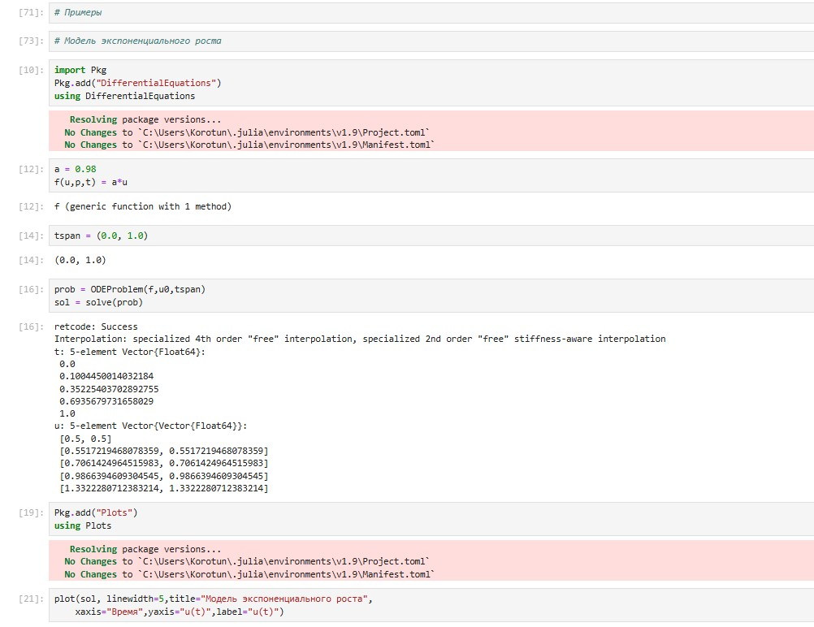

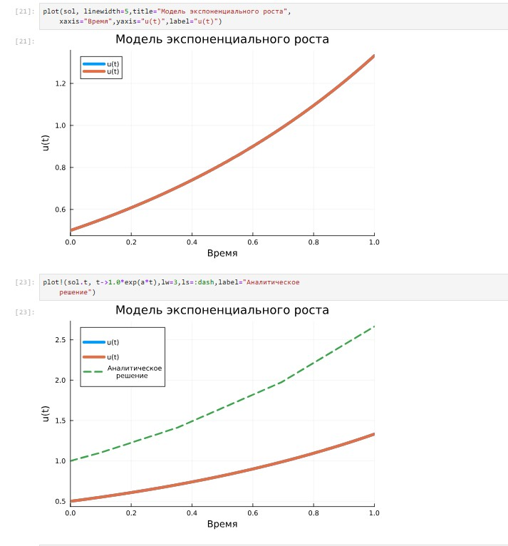

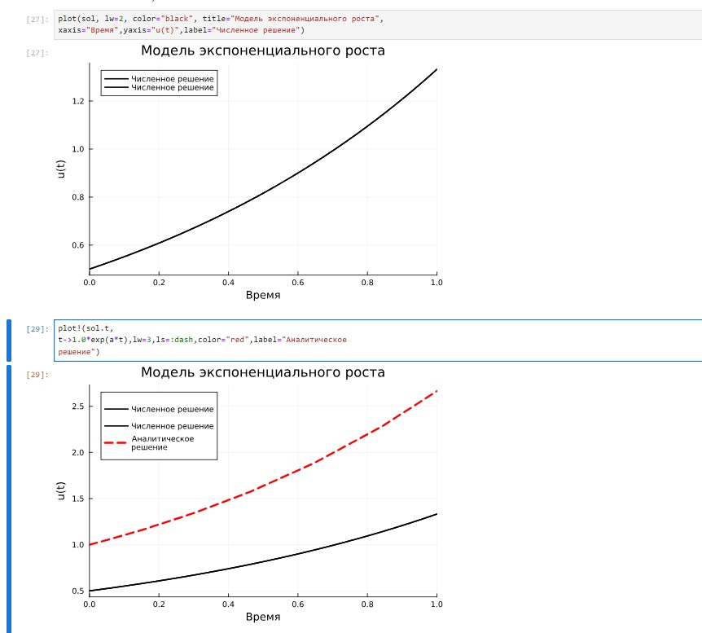

2.  Система Лоренца

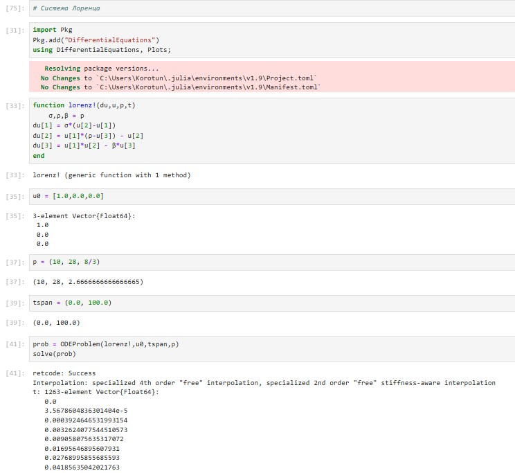

3. Модель Лотки–Вольтерры

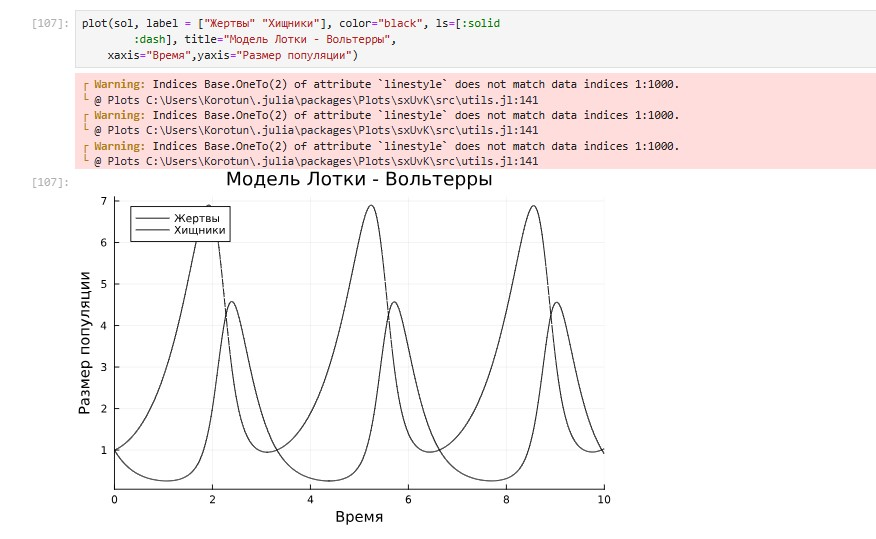

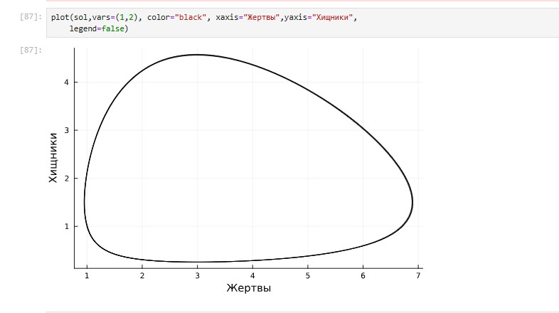

# Задания для самостоятельного выполнения

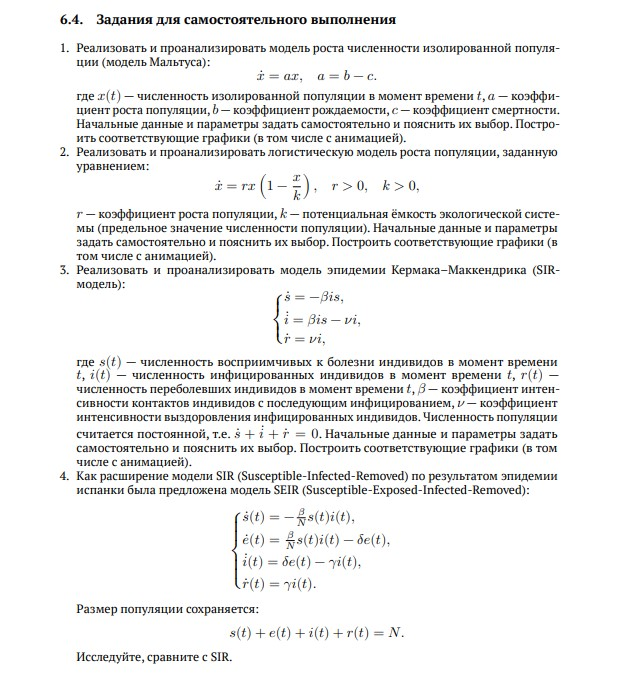

## №1 Модель Мальтуса

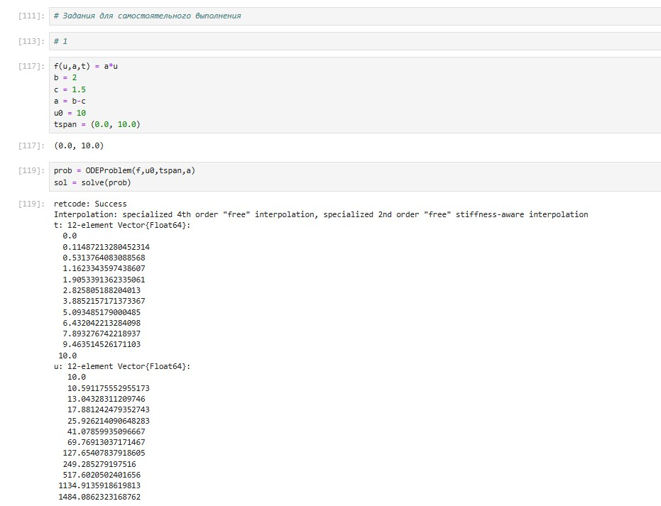

## №2 Модель роста популяции

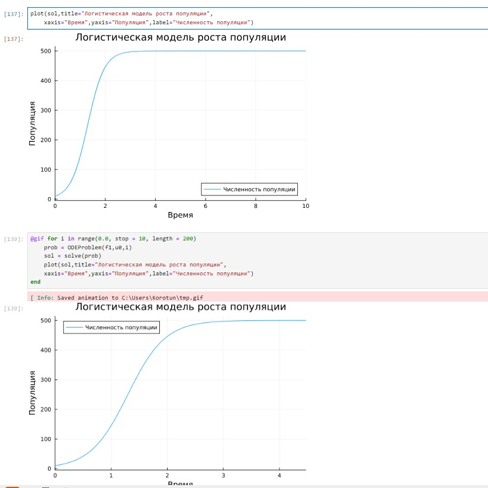

## №3 Модель эпидемии Кермака–Маккендрика (SIR модель)

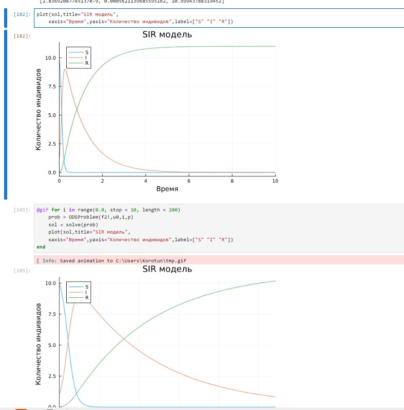

## №4 SEIR Модель

## №5 Дискретная модель Лотки–Вольтерры

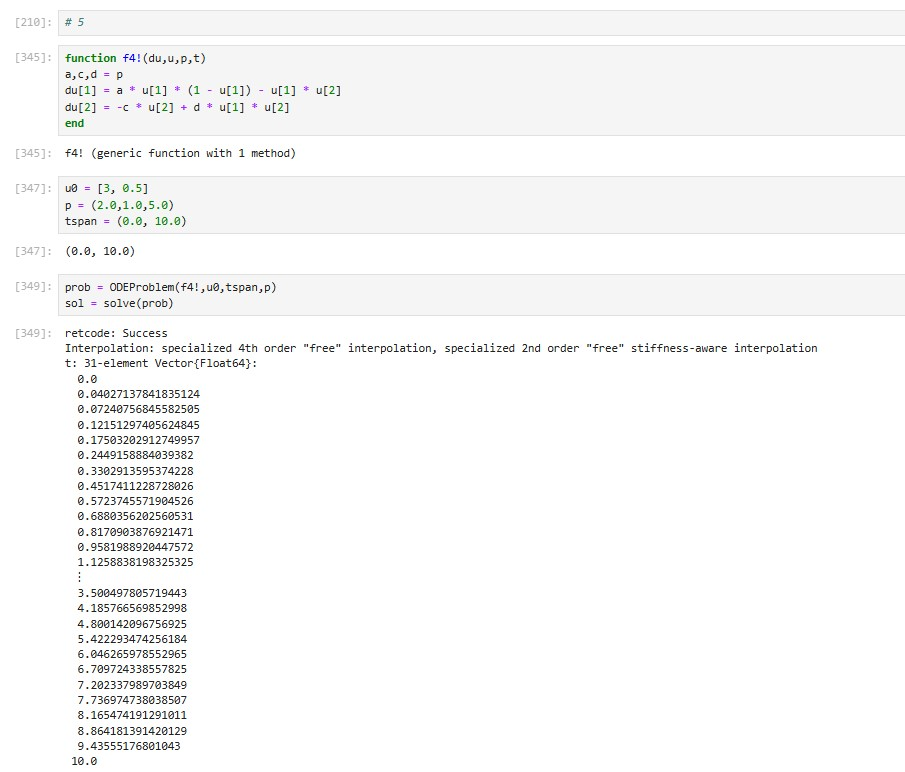

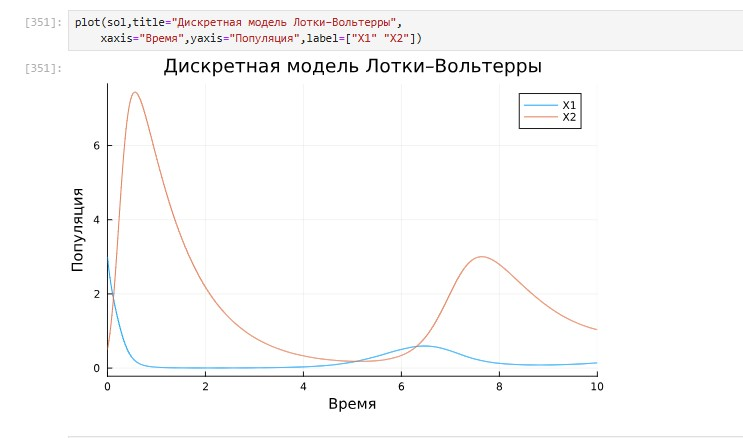

## Аналитичнское решение и фазовый портрет

## №6 Модель отбора на основе конкурентных отношений

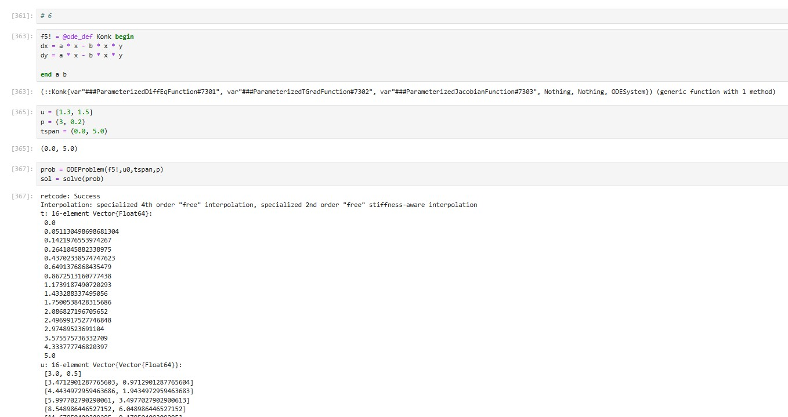

## Фазовый портрет

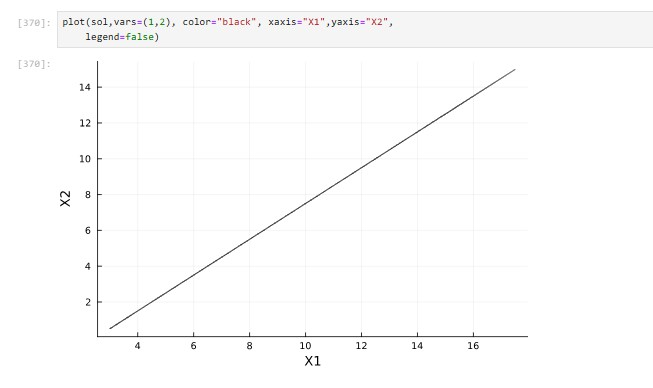

## №7 Модель консервативного гармонического осциллятора

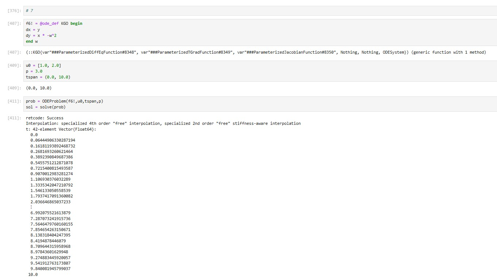

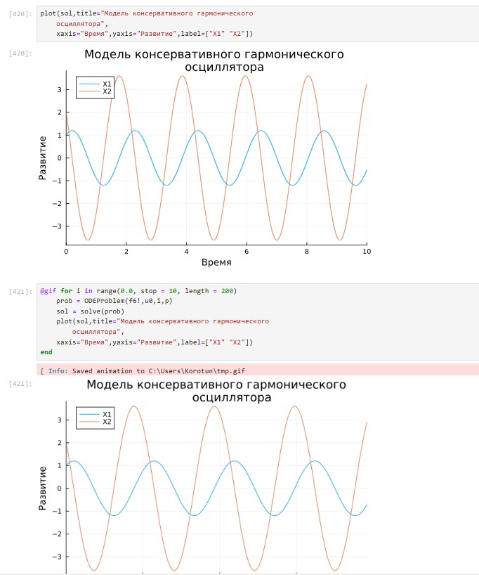

## Фазовый портрет

## №8 Модель свободных колебаний гармонического осциллятора

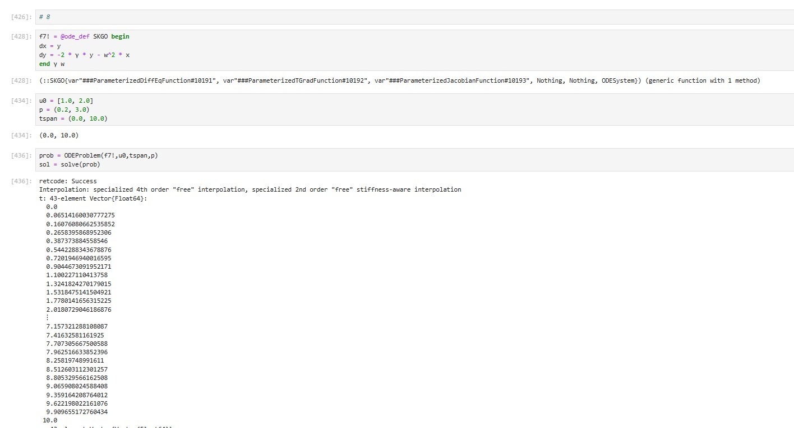

## Фазовый портрет

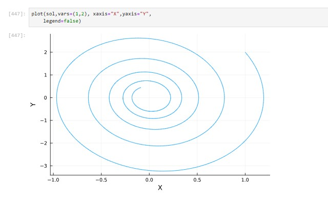

# Выводы

Я освоил специализированные пакеты для решения задач в непрерывном и дискретном времени. С помощью полученных навыков выполнил Лабораторную работу №6.

