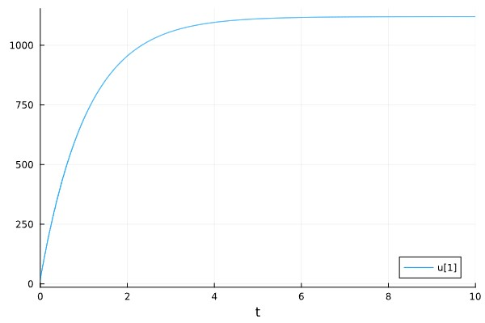
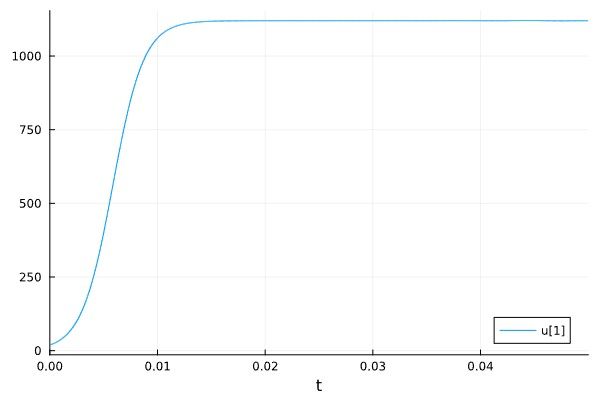
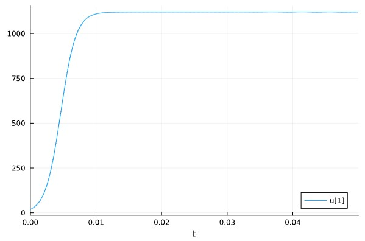
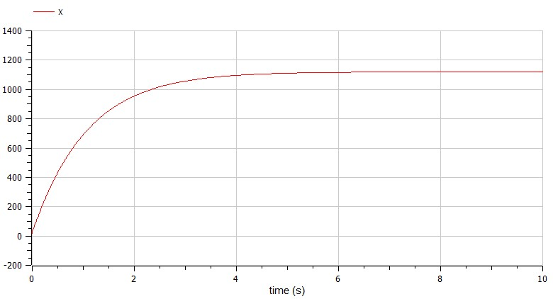
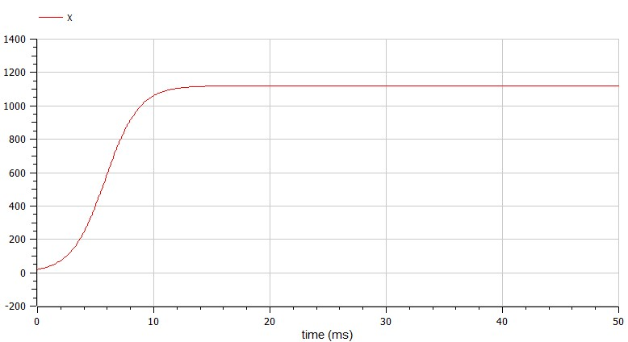
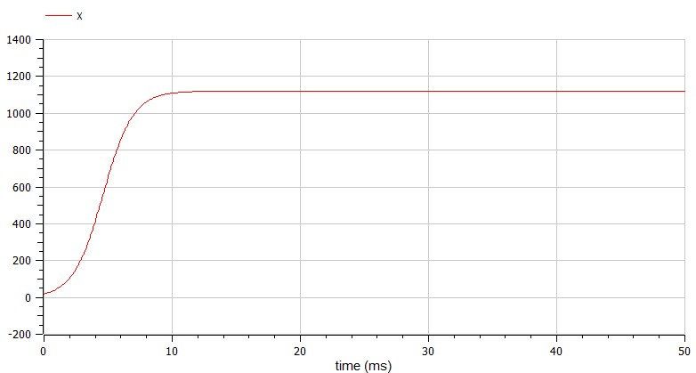

---
## Front matter
lang: ru-RU
title: Structural approach to the deep learning method
author: |
	Leonid A. Sevastianov\inst{1,3}
	\and
	Anton L. Sevastianov\inst{1}
	\and
	Edik A. Ayrjan\inst{2}
	\and
	Anna V. Korolkova\inst{1}
	\and
	Dmitry S. Kulyabov\inst{1,2}
	\and
	Imrikh Pokorny\inst{4}
institute: |
	\inst{1}RUDN University, Moscow, Russian Federation
	\and
	\inst{2}LIT JINR, Dubna, Russian Federation
	\and
	\inst{3}BLTP JINR, Dubna, Russian Federation
	\and
	\inst{4}Technical University of Košice, Košice, Slovakia
date: NEC--2019, 30 September -- 4 October, 2019 Budva, Montenegro

## Formatting
toc: false
slide_level: 2
theme: metropolis
header-includes: 
 - \metroset{progressbar=frametitle,sectionpage=progressbar,numbering=fraction}
 - '\makeatletter'
 - '\beamer@ignorenonframefalse'
 - '\makeatother'
aspectratio: 43
section-titles: true
---

# Лабораторная работа 7

## Коротун Илья Игоревич

## НКНбд-01-21

## Москва 2024г.

# Цели

Ознакомится с материалом по математической модели распространения рекламы и на основе полученных знаний выполнить Лабораторную работу №7.

# Задание

Вариант № 29

Постройте график распространения рекламы, математическая модель которой описывается следующим уравнением:

{ # уравнения }

При этом объем аудитории N=1120, в начальный момент о товаре знает 19 человек.
Для случая 2 определите в какой момент времени скорость распространения рекламы будет иметь максимальное значение

# Ход работы 

## Julia: 

## Для начала введем необходимые библиотеки

using DifferentialEquations

using Plots

## Зададим уравнения

promotion1(n,v,t) = (0.93 + 0.00003*n)*(v - n)

promotion2(n,v,t) = (0.00003 + 0.62*n)*(v - n)

promotion3(n,v,t) = (0.88*cos(t) + 0.77*cos(2*t)*n)*(v - n)

## Зададим начальные данные

v = 1120

x0 = 19

tspan1 = (0,10)

tspan2 = (0,0.05)

## Распишем решение и ввод графиков

problem1 = ODEProblem(promotion1, x0, tspan1, v)

solution1 = solve(problem1, Tsit5(), dtmax = 0.05)

problem2 = ODEProblem(promotion2, x0, tspan2, v)

solution2 = solve(problem2, Tsit5(), dtmax = 0.05)

problem3 = ODEProblem(promotion3, x0, tspan2, v)

solution3 = solve(problem3, Tsit5(), dtmax = 0.05)

plot(solution1)

plot(solution2)

plot(solution3)

## Посчитаем максимальную скорость для второго случая

begin
    skorost = [solution2(i, Val{1}) for i in 0.001:0.001:20]
    max_skorost = findfirst(x -> x == maximum(skorost), skorost)
end

## Результат 1 случай 

{ # случай 1}

## Результат 2 случай 

{ # случай 2}

## Результат 3 случай 

{ # случай 3}

## Теперь построим такой же график в OpenModelica

## 1 случай 

model Lab7

parameter Real a = 0.93;

parameter Real b = 0.00003;

parameter Real c = 1120;

Real X(start = 19);

equation

  der(X) = (a + b*X)*(c - X);

end Lab7;

{ # случай 1}

## 2 случай 

model Lab7

parameter Real a = 0.62;

parameter Real b = 0.00003;

parameter Real c = 1120;

Real X(start = 19);

equation

  der(X) = (b + a*X)*(c - X);

end Lab7;

{ # случай 2}

## 3 случай 

model Lab7

parameter Real a = 0.88;

parameter Real b = 0.77;

parameter Real c = 1120;

Real p;

Real q;

Real X(start = 19);

equation

  der(X) = (a*p + b*q*X)*(c - X);
  
  p = cos(time);
  
  q = cos(2*time);
  

end Lab7;

{ # случай 3}

# Выводы

Я ознакомился с материалом по математической модели распространения рекламы и на основе полученных знаний выполнил Лабораторную работу №7.

