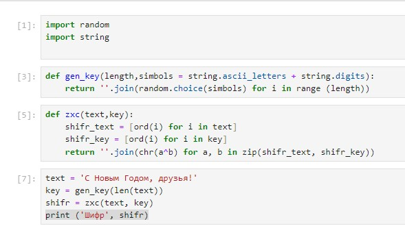
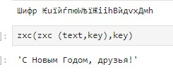

---
## Front matter
lang: ru-RU
title: Structural approach to the deep learning method
author: |
	Leonid A. Sevastianov\inst{1,3}
	\and
	Anton L. Sevastianov\inst{1}
	\and
	Edik A. Ayrjan\inst{2}
	\and
	Anna V. Korolkova\inst{1}
	\and
	Dmitry S. Kulyabov\inst{1,2}
	\and
	Imrikh Pokorny\inst{4}
institute: |
	\inst{1}RUDN University, Moscow, Russian Federation
	\and
	\inst{2}LIT JINR, Dubna, Russian Federation
	\and
	\inst{3}BLTP JINR, Dubna, Russian Federation
	\and
	\inst{4}Technical University of Košice, Košice, Slovakia
date: NEC--2019, 30 September -- 4 October, 2019 Budva, Montenegro

## Formatting
toc: false
slide_level: 2
theme: metropolis
header-includes: 
 - \metroset{progressbar=frametitle,sectionpage=progressbar,numbering=fraction}
 - '\makeatletter'
 - '\beamer@ignorenonframefalse'
 - '\makeatother'
aspectratio: 43
section-titles: true
---

# Лабораторная работа 7

## Коротун Илья Игоревич

## НКНбд-01-21

## Москва 2024г.

# Цели

Освоить на практике применение режима однократного гаммирования.

# Задание

Нужно подобрать ключ, чтобы получить сообщение «С Новым Годом, друзья!». Требуется разработать приложение, позволяющее шифровать и дешифровать данные в режиме однократного гаммирования. Приложение должно:

1. Определить вид шифротекста при известном ключе и известном открытом тексте.
2. Определить ключ, с помощью которого шифротекст может быть преобразован в некоторый фрагмент текста, представляющий собой один из возможных вариантов прочтения открытого текста.

# Ход работы 

Код на Python

Результат кода 

# Контрольные вопросы

1. Поясните смысл однократного гаммирования.

Однократное гаммирование это метод шифрования, при котором каждый символ открытого текста заменяется с помощью ключа только один раз. Один и тот же ключ не может использоваться для нескольких сообщений.

2. Перечислите недостатки однократного гаммирования.

- небезопасность
- сложность управления большим количеством ключей.

3. Перечислите преимущества однократного гаммирования.

- отсутствие структуры в зашифрованном тексте.

4. Почему длина открытого текста должна совпадать с длиной ключа?

Для обеспечения абсолютной стойкости шифра.

5. Какая операция используется в режиме однократного гаммирования, назовите её особенности?

Операция XOR. Основное свойство - обратимость.

6. Как по открытому тексту и ключу получить шифротекст?

С помощью операции XOR между открытым текстом и ключом.

7. Как по открытому тексту и шифротексту получить ключ?

С помощью операции XOR между открытым текстом и зашифрованным текстом.

8. В чем заключаются необходимые и достаточные условия абсолютной стойкости шифра?

– полная случайность ключа
– равенство длин ключа и открытого текста
– однократное использование ключа

# Выводы

Я освоил на практике применение режима однократного гаммирования и выполнил задание, поставленное в Лабораторной работе 7.
