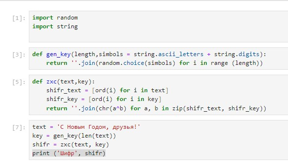
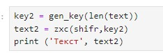
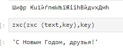

---
## Front matter
title: "Лабораторная работа №7"
subtitle: " Элементы криптографии. Однократное гаммирование"
author: "Коротун Илья Игоревич"

## Generic otions
lang: ru-RU
toc-title: "Содержание"

## Bibliography
bibliography: bib/cite.bib
csl: pandoc/csl/gost-r-7-0-5-2008-numeric.csl

## Pdf output format
toc: true # Table of contents
toc-depth: 2
lof: true # List of figures
lot: true # List of tables
fontsize: 12pt
linestretch: 1.5
papersize: a4
documentclass: scrreprt
## I18n polyglossia
polyglossia-lang:
  name: russian
  options:
	- spelling=modern
	- babelshorthands=true
polyglossia-otherlangs:
  name: english
## I18n babel
babel-lang: russian
babel-otherlangs: english
## Fonts
mainfont: PT Serif
romanfont: PT Serif
sansfont: PT Sans
monofont: PT Mono
mainfontoptions: Ligatures=TeX
romanfontoptions: Ligatures=TeX
sansfontoptions: Ligatures=TeX,Scale=MatchLowercase
monofontoptions: Scale=MatchLowercase,Scale=0.9
## Biblatex
biblatex: true
biblio-style: "gost-numeric"
biblatexoptions:
  - parentracker=true
  - backend=biber
  - hyperref=auto
  - language=auto
  - autolang=other*
  - citestyle=gost-numeric
## Pandoc-crossref LaTeX customization
figureTitle: "Рис."
tableTitle: "Таблица"
listingTitle: "Листинг"
lofTitle: "Список иллюстраций"
lotTitle: "Список таблиц"
lolTitle: "Листинги"
## Misc options
indent: true
header-includes:
  - \usepackage{indentfirst}
  - \usepackage{float} # keep figures where there are in the text
  - \floatplacement{figure}{H} # keep figures where there are in the text
---

# Цель работы

Освоить на практике применение режима однократного гаммирования.

# Задание

Нужно подобрать ключ, чтобы получить сообщение «С Новым Годом, друзья!». Требуется разработать приложение, позволяющее шифровать и дешифровать данные в режиме однократного гаммирования. Приложение должно:

1. Определить вид шифротекста при известном ключе и известном открытом тексте.
2. Определить ключ, с помощью которого шифротекст может быть преобразован в некоторый фрагмент текста, представляющий собой один из возможных вариантов прочтения открытого текста.

# Теоретическое введение

Гаммирование представляет собой наложение (снятие) на открытые (зашифрованные) данные последовательности элементов других данных, полученной с помощью некоторого криптографического алгоритма, для получения зашифрованных (открытых) данных. Иными словами, наложение гаммы — это сложение её элементов с элементами открытого (закрытого) текста по некоторому фиксированному модулю, значение которого представляет собой известную часть алгоритма шифрования. В соответствии с теорией криптоанализа, если в методе шифрования используется однократная вероятностная гамма (однократное гаммирование) той же длины, что и подлежащий сокрытию текст, то текст нельзя раскрыть. Даже при раскрытии части последовательности гаммы нельзя получить информацию о всём скрываемом тексте.

# Выполнение лабораторной работы

Код на Python

Результат кода 

# Контрольные вопросы

1. Поясните смысл однократного гаммирования.

Однократное гаммирование это метод шифрования, при котором каждый символ открытого текста заменяется с помощью ключа только один раз. Один и тот же ключ не может использоваться для нескольких сообщений.

2. Перечислите недостатки однократного гаммирования.

- небезопасность
- сложность управления большим количеством ключей.

3. Перечислите преимущества однократного гаммирования.

- отсутствие структуры в зашифрованном тексте.

4. Почему длина открытого текста должна совпадать с длиной ключа?

Для обеспечения абсолютной стойкости шифра.

5. Какая операция используется в режиме однократного гаммирования, назовите её особенности?

Операция XOR. Основное свойство - обратимость.

6. Как по открытому тексту и ключу получить шифротекст?

С помощью операции XOR между открытым текстом и ключом.

7. Как по открытому тексту и шифротексту получить ключ?

С помощью операции XOR между открытым текстом и зашифрованным текстом.

8. В чем заключаются необходимые и достаточные условия абсолютной стойкости шифра?

– полная случайность ключа
– равенство длин ключа и открытого текста
– однократное использование ключа

# Выводы

Я освоил на практике применение режима однократного гаммирования и выполнил задание, поставленное в Лабораторной работе 7.

