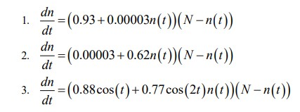
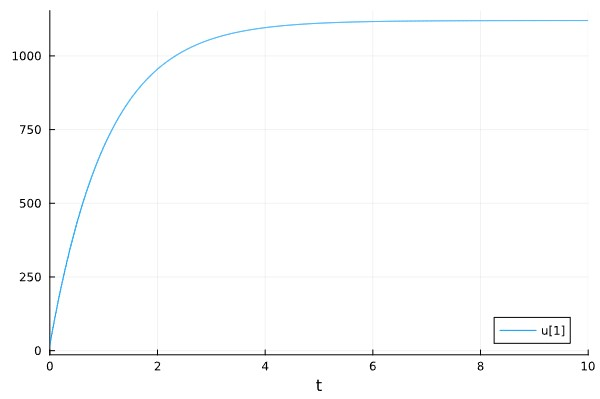
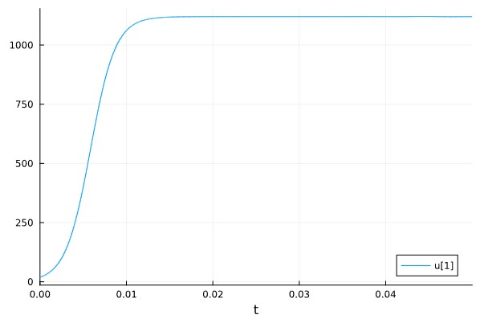
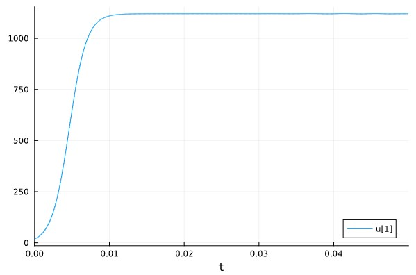
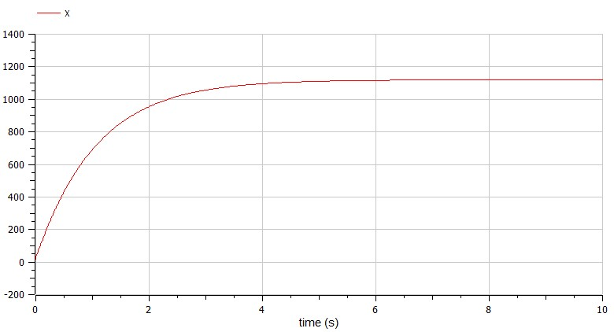
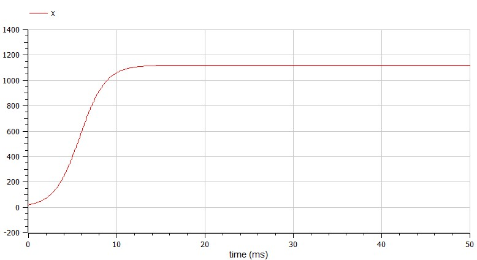
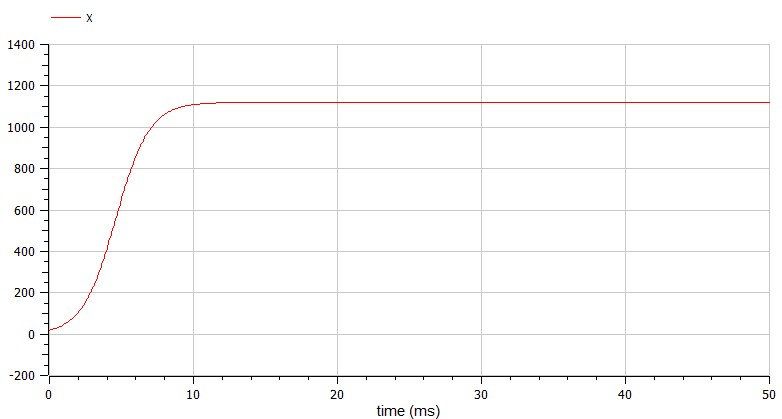

---
## Front matter
title: "Лабораторная работа №7"
subtitle: "Эффективность рекламы"
author: "Коротун Илья Игоревич"

## Generic otions
lang: ru-RU
toc-title: "Содержание"

## Bibliography
bibliography: bib/cite.bib
csl: pandoc/csl/gost-r-7-0-5-2008-numeric.csl

## Pdf output format
toc: true # Table of contents
toc-depth: 2
lof: true # List of figures
lot: true # List of tables
fontsize: 12pt
linestretch: 1.5
papersize: a4
documentclass: scrreprt
## I18n polyglossia
polyglossia-lang:
  name: russian
  options:
	- spelling=modern
	- babelshorthands=true
polyglossia-otherlangs:
  name: english
## I18n babel
babel-lang: russian
babel-otherlangs: english
## Fonts
mainfont: PT Serif
romanfont: PT Serif
sansfont: PT Sans
monofont: PT Mono
mainfontoptions: Ligatures=TeX
romanfontoptions: Ligatures=TeX
sansfontoptions: Ligatures=TeX,Scale=MatchLowercase
monofontoptions: Scale=MatchLowercase,Scale=0.9
## Biblatex
biblatex: true
biblio-style: "gost-numeric"
biblatexoptions:
  - parentracker=true
  - backend=biber
  - hyperref=auto
  - language=auto
  - autolang=other*
  - citestyle=gost-numeric
## Pandoc-crossref LaTeX customization
figureTitle: "Рис."
tableTitle: "Таблица"
listingTitle: "Листинг"
lofTitle: "Список иллюстраций"
lotTitle: "Список таблиц"
lolTitle: "Листинги"
## Misc options
indent: true
header-includes:
  - \usepackage{indentfirst}
  - \usepackage{float} # keep figures where there are in the text
  - \floatplacement{figure}{H} # keep figures where there are in the text
---

# Цель работы

Ознакомится с материалом по математической модели распространения рекламы и на основе полученных знаний выполнить Лабораторную работу №7.

# Задание

Вариант № 29
Постройте график распространения рекламы, математическая модель которой описывается следующим уравнением:

{ # уравнения }

# Теоретическое введение

Организуется рекламная кампания нового товара или услуги. Необходимо, чтобы прибыль будущих продаж с избытком покрывала издержки на рекламу. Вначале расходы могут превышать прибыль, поскольку лишь малая часть потенциальных покупателей будет информирована о новинке. Затем, при увеличении числа продаж, возрастает и прибыль, и, наконец, наступит момент, когда рынок насытиться, и рекламировать товар станет бесполезным.
Предположим, что торговыми учреждениями реализуется некоторая продукция, о которой в момент времени t из числа потенциальных покупателей N знает лишь n покупателей. Для ускорения сбыта продукции запускается реклама
по радио, телевидению и других средств массовой информации. После запуска рекламной кампании информация о продукции начнет распространяться среди потенциальных покупателей путем общения друг с другом. Таким образом, после
запуска рекламных объявлений скорость изменения числа знающих о продукции людей пропорциональна как числу знающих о товаре покупателей, так и числу покупателей о нем не знающих.

Модель рекламной кампании описывается следующими величинами. Считаем, что dn/dt - скорость изменения со временем числа потребителей, узнавших о товаре и готовых его купить,
t - время, прошедшее с начала рекламной кампании, n(t) - число уже информированных клиентов.

Эта величина пропорциональна числу покупателей, еще не знающих о нем, это описывается следующим образом:
α1(t)(N-n(t)), где N - общее число потенциальных платежеспособных покупателей, α1(t) > 0 - характеризует интенсивность рекламной кампании (зависит от затрат на рекламу в данный момент времени).
Помимо этого, узнавшие о товаре потребители также распространяют полученную информацию среди потенциальных покупателей, не знающих о нем (в этом случа работает т.н. сарафанное радио).
Этот вклад в рекламу описывается величиной α2(t)n(t)(N-n(t)) , эта величина увеличивается с увеличением потребителей узнавших о товаре. Математическая модель распространения рекламы описывается
уравнением: dn/dt = (α1(t)+α2(t)n(t))(N-n(t))

# Выполнение лабораторной работы

## Julia: 

## Для начала введем необходимые библиотеки

using DifferentialEquations

using Plots

## Зададим уравнения

promotion1(n,v,t) = (0.93 + 0.00003*n)*(v - n)

promotion2(n,v,t) = (0.00003 + 0.62*n)*(v - n)

promotion3(n,v,t) = (0.88*cos(t) + 0.77*cos(2*t)*n)*(v - n)

## Зададим начальные данные

v = 1120

x0 = 19

tspan1 = (0,10)

tspan2 = (0,0.05)

## Распишем решение и ввод графиков

problem1 = ODEProblem(promotion1, x0, tspan1, v)

solution1 = solve(problem1, Tsit5(), dtmax = 0.05)

problem2 = ODEProblem(promotion2, x0, tspan2, v)

solution2 = solve(problem2, Tsit5(), dtmax = 0.05)

problem3 = ODEProblem(promotion3, x0, tspan2, v)

solution3 = solve(problem3, Tsit5(), dtmax = 0.05)

plot(solution1)

plot(solution2)

plot(solution3)

## Посчитаем максимальную скорость для второго случая

begin
    skorost = [solution2(i, Val{1}) for i in 0.001:0.001:20]
    max_skorost = findfirst(x -> x == maximum(skorost), skorost)
end

## Результат 1 случай 

{ # случай 1}

## Результат 2 случай 

{ # случай 2}

## Результат 3 случай 

{ # случай 3}

## Теперь построим такой же график в OpenModelica

## 1 случай 

model Lab7

parameter Real a = 0.93;

parameter Real b = 0.00003;

parameter Real c = 1120;

Real X(start = 19);

equation

  der(X) = (a + b*X)*(c - X);

end Lab7;

{ # случай 1}

## 2 случай 

model Lab7

parameter Real a = 0.62;

parameter Real b = 0.00003;

parameter Real c = 1120;

Real X(start = 19);

equation

  der(X) = (b + a*X)*(c - X);

end Lab7;

{ # случай 2}

## 3 случай 

model Lab7

parameter Real a = 0.88;

parameter Real b = 0.77;

parameter Real c = 1120;

Real p;

Real q;

Real X(start = 19);

equation

  der(X) = (a*p + b*q*X)*(c - X);
  
  p = cos(time);
  
  q = cos(2*time);
  

end Lab7;

{ # случай 3}

# Выводы

Я ознакомился с материалом по математической модели распространения рекламы и на основе полученных знаний выполнил Лабораторную работу №7.

# Список литературы{.unnumbered}
::: {#refs}
:::
