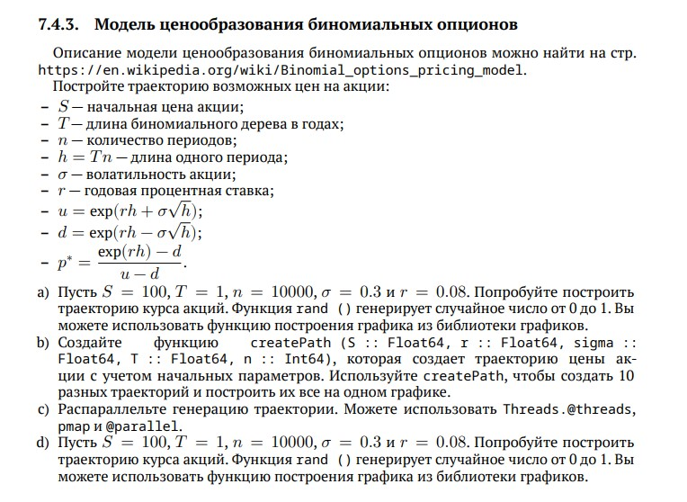

---
## Front matter
title: "Лабораторная работа №7"
subtitle: " Введение в работу с данными"
author: "Коротун Илья Игоревич"

## Generic otions
lang: ru-RU
toc-title: "Содержание"

## Bibliography
bibliography: bib/cite.bib
csl: pandoc/csl/gost-r-7-0-5-2008-numeric.csl

## Pdf output format
toc: true # Table of contents
toc-depth: 2
lof: true # List of figures
lot: true # List of tables
fontsize: 12pt
linestretch: 1.5
papersize: a4
documentclass: scrreprt
## I18n polyglossia
polyglossia-lang:
  name: russian
  options:
	- spelling=modern
	- babelshorthands=true
polyglossia-otherlangs:
  name: english
## I18n babel
babel-lang: russian
babel-otherlangs: english
## Fonts
mainfont: PT Serif
romanfont: PT Serif
sansfont: PT Sans
monofont: PT Mono
mainfontoptions: Ligatures=TeX
romanfontoptions: Ligatures=TeX
sansfontoptions: Ligatures=TeX,Scale=MatchLowercase
monofontoptions: Scale=MatchLowercase,Scale=0.9
## Biblatex
biblatex: true
biblio-style: "gost-numeric"
biblatexoptions:
  - parentracker=true
  - backend=biber
  - hyperref=auto
  - language=auto
  - autolang=other*
  - citestyle=gost-numeric
## Pandoc-crossref LaTeX customization
figureTitle: "Рис."
tableTitle: "Таблица"
listingTitle: "Листинг"
lofTitle: "Список иллюстраций"
lotTitle: "Список таблиц"
lolTitle: "Листинги"
## Misc options
indent: true
header-includes:
  - \usepackage{indentfirst}
  - \usepackage{float} # keep figures where there are in the text
  - \floatplacement{figure}{H} # keep figures where there are in the text
---

# Цель работы

Основной целью работы является использование специализированных пакетов Julia для обработки данных.

# Задание

1. Используя Jupyter Lab, повторите примеры из раздела 7.2.
2. Выполните задания для самостоятельной работы (раздел 7.4).

# Теоретическое введение

Обработка и анализ данных, полученных в результате проведения исследований, — важная и неотъемлемая часть исследовательской деятельности. Большое значение имеет выявление определённых связей и закономерностей в имеющихся неструктурированных данных, особенно в данных больших размерностей. Выявленные в данных связей и закономерностей позволяет строить прогнозные модели с предполагаемым результатом. Для решения таких задач применяют методы из таких областей знаний как математическая статистика, программирование, искусственный интеллект, машинное обучение.

# Выполнение лабораторной работы

## Повторил примеры из методички

## Julia для науки о данных

# 1. Считывание данных

# 2. Запись данных в файл

# 3. Словари

# 4. RDatasets

# 5. Работа с переменными отсутствующего типа (Missing Values)

# 6. FileIO

## Обработка данных: стандартные алгоритмы машинного обучения в Julia

# Кластеризация данных. Метод k-средних

# Кластеризация данных. Метод k ближайших соседей

# Обработка данных. Метод главных компонентов

# Обработка данных. Линейная регрессия

## Задания для самостоятельного выполнения

# Кластеризация

#  Регрессия (метод наименьших квадратов в случае линейной регрессии)

# Часть 1

# Часть 2

# Модель ценообразования биномиальных опционов

# Выводы

Я освоил специализированные пакеты Julia для обработки данных и выполнил задания, поставленные в Лабораторной работе 7.

