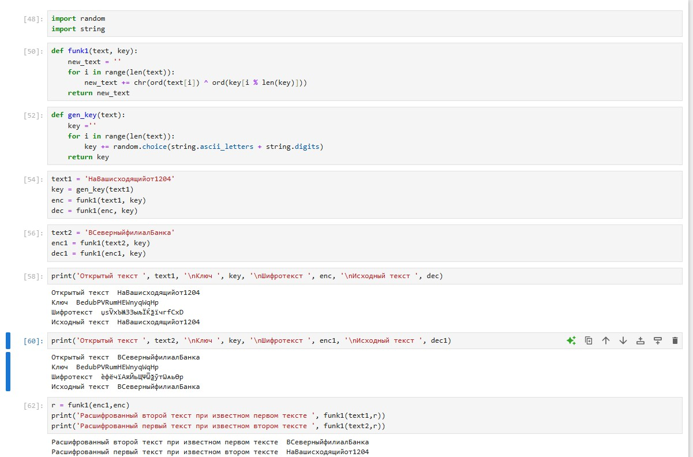

---
## Front matter
lang: ru-RU
title: Structural approach to the deep learning method
author: |
	Leonid A. Sevastianov\inst{1,3}
	\and
	Anton L. Sevastianov\inst{1}
	\and
	Edik A. Ayrjan\inst{2}
	\and
	Anna V. Korolkova\inst{1}
	\and
	Dmitry S. Kulyabov\inst{1,2}
	\and
	Imrikh Pokorny\inst{4}
institute: |
	\inst{1}RUDN University, Moscow, Russian Federation
	\and
	\inst{2}LIT JINR, Dubna, Russian Federation
	\and
	\inst{3}BLTP JINR, Dubna, Russian Federation
	\and
	\inst{4}Technical University of Košice, Košice, Slovakia
date: NEC--2019, 30 September -- 4 October, 2019 Budva, Montenegro

## Formatting
toc: false
slide_level: 2
theme: metropolis
header-includes: 
 - \metroset{progressbar=frametitle,sectionpage=progressbar,numbering=fraction}
 - '\makeatletter'
 - '\beamer@ignorenonframefalse'
 - '\makeatother'
aspectratio: 43
section-titles: true
---

# Лабораторная работа 8

## Коротун Илья Игоревич

## НКНбд-01-21

## Москва 2024г.

# Цели

Освоить на практике применение режима однократного гаммирования на примере кодирования различных исходных текстов одним ключом.

# Задание

Два текста кодируются одним ключом (однократное гаммирование).
Требуется не зная ключа и не стремясь его определить, прочитать оба текста. Необходимо разработать приложение, позволяющее шифровать и дешифровать тексты P1 и P2 в режиме однократного гаммирования. Приложение должно определить вид шифротекстов C1 и C2 обоих текстов P1 и P2 при известном ключе ; Необходимо определить и выразить аналитически способ, при котором злоумышленник может прочитать оба текста, не зная ключа и не стремясь его определить

# Ход работы 

Код на Python

# Контрольные вопросы

1. Как, зная один из текстов (P1 или P2), определить другой, не зная при этом ключа?

Для определения другого текста (P2) можно взять зашифрованные тексты C1 C2, применить к ним XOR и также к известному тексту

2. Что будет при повторном использовании ключа при шифровании текста?

Мы получим дешифрованный текст.

3. Как реализуется режим шифрования однократного гаммирования одним ключом двух открытых текстов?

Путем XOR-ирования каждого однокрастного бита первого текста с соответсвующим битом ключа или второго текста.

4. Перечислите недостатки шифрования одним ключом двух открытых текстов.

Возможность раскрытия ключа или текстов при известном открытом тексте.

5. Перечислите преимущества шифрования одним ключом двух открытых текстов.

Использование одного ключа для шифрования нескольких сообщений без необходимости создания нового ключа и выделения на него памяти.

# Выводы

Я освоил на практике применение режима однократного гаммирования на примере кодирования различных исходных текстов одним ключом.
