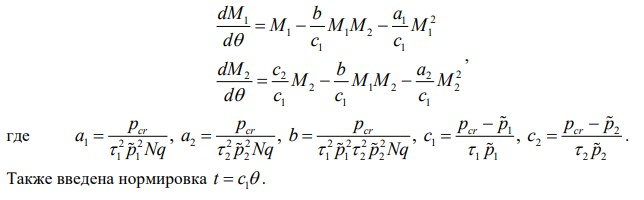
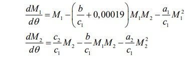
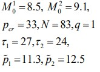
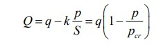
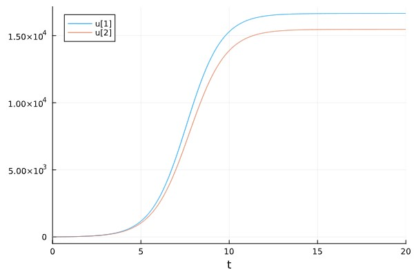
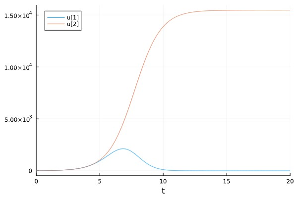
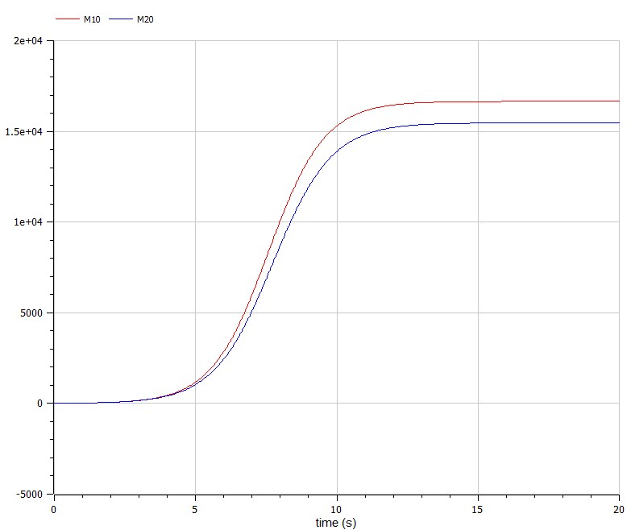
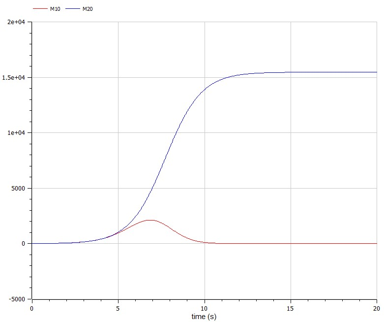

---
## Front matter
title: "Лабораторная работа №8"
subtitle: "Модель конкуренции двух фирм"
author: "Коротун Илья Игоревич"

## Generic otions
lang: ru-RU
toc-title: "Содержание"

## Bibliography
bibliography: bib/cite.bib
csl: pandoc/csl/gost-r-7-0-5-2008-numeric.csl

## Pdf output format
toc: true # Table of contents
toc-depth: 2
lof: true # List of figures
lot: true # List of tables
fontsize: 12pt
linestretch: 1.5
papersize: a4
documentclass: scrreprt
## I18n polyglossia
polyglossia-lang:
  name: russian
  options:
	- spelling=modern
	- babelshorthands=true
polyglossia-otherlangs:
  name: english
## I18n babel
babel-lang: russian
babel-otherlangs: english
## Fonts
mainfont: PT Serif
romanfont: PT Serif
sansfont: PT Sans
monofont: PT Mono
mainfontoptions: Ligatures=TeX
romanfontoptions: Ligatures=TeX
sansfontoptions: Ligatures=TeX,Scale=MatchLowercase
monofontoptions: Scale=MatchLowercase,Scale=0.9
## Biblatex
biblatex: true
biblio-style: "gost-numeric"
biblatexoptions:
  - parentracker=true
  - backend=biber
  - hyperref=auto
  - language=auto
  - autolang=other*
  - citestyle=gost-numeric
## Pandoc-crossref LaTeX customization
figureTitle: "Рис."
tableTitle: "Таблица"
listingTitle: "Листинг"
lofTitle: "Список иллюстраций"
lotTitle: "Список таблиц"
lolTitle: "Листинги"
## Misc options
indent: true
header-includes:
  - \usepackage{indentfirst}
  - \usepackage{float} # keep figures where there are in the text
  - \floatplacement{figure}{H} # keep figures where there are in the text
---

# Цель работы
Ознакомится с материалом и на основе полученных знаний выполнить Лабораторную работу №8 в которой необходимо было построить модели конкурирующих фирм. 

# Задание

Случай 1. Рассмотрим две фирмы, производящие взаимозаменяемые товары одинакового качества и находящиеся в одной рыночной нише. Считаем, что в рамках
нашей модели конкурентная борьба ведётся только рыночными методами. То есть, конкуренты могут влиять на противника путем изменения параметров своего
производства: себестоимость, время цикла, но не могут прямо вмешиваться в ситуацию на рынке («назначать» цену или влиять на потребителей каким-либо иным
способом.) Будем считать, что постоянные издержки пренебрежимо малы, и в модели учитывать не будем. В этом случае динамика изменения объемов продаж
фирмы 1 и фирмы 2 описывается следующей системой уравнений:

{условие 1}

Случай 2. Рассмотрим модель, когда, помимо экономического фактора влияния (изменение себестоимости, производственного цикла, использование
кредита и т.п.), используются еще и социально-психологические факторы – формирование общественного предпочтения одного товара другому, не зависимо от
их качества и цены. В этом случае взаимодействие двух фирм будет зависеть друг от друга, соответственно коэффициент перед M1 M2 будет отличаться. Пусть в
рамках рассматриваемой модели динамика изменения объемов продаж фирмы 1 и фирмы 2 описывается следующей системой уравнений:

{условие 2}

Для обоих случаев рассмотрим задачу со следующими начальными условиями и параметрами:

{условие 2}

# Теоретическое введение

Модель одной фирмы
Для построения модели конкуренции хотя бы двух фирм необходимо
рассмотреть модель одной фирмы. Вначале рассмотрим модель фирмы,
производящей продукт долговременного пользования, когда цена его определяется
балансом спроса и предложения. Примем, что этот продукт занимает
определенную нишу рынка и конкуренты в ней отсутствуют.
Обозначим:
N – число потребителей производимого продукта.
S – доходы потребителей данного продукта. Считаем, что доходы всех
потребителей одинаковы. Это предположение справедливо, если речь идет об
одной рыночной нише, т.е. производимый продукт ориентирован на определенный
слой населения.
M – оборотные средства предприятия
τ – длительность производственного цикла
p – рыночная цена товара
p̃ – себестоимость продукта, то есть переменные издержки на производство
единицы продукции.
δ – доля оборотных средств, идущая на покрытие переменных издержек.
κ – постоянные издержки, которые не зависят от количества выпускаемой
продукции.
Q(S/p) – функция спроса, зависящая от отношения дохода S к цене p. Она
равна количеству продукта, потребляемого одним потребителем в единицу
времени.
Функцию спроса товаров долговременного использования часто
представляют в простейшей форме:

{функция}

где q – максимальная потребность одного человека в продукте в единицу времени.
Эта функция падает с ростом цены и при p = pcr (критическая стоимость продукта)
потребители отказываются от приобретения товара. Величина pcr = Sq/k.
Параметр k – мера эластичности функции спроса по цене. Таким образом, функция
спроса в форме (1) является пороговой (то есть, Q(S/p) = 0 при p ≥ pcr) и обладает
свойствами насыщения.

# Выполнение лабораторной работы

## Julia:

## Для начала введем необходимые библиотеки

using DifferentialEquations
using Plots

## Зададим параметры

M10 = 8.5
M20 = 9.1
Pcr = 33
N = 83
q = 1
t1 = 27
t2 = 24
p1 = 11.3
p2 = 12.5

## Зададим функции

function funk1(du ,u ,p ,t )

    a1, a2, b, c1, c2 = p
    du[1] = u[1] - b/c1 * u[1] * u[2] - a1/c1 * u[1]^2
    du[2] = c2/c1 * u[2] - b/c1 * u[1]*u[2] - a2/c1 * u[2]^2
    
end

function funk2(du ,u ,p ,t )

    a1, a2, b, c1, c2 = p
    du[1] = u[1] - (b/c1 +0.00019) * u[1] * u[2] - a1/c1 * u[1]^2
    du[2] = c2/c1 * u[2] - b/c1 * u[1]*u[2] - a2/c1 * u[2]^2
    
end

a1 = Pcr/(t1^2 * p1^2 * N * q)
a2 = Pcr/(t2^2 * p2^2 * N * q)
b = Pcr/(t1^2 * p1^2 * t2^2 * p2^2 * N * q)
c1 = (Pcr - p1)/(t1 * p1)
c2 = (Pcr - p2)/(t2 * p2)

p = [a1, a2, b ,c1 ,c2]
tspan = (0, 20)

## Распишем решение и ввод графиков

problem1 = ODEProblem(funk1, [M10, M20], tspan, p)
solution1 = solve(problem1, Tsit5(), dtmax = 0.05)

problem2 = ODEProblem(funk2, [M10, M20], tspan, p)
solution2 = solve(problem2, Tsit5(), dtmax = 0.05)

plot(solution1)
plot(solution2)

## Результат случай 1

{случай 1}

## Результат случай 2

{случай 2}

## Теперь построим такой же график в OpenModelica

## 1 случай 

model lab8

parameter Real Pcr = 33;
parameter Real N = 83;
parameter Real q = 1;
parameter Real t1 = 27;
parameter Real t2 = 24;
parameter Real p1 = 11.3;
parameter Real p2 = 12.5;

parameter Real a1 = Pcr/(t1^2 * p1^2 * N * q);
parameter Real a2 = Pcr/(t2^2 * p2^2 * N * q);
parameter Real b = Pcr/(t1^2 * p1^2 * t2^2 * p2^2 * N * q);
parameter Real c1 = (Pcr - p1)/(t1 * p1);
parameter Real c2 = (Pcr - p2)/(t2 * p2);

Real M10(start = 8.5);
Real M20(start = 9.1);

equation

 der(M10) = M10 - b/c1 * M10 * M20 - a1/c1 * M10^2;
 der(M20) = c2/c1 * M20 - b/c1 * M10 * M20 - a2/c1 * M20^2;

end lab8;

{случай 1}

## 2 случай 

model lab8

parameter Real Pcr = 33;
parameter Real N = 83;
parameter Real q = 1;
parameter Real t1 = 27;
parameter Real t2 = 24;
parameter Real p1 = 11.3;
parameter Real p2 = 12.5;

parameter Real a1 = Pcr/(t1^2 * p1^2 * N * q);
parameter Real a2 = Pcr/(t2^2 * p2^2 * N * q);
parameter Real b = Pcr/(t1^2 * p1^2 * t2^2 * p2^2 * N * q);
parameter Real c1 = (Pcr - p1)/(t1 * p1);
parameter Real c2 = (Pcr - p2)/(t2 * p2);

Real M10(start = 8.5);
Real M20(start = 9.1);

equation

 der(M10) = M10 - (b/c1 + 0.00019) * M10 * M20 - a1/c1 * M10^2;
 der(M20) = c2/c1 * M20 - b/c1 * M10 * M20 - a2/c1 * M20^2;

end lab8;

{случай 2}

# Выводы

Я ознакомился с материалом и на основе полученных знаний выполнил Лабораторную работу №8 в которой необходимо было построить модели конкурирующих фирм. 

# Список литературы{.unnumbered}
::: {#refs}
:::

