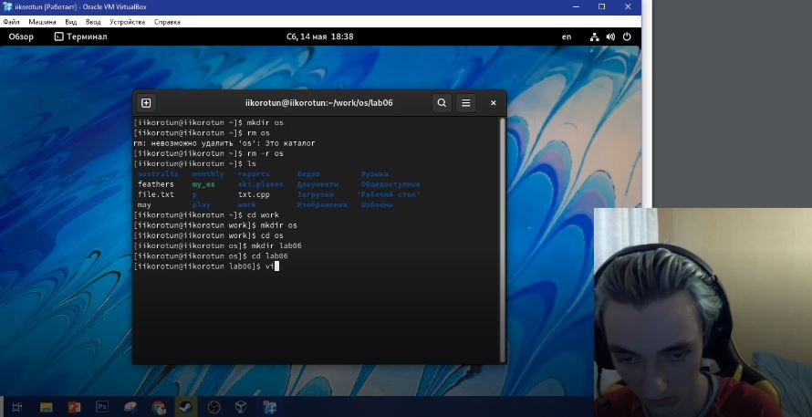
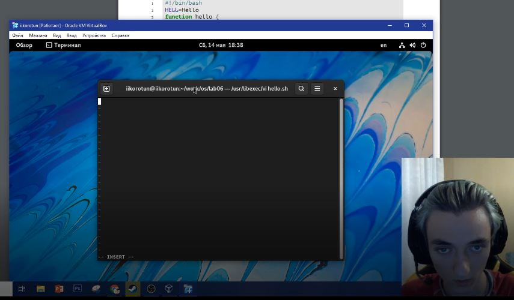
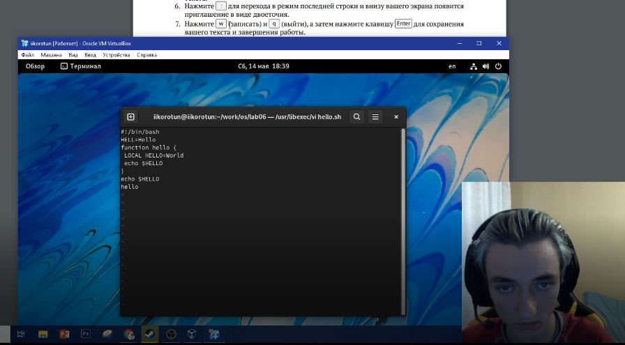
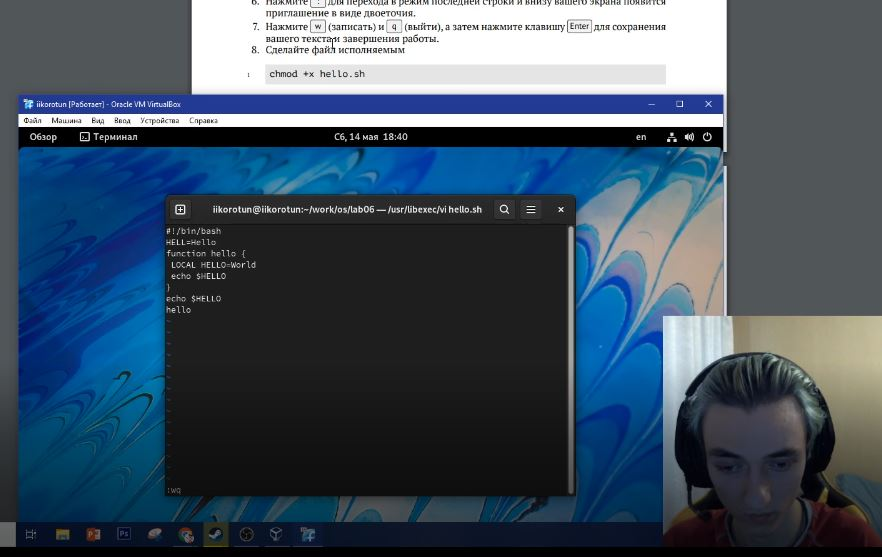
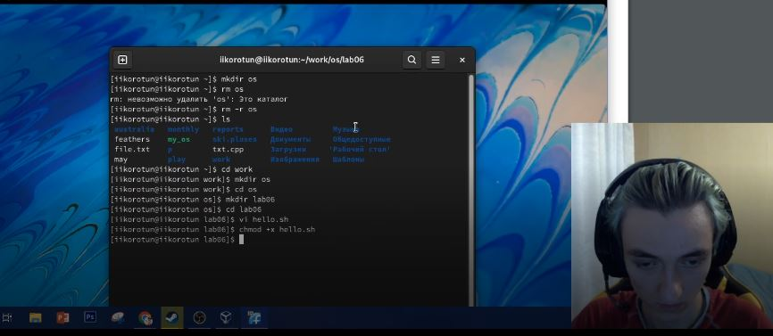
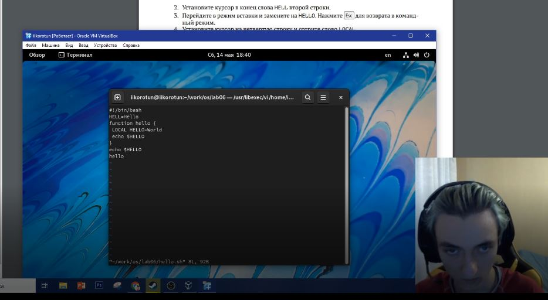
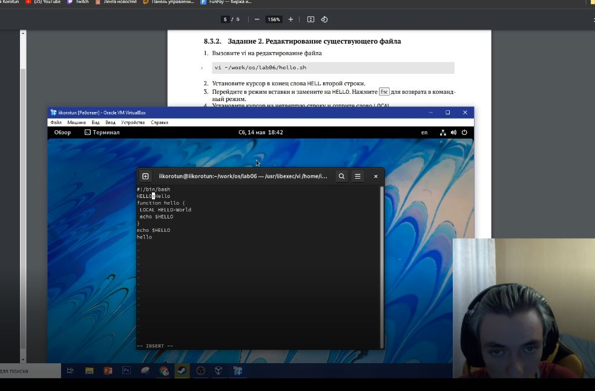
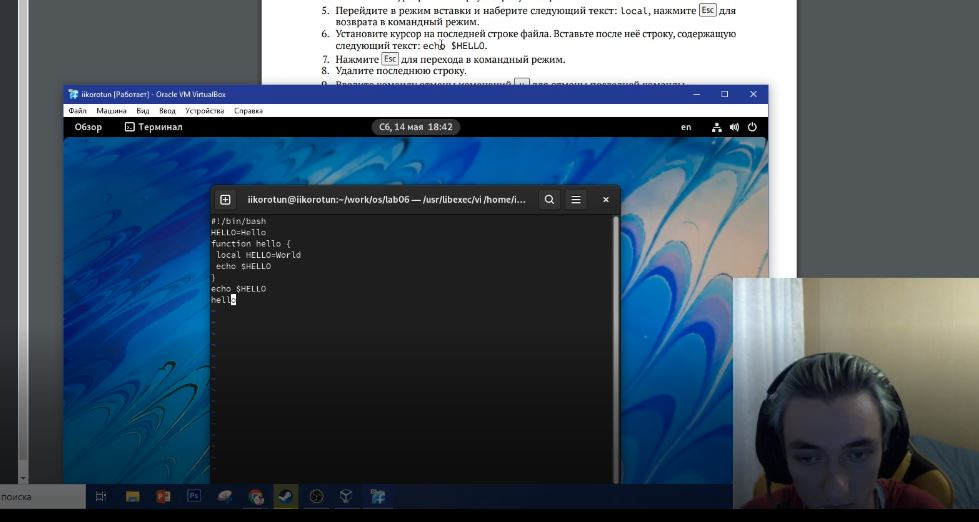
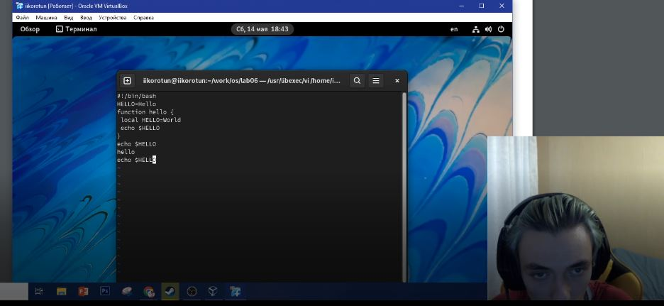
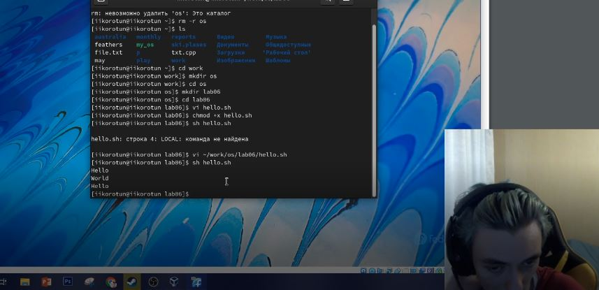

---
## Front matter
title: "Лабораторная работа №8"
subtitle: "Текстовой редактор vi"
author: "Коротун Илья Игоревич"

## Generic otions
lang: ru-RU
toc-title: "Содержание"

## Bibliography
bibliography: bib/cite.bib
csl: pandoc/csl/gost-r-7-0-5-2008-numeric.csl

## Pdf output format
toc: true # Table of contents
toc-depth: 2
lof: true # List of figures
lot: true # List of tables
fontsize: 12pt
linestretch: 1.5
papersize: a4
documentclass: scrreprt
## I18n polyglossia
polyglossia-lang:
  name: russian
  options:
	- spelling=modern
	- babelshorthands=true
polyglossia-otherlangs:
  name: english
## I18n babel
babel-lang: russian
babel-otherlangs: english
## Fonts
mainfont: PT Serif
romanfont: PT Serif
sansfont: PT Sans
monofont: PT Mono
mainfontoptions: Ligatures=TeX
romanfontoptions: Ligatures=TeX
sansfontoptions: Ligatures=TeX,Scale=MatchLowercase
monofontoptions: Scale=MatchLowercase,Scale=0.9
## Biblatex
biblatex: true
biblio-style: "gost-numeric"
biblatexoptions:
  - parentracker=true
  - backend=biber
  - hyperref=auto
  - language=auto
  - autolang=other*
  - citestyle=gost-numeric
## Pandoc-crossref LaTeX customization
figureTitle: "Рис."
tableTitle: "Таблица"
listingTitle: "Листинг"
lofTitle: "Список иллюстраций"
lotTitle: "Список таблиц"
lolTitle: "Листинги"
## Misc options
indent: true
header-includes:
  - \usepackage{indentfirst}
  - \usepackage{float} # keep figures where there are in the text
  - \floatplacement{figure}{H} # keep figures where there are in the text
---

# Цель работы

Познакомиться с операционной системой Linux. Получить практические навыки работы с редактором vi, установленным по умолчанию практически во всех дистрибутивах.
# Последовательность выполнения работы

1. Ознакомиться с теоретическим материалом.
2. Ознакомиться с редактором vi.
3. Выполнить упражнения, используя команды vi.

# Задания

Задание 1. Создание нового файла с использованием vi

1. Создайте каталог с именем ~/work/os/lab06.
2. Перейдите во вновь созданный каталог.
3. Вызовите vi и создайте файл hello.sh
 vi hello.sh
4. Нажмите клавишу i и вводите следующий текст

 #!/bin/bash
 HELL=Hello
 function hello {
 LOCAL HELLO=World
 echo $HELLO
 }
 echo $HELLO
 hello
 
5. Нажмите клавишу Esc для перехода в командный режим после завершения ввода
текста.
6. Нажмите : для перехода в режим последней строки и внизу вашего экрана появится
приглашение в виде двоеточия.
7. Нажмите w (записать) и q (выйти), а затем нажмите клавишу Enter для сохранения
вашего текста и завершения работы.
8. Сделайте файл исполняемым
 chmod +x hello.sh
 
Задание 2. Редактирование существующего файла

1. Вызовите vi на редактирование файла
1 vi ~/work/os/lab06/hello.sh
2. Установите курсор в конец слова HELL второй строки.
3. Перейдите в режим вставки и замените на HELLO. Нажмите Esc для возврата в командный режим.
4. Установите курсор на четвертую строку и сотрите слово LOCAL.
5. Перейдите в режим вставки и наберите следующий текст: local, нажмите Esc для
возврата в командный режим.
6. Установите курсор на последней строке файла. Вставьте после неё строку, содержащую
следующий текст: echo $HELLO.
7. Нажмите Esc для перехода в командный режим.
8. Удалите последнюю строку.
9. Введите команду отмены изменений u для отмены последней команды.
10. Введите символ : для перехода в режим последней строки. Запишите произведённые
изменения и выйдите из vi.

# Теоретическое введение

В большинстве дистрибутивов Linux в качестве текстового редактора по умолчанию
устанавливается интерактивный экранный редактор vi (Visual display editor).
Редактор vi имеет три режима работы:
– командный режим — предназначен для ввода команд редактирования и навигации по
редактируемому файлу;
– режим вставки — предназначен для ввода содержания редактируемого файла;
– режим последней (или командной) строки — используется для записи изменений в файл
и выхода из редактора.
Для вызова редактора vi необходимо указать команду vi и имя редактируемого файла:
vi <имя_файла>
При этом в случае отсутствия файла с указанным именем будет создан такой файл.
Переход в командный режим осуществляется нажатием клавиши Esc . Для выхода из
редактора vi необходимо перейти в режим последней строки: находясь в командном
режиме, нажать Shift-; (по сути символ : — двоеточие), затем:
– набрать символы wq, если перед выходом из редактора требуется записать изменения
в файл;
– набрать символ q (или q!), если требуется выйти из редактора без сохранения.
Замечание. Следует помнить, что vi различает прописные и строчные буквы при наборе
(восприятии) команд.

# Выполнение лабораторной работы

# Выполнение задания 1

# Создал каталог с именем ~/work/os/lab06 и перешел во вновь созданный каталог.

# Вызвал vi и создал файл hello.sh

# Нажал клавишу i и ввел следующий текст

 #!/bin/bash
 HELL=Hello
 function hello {
 LOCAL HELLO=World
 echo $HELLO
 }
 echo $HELLO
 hello
 
 
 
# Нажал клавишу Esc для перехода в командный режим после завершения ввода текста. Нажал : для перехода в режим последней строки. Нажал w (записать) и q (выйти), а затем нажал клавишу Enter для сохранения текста и завершения работы.

# Сделал файл исполняемым 
chmod +x hello.sh

# Выполнение задания 2

# Вызвал vi на редактирование файла
vi ~/work/os/lab06/hello.sh

# Установил курсор в конец слова HELL второй строки. Перешел в режим вставки и заменил на HELLO. Нажал Esc для возврата в командный режим.

# Установил курсор на четвертую строку и стер слово LOCAL. Перешел в режим вставки и набрал следующий текст: local, нажал Esc для возврата в командный режим.

# Установил курсор на последней строке файла. Вставил после неё строку, содержащую следующий текст: echo $HELLO. Нажал Esc для перехода в командный режим. Удалил последнюю строку. Ввел команду отмены изменений u для отмены последней команды. Ввел символ : для перехода в режим последней строки. Записал произведённые изменения и вышел из vi.

# Проверил работу файла

# Выводы

Я познакомился с операционной системой Linux. Получил практические навыки работы с редактором vi.

# Контрольные вопросы

1. Дайте краткую характеристику режимам работы редактора vi.

Редактор vi имеет три режима работы:

– командный режим — предназначен для ввода команд редактирования и навигации по
редактируемому файлу;
– режим вставки — предназначен для ввода содержания редактируемого файла;
– режим последней (или командной) строки — используется для записи изменений в файл
и выхода из редактора.

2. Как выйти из редактора, не сохраняя произведённые изменения?

набрать символ q (или q!) после :

3. Назовите и дайте краткую характеристику командам позиционирования.

Команды позиционирования
– 0 (ноль) — переход в начало строки;
– $ — переход в конец строки;
– G — переход в конец файла;
– 𝑛 G — переход на строку с номером 𝑛.

4. Что для редактора vi является словом?

Слова, введенные в режиме редактирования и над которыми работают команды изменяющие их.

5. Каким образом из любого места редактируемого файла перейти в начало (конец) файла?

– 0 (ноль) — переход в начало строки;
– $ — переход в конец строки;
– G — переход в конец файла;
– 𝑛 G — переход на строку с номером 𝑛.

6. Назовите и дайте краткую характеристику основным группам команд редактирования.

Команды редактирования
8.2.2.1. Вставка текста
– а — вставить текст после курсора;
– А — вставить текст в конец строки;
– i — вставить текст перед курсором;
– 𝑛 i — вставить текст 𝑛 раз;
– I — вставить текст в начало строки.
8.2.2.2. Вставка строки
– о — вставить строку под курсором;
– О — вставить строку над курсором.
8.2.2.3. Удаление текста
– x — удалить один символ в буфер;
– d w — удалить одно слово в буфер;
– d $ — удалить в буфер текст от курсора до конца строки;
– d 0 — удалить в буфер текст от начала строки до позиции курсора;
– d d — удалить в буфер одну строку;
– 𝑛 d d — удалить в буфер 𝑛 строк.
8.2.2.4. Отмена и повтор произведённых изменений
– u — отменить последнее изменение;
– . — повторить последнее изменение.
8.2.2.5. Копирование текста в буфер
– Y — скопировать строку в буфер;
– 𝑛 Y — скопировать 𝑛 строк в буфер;
– y w — скопировать слово в буфер.
8.2.2.6. Вставка текста из буфера
– p — вставить текст из буфера после курсора;
– P — вставить текст из буфера перед курсором.
8.2.2.7. Замена текста
– c w — заменить слово;
– 𝑛 c w — заменить 𝑛 слов;
– c $ — заменить текст от курсора до конца строки;
– r — заменить слово;
– R — заменить текст.
8.2.2.8. Поиск текста
– / текст — произвести поиск вперёд по тексту указанной строки символов текст;
– ? текст — произвести поиск назад по тексту указанной строки символов текст.

7. Необходимо заполнить строку символами $. Каковы ваши действия?

– c $ — заменить текст от курсора до конца строки;

8. Как отменить некорректное действие, связанное с процессом редактирования?

– u — отменить последнее изменение;

9. Назовите и дайте характеристику основным группам команд режима последней строки.

Команды редактирования в режиме командной строки

8.2.3.1. Копирование и перемещение текста
– : 𝑛,𝑚 d — удалить строки с 𝑛 по 𝑚;
– : 𝑖,𝑗 m 𝑘 — переместить строки с 𝑖 по 𝑗, начиная со строки 𝑘;
– : 𝑖,𝑗 t 𝑘 — копировать строки с 𝑖 по 𝑗 в строку 𝑘;
– : 𝑖,𝑗 w имя-файла — записать строки с 𝑖 по 𝑗 в файл с именем имя-файла.
8.2.3.2. Запись в файл и выход из редактора
– : w — записать изменённый текст в файл, не выходя из vi;
– : w имя-файла — записать изменённый текст в новый файл с именем имя-файла;
– : w ! имя-файла — записать изменённый текст в файл с именем имя-файла;
– : w q — записать изменения в файл и выйти из vi;
– : q — выйти из редактора vi;
– : q ! — выйти из редактора без записи;
– : e ! — вернуться в командный режим, отменив все изменения, произведённые
со времени последней записи.

10. Как определить, не перемещая курсора, позицию, в которой заканчивается строка?

При включённой опции 'ruler' позиция курсора постоянно отображается в строке состояния (это немного замедляет работу Vim).

11. Выполните анализ опций редактора vi (сколько их, как узнать их назначение и т.д.).

Опции редактора vi позволяют настроить рабочую среду. Для задания опций используется команда set (в режиме последней строки):
– : set all — вывести полный список опций;
– : set nu — вывести номера строк;
– : set list — вывести невидимые символы;
– : set ic — не учитывать при поиске, является ли символ прописным или строчным.
Если вы хотите отказаться от использования опции, то в команде set перед именем
опции надо поставить no.

12. Как определить режим работы редактора vi?

В редакторе vi есть два основных режима: командный режим и режим вставки. По умолчанию работа начинается в командном режиме. В режиме вставки клавиатура используется для набора текста. Для выхода в командный режим используется клавиша Esc или комбинация Ctrl + c.

Когда включен режим вставки, внизу пишется INSERT

13. Постройте граф взаимосвязи режимов работы редактора vi.

В любой момент при работе в редакторе vi вы находитесь в одном из трёх режимов редактора: командный режим (command mode), режим ввода (insert mode) и режим последней строки (last line mode).

При запуске редактора vi вы оказываетесь в командном режиме. В этом режиме можно давать команды для редактирования файлов или перейти в другой режим. Например, вводя x в командном режиме мы удаляем символ, на который указывает курсор. Клавиши-стрелки перемещают курсор по редактируемому файлу. Как правило, команды, используемые в командном режиме, состоят из одного или двух символов.

Основной ввод и редактирование текста осуществляется в режиме ввода. При использовании редактора vi основное время, скорее всего, будет проводиться именно в этом режиме. Переход в режим ввода из командного режима осуществляется командой i (от слова insert). Находясь в режиме ввода, можно вводить текст в то место, куда указывает курсор. Выход из режима ввода в командный режим осуществляется клавишей Esc.

Режим последней строки═ — это специальный режим, в котором редактору даются сложные команды. При вводе этих команд они отображаются в последней строке экрана (отсюда пошло название режима). Например, если ввести в командном режиме команду :, то осуществится переход в режим последней строки, и можно будет вводить такие команды, как wq (записать файл и покинуть редактор vi) или q! (выйти из редактора vi без сохранения изменений). В режиме последней строки обычно вводятся команды, название которых состоит из нескольких символов. В этом режиме в последнюю строку вводится команда, после чего нажимается клавиша Enter, и команда исполняется.

