---
## Front matter
title: "Лабораторная работа №9"
subtitle: "Текстовой редактор emacs"
author: "Коротун Илья Игоревич"

## Generic otions
lang: ru-RU
toc-title: "Содержание"

## Bibliography
bibliography: bib/cite.bib
csl: pandoc/csl/gost-r-7-0-5-2008-numeric.csl

## Pdf output format
toc: true # Table of contents
toc-depth: 2
lof: true # List of figures
lot: true # List of tables
fontsize: 12pt
linestretch: 1.5
papersize: a4
documentclass: scrreprt
## I18n polyglossia
polyglossia-lang:
  name: russian
  options:
	- spelling=modern
	- babelshorthands=true
polyglossia-otherlangs:
  name: english
## I18n babel
babel-lang: russian
babel-otherlangs: english
## Fonts
mainfont: PT Serif
romanfont: PT Serif
sansfont: PT Sans
monofont: PT Mono
mainfontoptions: Ligatures=TeX
romanfontoptions: Ligatures=TeX
sansfontoptions: Ligatures=TeX,Scale=MatchLowercase
monofontoptions: Scale=MatchLowercase,Scale=0.9
## Biblatex
biblatex: true
biblio-style: "gost-numeric"
biblatexoptions:
  - parentracker=true
  - backend=biber
  - hyperref=auto
  - language=auto
  - autolang=other*
  - citestyle=gost-numeric
## Pandoc-crossref LaTeX customization
figureTitle: "Рис."
tableTitle: "Таблица"
listingTitle: "Листинг"
lofTitle: "Список иллюстраций"
lotTitle: "Список таблиц"
lolTitle: "Листинги"
## Misc options
indent: true
header-includes:
  - \usepackage{indentfirst}
  - \usepackage{float} # keep figures where there are in the text
  - \floatplacement{figure}{H} # keep figures where there are in the text
---

# Цель работы

Познакомиться с операционной системой Linux. Получить практические навыки работы с редактором Emacs.

# Последовательность выполнения работы

1. Ознакомиться с теоретическим материалом.

2. Ознакомиться с редактором emacs.

3. Выполнить упражнения.

4. Ответить на контрольные вопросы.

# Теоретическое введение

# Основные термины Emacs
Определение 1. Буфер — объект, представляющий какой-либо текст. Буфер может содержать что угодно, например, результаты компиляции программы или встроенные подсказки. Практически всё взаимодействие с пользователем, в том числе интерактивное, происходит посредством буферов.

Определение 2. Фрейм соответствует окну в обычном понимании этого слова. Каждый фрейм содержит область вывода и одно или несколько окон Emacs.

Определение 3. Окно — прямоугольная область фрейма, отображающая один из буферов. Каждое окно имеет свою строку состояния, в которой выводится следующая информация: название буфера, его основной режим, изменялся ли текст буфера и как далеко вниз по буферу расположен курсор. Каждый буфер находится только в одном из возможных основных режимов. Существующие основные режимы включают режим Fundamental (наименее специализированный), режим Text, режим Lisp, режим С, режим Texinfo и другие. Под второстепенными режимами понимается список режимов, которые включены в данный момент в буфере выбранного окна.

Определение 4. Область вывода — одна или несколько строк внизу фрейма, в которой Emacs выводит различные сообщения, а также запрашивает подтверждения и дополнительную информацию от пользователя.

Определение 5. Минибуфер используется для ввода дополнительной информации и всегда отображается в области вывода.

Определение 6. Точка вставки — место вставки (удаления) данных в буфере.

# Комбинация клавиш Действие

C-p переместиться вверх на одну строку

C-n переместиться вниз на одну строку

C-f переместиться вперёд на один символ

C-b переместиться назад на один символ

C-a переместиться в начало строки

C-e переместиться в конец строки

C-v переместиться вниз на одну страницу

M-v переместиться вверх на одну страницу

M-f переместиться вперёд на одно слово

M-b переместиться назад на одно слово

M-< переместиться в начало буфера

M-> переместиться в конец буфера

C-g закончить текущую операцию

# Комбинация клавиш Действие

C-d Удалить символ перед текущим положением курсора

M-d Удалить следующее за текущим положением курсора слово

C-k Удалить текст от текущего положения курсора до конца строки

M-k Удалить текст от текущего положения курсора до конца предложения

M-\ Удалить все пробелы и знаки табуляции вокруг текущего положения курсора

C-q Вставить символ, соответствующий нажатой клавише или сочетанию

M-q Выровнять текст в текущем параграфе буфера

# Выполнение лабораторной работы
1. Открыть emacs.

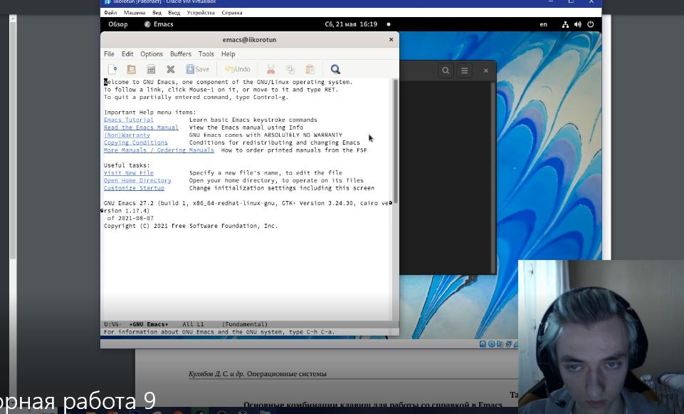

2. Создать файл lab07.sh с помощью комбинации Ctrl-x Ctrl-f (C-x C-f).

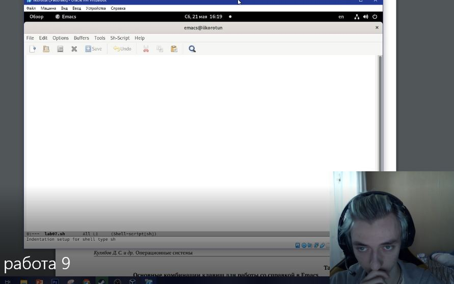

3. Наберите текст:

#!/bin/bash

HELL=Hello

function hello {

LOCAL HELLO=World

echo $HELLO

}

echo $HELLO

hello

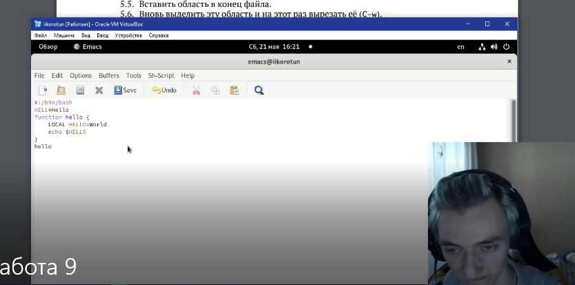

4. Сохранить файл с помощью комбинации Ctrl-x Ctrl-s (C-x C-s).

5. Проделать с текстом стандартные процедуры редактирования, каждое действие должно осуществляться комбинацией клавиш.

5.1. Вырезать одной командой целую строку (С-k).

5.2. Вставить эту строку в конец файла (C-y).

5.3. Выделить область текста (C-space).

5.4. Скопировать область в буфер обмена (M-w).

5.5. Вставить область в конец файла.

5.6. Вновь выделить эту область и на этот раз вырезать её (C-w).

5.7. Отмените последнее действие (C-/).

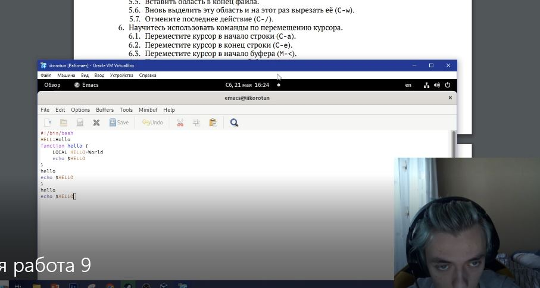

6. Научитесь использовать команды по перемещению курсора.

6.1. Переместите курсор в начало строки (C-a).

6.2. Переместите курсор в конец строки (C-e).

6.3. Переместите курсор в начало буфера (M-<).

6.4. Переместите курсор в конец буфера (M->).

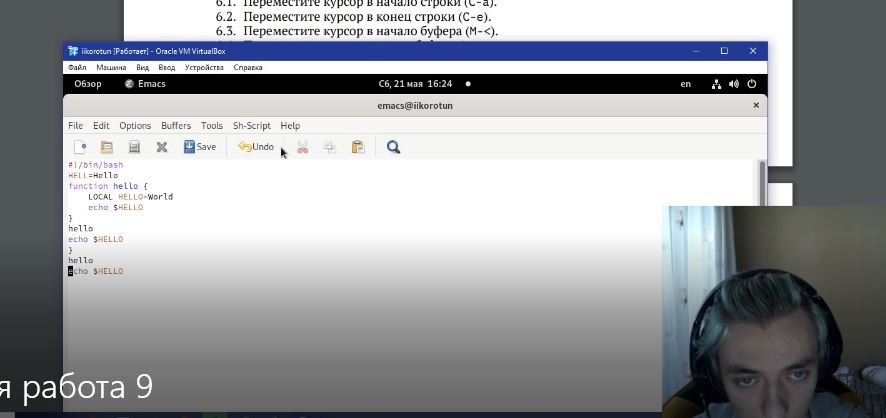

7. Управление буферами.

7.1. Вывести список активных буферов на экран (C-x C-b).

7.2. Переместитесь во вновь открытое окно (C-x) o со списком открытых буферов и переключитесь на другой буфер.

7.3. Закройте это окно (C-x 0).

7.4. Теперь вновь переключайтесь между буферами, но уже без вывода их списка на экран (C-x b).

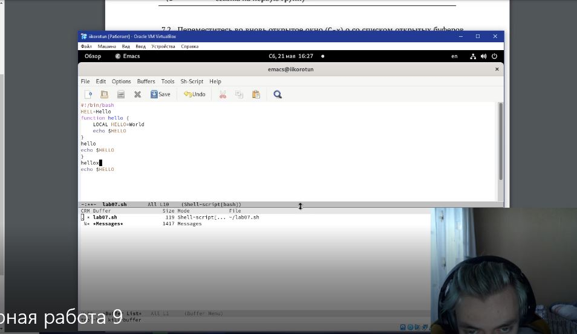 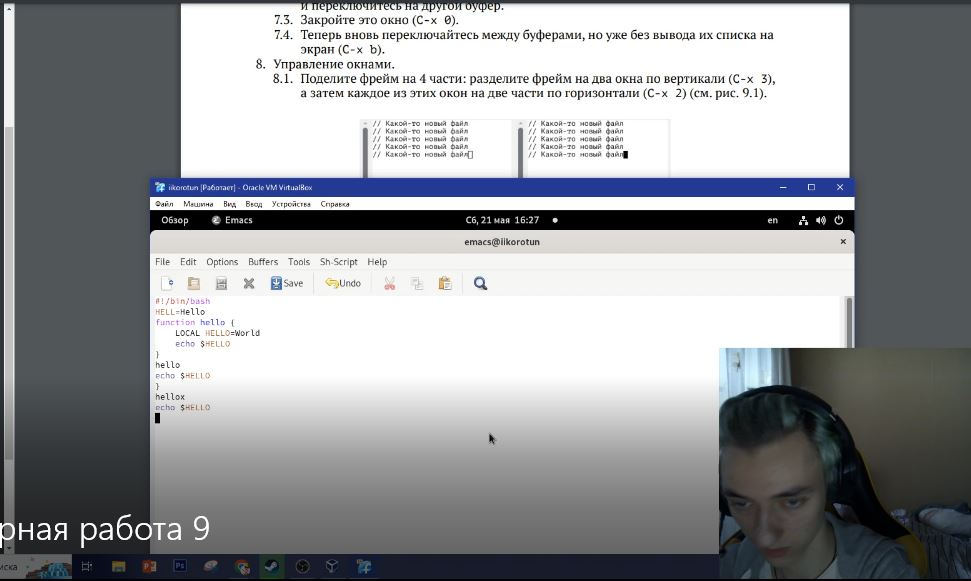

8. Управление окнами.

8.1. Поделите фрейм на 4 части: разделите фрейм на два окна по вертикали (C-x 3) а затем каждое из этих окон на две части по горизонтали (C-x 2).

8.2. В каждом из четырёх созданных окон откройте новый буфер (файл) и введите несколько строк текста.

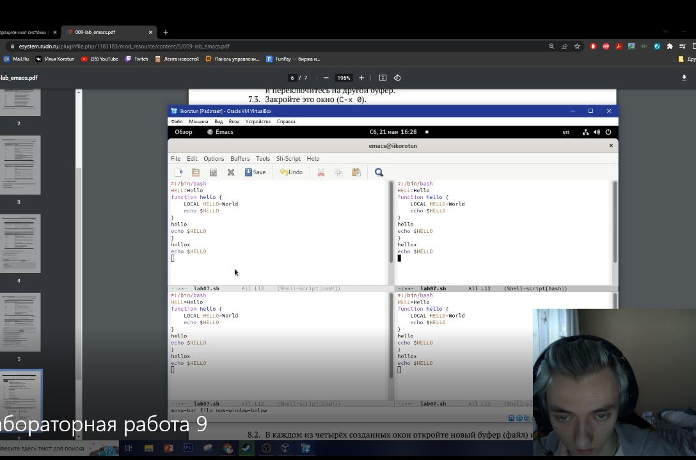 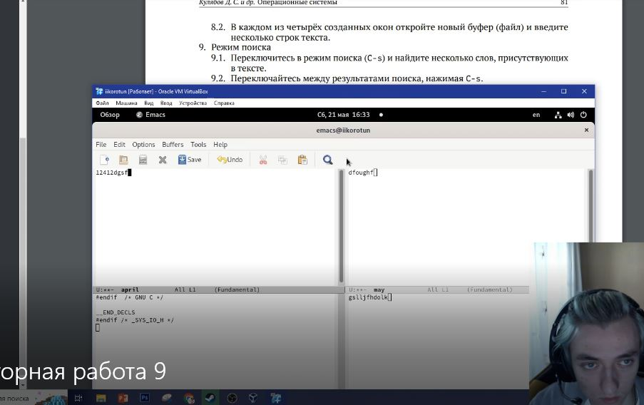

9. Режим поиска

9.1. Переключитесь в режим поиска (C-s) и найдите несколько слов, присутствующих в тексте.

9.2. Переключайтесь между результатами поиска, нажимая C-s.

9.3. Выйдите из режима поиска, нажав C-g.

9.4. Перейдите в режим поиска и замены (M-%), введите текст, который следует найт и заменить, нажмите Enter , затем введите текст для замены. После того как будут подсвечены результаты поиска, нажмите ! для подтверждения замены.

9.5. Испробуйте другой режим поиска, нажав M-s o. Объясните, чем он отличается от обычного режима?

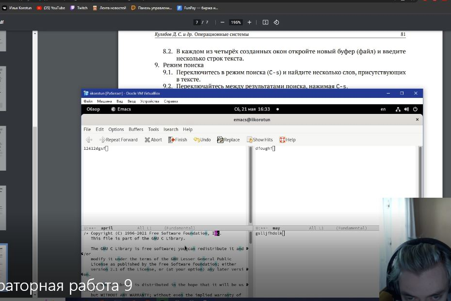 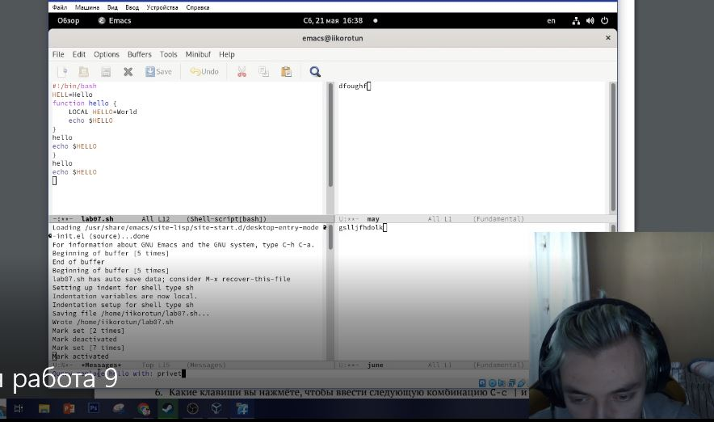

# Выводы

Я познакомился с операционной системой Linux. Получил практические навыки работы с редактором Emacs.

# Контрольные вопросы

1. Кратко охарактеризуйте редактор emacs.

Emacs — один из наиболее мощных и широко распространённых редакторов, используемых в мире UN. Он предоставляет средства, которые дают “нечто большее, чем простая вставка или удаление”, а именно: Просмотр и редактирование 2-х или более файлов (с возможностью перемещения текста между файлами).

2. Какие особенности данного редактора могут сделать его сложным для освоения новичком?

Каждый перестраивает радактор под себя, и часто настолько кардинально, что другой пользователь того же редактора может его не узнать.

3. Своими словами опишите, что такое буфер и окно в терминологии emacs’а.

Буфер — это основная единица редактирования; один буфер соответствует одному куску редактируемого текста. Вы можете иметь несколько буферов, но в каждый конкретный момент вы редактируете только один выбранный буфер.

Окно в emacs — это область экрана, в которой отображается буфер. 

4. Можно ли открыть больше 10 буферов в одном окне?

Нельзя

5. Какие буферы создаются по умолчанию при запуске emacs?

Только что запущенный Emacs несет один буфер с именем `*scratch*', который может быть использован для вычисления выражений Лиспа в Emacs.

6. Какие клавиши вы нажмёте, чтобы ввести следующую комбинацию C-c | и C-c C-|?

Ctrl + c, Ctrl + c,  Ctrl - .

7. Как поделить текущее окно на две части?

C-x 3 ( Ctrl + x + 3 ).

8. В каком файле хранятся настройки редактора emacs?

Файлы `site-init.el' и `site-load.el'.

9. Какую функцию выполняет <- клавиша и можно ли её переназначить?

Стирание значений в файле. Можно переназначить под себя.

10. Какой редактор вам показался удобнее в работе vi или emacs? Поясните почему.

Редактор vi понятнее на подсознательном уровне. Удобнее выполнено меню и сама программа.

