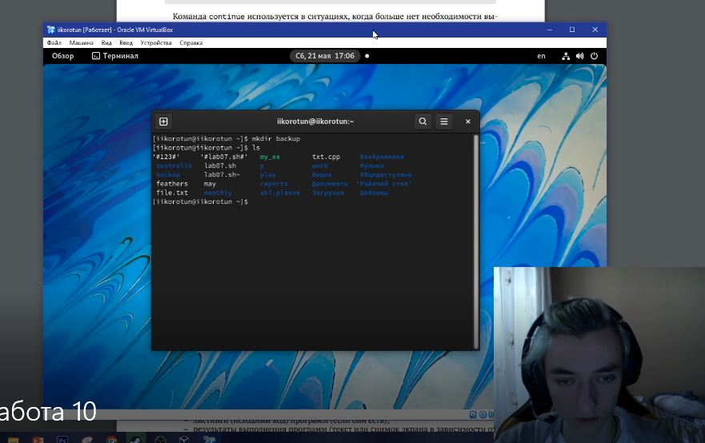
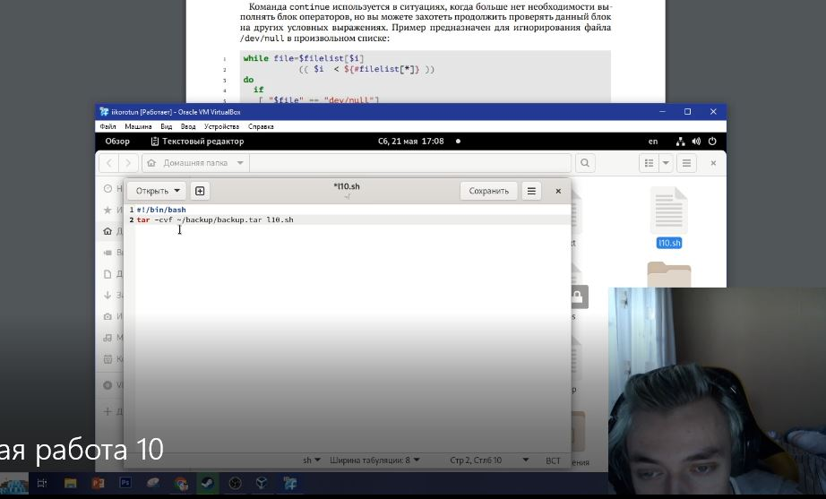
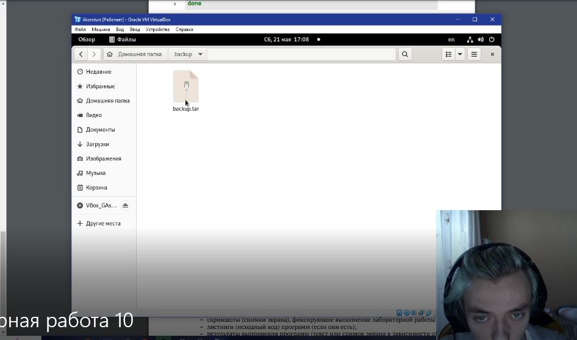
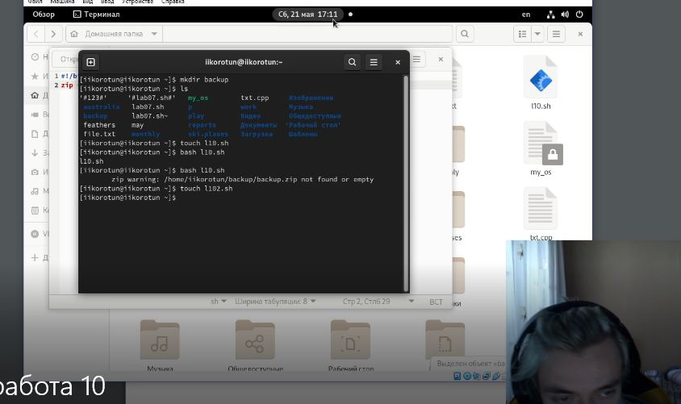
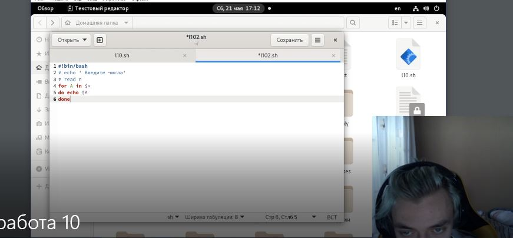
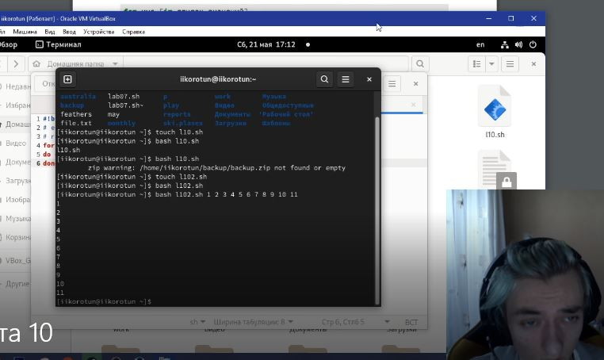
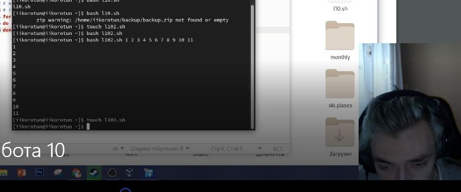
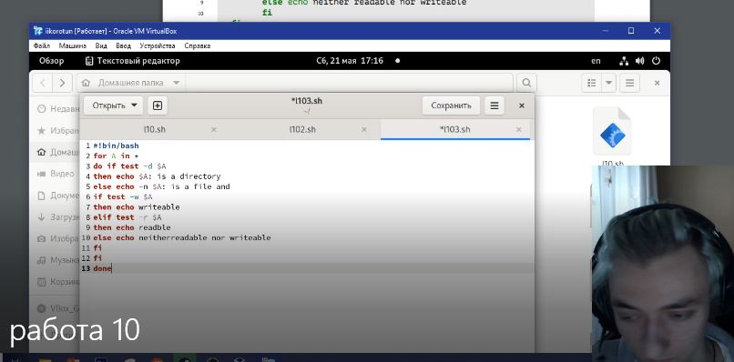
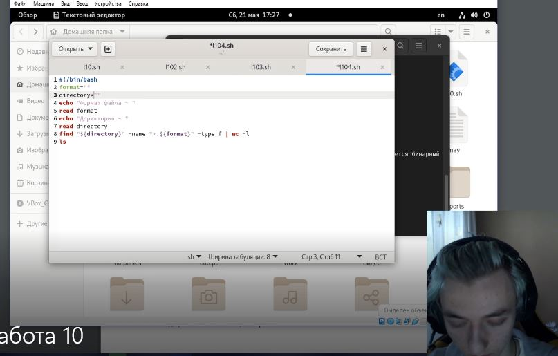

---
## Front matter
title: "Лабораторная работа №10"
subtitle: "Программирование в командном процессоре ОС UNIX. Командные файлы"
author: "Коротун Илья Игоревич"

## Generic otions
lang: ru-RU
toc-title: "Содержание"

## Bibliography
bibliography: bib/cite.bib
csl: pandoc/csl/gost-r-7-0-5-2008-numeric.csl

## Pdf output format
toc: true # Table of contents
toc-depth: 2
lof: true # List of figures
lot: true # List of tables
fontsize: 12pt
linestretch: 1.5
papersize: a4
documentclass: scrreprt
## I18n polyglossia
polyglossia-lang:
  name: russian
  options:
	- spelling=modern
	- babelshorthands=true
polyglossia-otherlangs:
  name: english
## I18n babel
babel-lang: russian
babel-otherlangs: english
## Fonts
mainfont: PT Serif
romanfont: PT Serif
sansfont: PT Sans
monofont: PT Mono
mainfontoptions: Ligatures=TeX
romanfontoptions: Ligatures=TeX
sansfontoptions: Ligatures=TeX,Scale=MatchLowercase
monofontoptions: Scale=MatchLowercase,Scale=0.9
## Biblatex
biblatex: true
biblio-style: "gost-numeric"
biblatexoptions:
  - parentracker=true
  - backend=biber
  - hyperref=auto
  - language=auto
  - autolang=other*
  - citestyle=gost-numeric
## Pandoc-crossref LaTeX customization
figureTitle: "Рис."
tableTitle: "Таблица"
listingTitle: "Листинг"
lofTitle: "Список иллюстраций"
lotTitle: "Список таблиц"
lolTitle: "Листинги"
## Misc options
indent: true
header-includes:
  - \usepackage{indentfirst}
  - \usepackage{float} # keep figures where there are in the text
  - \floatplacement{figure}{H} # keep figures where there are in the text
---

# Цель работы

Изучить основы программирования в оболочке ОС UNIX/Linux. Научиться писать
небольшие командные файлы.

# Теоретическое введение

 Командные процессоры (оболочки)
Командный процессор (командная оболочка, интерпретатор команд shell) — это программа, позволяющая пользователю взаимодействовать с операционной системой
компьютера. В операционных системах типа UNIX/Linux наиболее часто используются
следующие реализации командных оболочек:

– оболочка Борна (Bourne shell или sh) — стандартная командная оболочка UNIX/Linux, содержащая базовый, но при этом полный набор функций;

– С-оболочка (или csh) — надстройка на оболочкой Борна, использующая С-подобный синтаксис команд с возможностью сохранения истории выполнения команд;

– оболочка Корна (или ksh) — напоминает оболочку С, но операторы управления программой совместимы с операторами оболочки Борна;

– BASH — сокращение от Bourne Again Shell (опять оболочка Борна), в основе своей совмещает свойства оболочек С и Корна (разработка компании Free Software Foundation).
POSIX (Portable Operating System Interface for Computer Environments) — набор стандартов описания интерфейсов взаимодействия операционной системы и прикладных программ.

Стандарты POSIX разработаны комитетом IEEE (Institute of Electrical and Electronics Engineers) для обеспечения совместимости различных UNIX/Linux-подобных операционных систем и переносимости прикладных программ на уровне исходного кода. POSIX-совместимые оболочки разработаны на базе оболочки Корна. Рассмотрим основные элементы программирования в оболочке bash. В других оболочках большинство команд будет совпадать с описанными ниже.

#  Последовательность выполнения работы

1. Написать скрипт, который при запуске будет делать резервную копию самого себя (то есть файла, в котором содержится его исходный код) в другую директорию backup в вашем домашнем каталоге. При этом файл должен архивироваться одним из архиваторов на выбор zip, bzip2 или tar. Способ использования команд архивации необходимо узнать, изучив справку.

1.1 Создал файл l10.sh

1.2 Написал скрипт

1.3 Проверил работу

2. Написать пример командного файла, обрабатывающего любое произвольное число аргументов командной строки, в том числе превышающее десять. Например, скрипт может последовательно распечатывать значения всех переданных аргументов.

2.1 Создал файл l102.sh

2.2 Написал скрипт

2.3 Проверил работу

3. Написать командный файл — аналог команды ls (без использования самой этой команды и команды dir). Требуется, чтобы он выдавал информацию о нужном каталоге и выводил информацию о возможностях доступа к файлам этого каталога.

3.1 Создал файл l103.sh

3.2 Написал скрипт

3.3 Проверил работу

4. Написать командный файл, который получает в качестве аргумента командной строки формат файла (.txt, .doc, .jpg, .pdf и т.д.) и вычисляет количество таких файлов в указанной директории. Путь к директории также передаётся в виде аргумента командной строки.

4.1 Создал файл l104.sh

4.2 Написал скрипт

4.3 Проверил работу

# Выводы

Я изучил основы программирования в оболочке ОС UNIX/Linux. Научился писать небольшие командные файлы.

# Контрольные вопросы

1. Объясните понятие командной оболочки. Приведите примеры командных оболочек. Чем они отличаются?

Командная оболочка Unix — командный интерпретатор, используемый в операционных системах семейства Unix, в котором пользователь может либо давать команды операционной системе по отдельности, либо запускать скрипты, состоящие из списка команд.

sh — оригинальный шелл Борна; dash, bash, zsh — другие современные клоны Bourne shell (расположены по возрастанию функциональности).

ksh (KornShell) — клон шелла Борна, разработанный Дэвидом Корном из AT&T Labs. Синтаксис совместим, функциональность интерактивности увеличена.

pdksh (public domain ksh) — открытая (почти целиком является общественным достоянием) реализация ksh.

bash (bourne again shell) (эмуляция совместимости POSIX) расширенная Борном свободная (разработанная в рамках проекта GNU) оболочка ash, сходная с pdksh. Стандартная оболочка в Linux.

C shell — (несовместима с POSIX shell) оболочка, с синтаксисом на основе Си, созданная Университетом Беркли в рамках проекта по реализации BSD Unix.
csh (C-Shell) — оболочка из состава дистрибутива BSD, имеет Си-образный синтаксис и не является POSIX-совместимой. Впервые введены возможности управления заданиями и произведены другие улучшения.

tcsh (csh) — реализация csh с интерактивными возможностями, не уступающими bash. Удобна для интерактивной работы. Совместима с csh.

ash (Almquist shell, оболочка Альмквиста), BusyBox — современные микроверсии, предназначенные для встраиваемых систем, а также используемые в мини-дистрибутивах.
xsh (Xiki shell, от executable wiki) — новая командная оболочка, совмещающая командный и графический режимы работы

fish (Friendly Interactive SHell) — (несовместима с POSIX) командная оболочка, отличиетельными особенностями которой являются продвинутое автодополнение и подсветка синтаксиса "из коробки", а также упрощённый язык скриптов

2. Что такое POSIX?

POSIX (Portable Operating System Interface for Computer Environments) — набор стандартов описания интерфейсов взаимодействия операционной системы и прикладных программ.

3. Как определяются переменные и массивы в языке программирования bash?

Командный процессор bash обеспечивает возможность использования переменных типа строка символов. Имена переменных могут быть выбраны пользователем. Пользователь имеет возможность присвоить переменной значение некоторой строки символов.

Например, команда

 mark=/usr/andy/bin
 
присваивает значение строки символов /usr/andy/bin переменной mark типа строка символов.

Значение, присвоенное некоторой переменной, может быть впоследствии использовано. Для этого в соответствующем месте командной строки должно быть употреблено
имя этой переменной, которому предшествует метасимвол $. Например, команда

 mv afile ${mark}

4. Каково назначение операторов let и read?

Команда let является показателем того, что последующие аргументы представляют собой выражение, подлежащее вычислению. 

Команда read позволяет читать значения переменных со стандартного ввода:

 echo "Please enter Month and Day of Birth ?"
 
 read mon day trash

5. Какие арифметические операции можно применять в языке программирования bash?

Арифметические операторы оболочки bash

Оператор Синтаксис Результат

! !ехр Если ехр равно 0, то возвращает 1; иначе 0

!= ехр1 !=ехр2 Если ехр1 не равно ехр2, то возвращает 1; иначе 0

% ехр1%ехр2 Возвращает остаток от деления ехр1 на ехр2

%= var=%exp Присваивает остаток от деления var на ехр переменной var

& ехр1&ехр2 Возвращает побитовое AND выражений ехр1 и ехр2

&& ехр1&&ехр2 Если и ехр1 и ехр2 не равны нулю, то возвращает 1; иначе 0

&= var &= ехр Присваивает переменной var побитовое AND var и ехр

* ехр1 * ехр2 Умножает ехр1 на ехр2

*= var *= ехр Умножает ехр на значение переменной var и присваивает результат переменной var

+ ехр1 + ехр2 Складывает ехр1 и ехр2

+= var += ехр Складывает ехр со значением переменной var и результат присваивает переменной var

- -exp Операция отрицания exp (унарный минус)

- expl - exp2 Вычитает exp2 из exp1

-= var -= exp Вычитает exp из значения переменной var и присваивает результат переменной var

/ exp / exp2 Делит exp1 на exp2

/= var /= exp Делит значение переменной var на exp и присваивает результат переменной var

< expl < exp2 Если exp1 меньше, чем exp2, то возвращает 1, иначе возвращает 0

<< exp1 << exp2 Сдвигает exp1 влево на exp2 бит

<<= var <<= exp Побитовый сдвиг влево значения переменной var на exp

<= expl <= exp2 Если exp1 меньше или равно exp2, то возвращает 1; иначе возвращает 0

= var = exp Присваивает значение exp переменной var

== exp1==exp2 Если exp1 равно exp2, то возвращает 1; иначе возвращает 0

> exp1 > exp2 1, если exp1 больше, чем exp2; иначе 0

>= exp1 >= exp2 1, если exp1 больше или равно exp2; иначе 0

>> exp >> exp2 Сдвигает exp1 вправо на exp2 бит

>>= var >>=exp Побитовый сдвиг вправо значения переменной var на exp

^ exp1 ^ exp2 Исключающее OR выражений exp1 и exp2

^= var ^= exp Присваивает переменной var побитовое XOR var и exp

| exp1 | exp2 Побитовое OR выражений exp1 и exp2

|= var |= exp Присваивает переменной var результат операции XOR var и exp

|| exp1 || exp2 1, если или exp1 или exp2 являются ненулевыми значениями; иначе 0

~ ~exp Побитовое дополнение до exp

6. Что означает операция (( ))?

Для облегчения программирования можно записывать условия оболочки bash в двойные
скобки — (( )).

7. Какие стандартные имена переменных Вам известны?

Другие стандартные переменные:

– HOME — имя домашнего каталога пользователя. Если команда cd вводится без аргументов, то происходит переход в каталог, указанный в этой переменной.

– IFS — последовательность символов, являющихся разделителями в командной строке, например, пробел, табуляция и перевод строки (new line).

– MAIL — командный процессор каждый раз перед выводом на экран промптера проверяет содержимое файла, имя которого указано в этой переменной, и если содержимое этого файла изменилось с момента последнего ввода из него, то перед тем как вывест на терминал промптер, командный процессор выводит на терминал сообщение You have mail (у Вас есть почта).

– TERM — тип используемого терминала.

– LOGNAME — содержит регистрационное имя пользователя, которое устанавливается автоматически при входе в систему.

8. Что такое метасимволы?

При перечислении имён файлов текущего каталога можно использовать следующие
символы:

– * — соответствует произвольной, в том числе и пустой строке;

– ? — соответствует любому одинарному символу;

– [c1-c1] — соответствует любому символу, лексикографически находящемуся между
символами c1 и с2.

Например,

– echo * — выведет имена всех файлов текущего каталога, что представляет собой
простейший аналог команды ls;

– ls *.c — выведет все файлы с последними двумя символами, совпадающими с .c.

– echo prog.? — выведет все файлы, состоящие из пяти или шести символов, первыми пятью символами которых являются prog..

– [a-z]* — соответствует произвольному имени файла в текущем каталоге, начинающемуся с любой строчной буквы латинского алфавита.

Такие символы, как ' < > * ? | \ " &, являются метасимволами и имеют для командного процессора специальный смысл. Снятие специального смысла с метасимвола называется экранированием метасимвола. Экранирование может быть осуществлено с помощью предшествующего метасимволу символа \, который, в свою очередь, является метасимволом.

9. Как экранировать метасимволы?

Для экранирования группы метасимволов нужно заключить её в одинарные кавычки. Строка, заключённая в двойные кавычки, экранирует все метасимволы, кроме $, ' , \, ". Например,

– echo \* выведет на экран символ *,

– echo ab’*\|*’cd выведет на экран строку ab*\|*cd.

10. Как создавать и запускать командные файлы?

Последовательность команд может быть помещена в текстовый файл. Такой файл называется командным. Далее этот файл можно выполнить по команде:

 bash командный_файл [аргументы]

Чтобы не вводить каждый раз последовательности символов bash, необходимо изменить код защиты этого командного файла, обеспечив доступ к этому файлу по выполнению. Это может быть сделано с помощью команды

 chmod +x имя_файла
 
Теперь можно вызывать свой командный файл на выполнение, просто вводя его имя с терминала так, как-будто он является выполняемой программой. Командный процессор распознает, что в Вашем файле на самом деле хранится не выполняемая программа, а программа

11. Как определяются функции в языке программирования bash?

Определим функцию, которая изменяет каталог и печатает список файлов:

 $ function clist {
 > cd $1
 > ls
 > }

12. Каким образом можно выяснить, является файл каталогом или обычным файлом?

С помощью скрипта 

 for A in *

 do if test -d $A

 then echo $A: is a directory

 else echo -n $A: is a file and

 if test -w $A

 then echo writeable

 elif test -r $A

 then echo readable

 else echo neither readable nor writeable

 fi

 fi

 done

13. Каково назначение команд set, typeset и unset?

Для создания массива используется команда set с флагом -A. 

Если использовать typeset -i для объявления и присвоения переменной, то при последующем её применении она станет целой.

Изъять переменную из программы можно с помощью команды unset.

14. Как передаются параметры в командные файлы?

При вызове командного файла на выполнение параметры ему могут быть переданы точно таким же образом, как и выполняемой программе. С точки зрения командного файла эти параметры являются позиционными. Символ $ является метасимволом командного процессора. Он используется, в частности, для ссылки на параметры, точнее, для получения их значений в командном файле. В командный файл можно передать до девяти параметров. При использовании где-либо в командном файле комбинации символов $i, где 0 < 𝑖 < 10, вместо неё будет осуществлена подстановка значения параметра с порядковым номером i, т.е. аргумента командного файла с порядковым номером i. Использование комбинации символов $0 приводит к подстановке вместо неё имени данного командного файла

15. Назовите специальные переменные языка bash и их назначение.

Имена некоторых переменных имеют для командного процессора специальный смысл. Значением переменной PATH (т.е. $РАТН) является список каталогов, в которых командный процессор осуществляет поиск программы или команды, указанной в командной строке, в том случае, если указанное имя программы или команды не содержит ни одного символа /. Если имя команды содержит хотя бы один символ /, то последовательность поиска, предписываемая значением переменной PATH, нарушается. В этом случае в зависимости от того, является имя команды абсолютным или относительным, поиск начинается соответственно от корневого или текущего каталога

