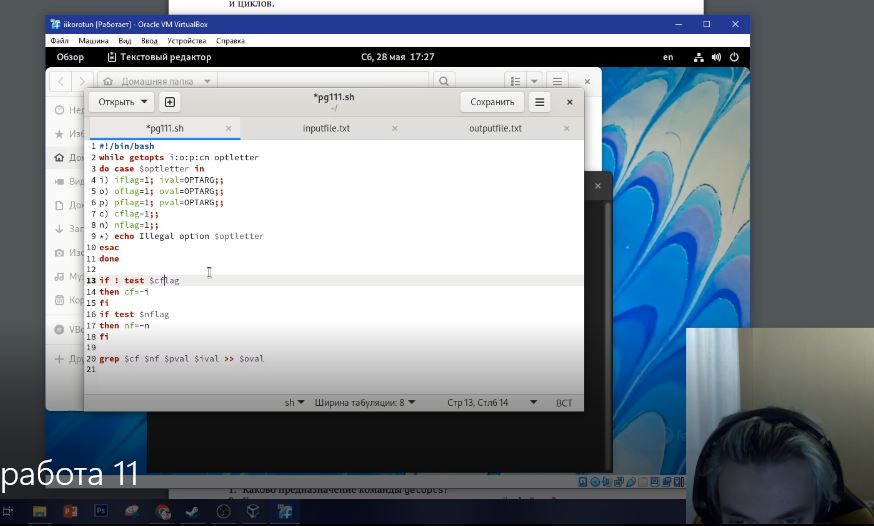
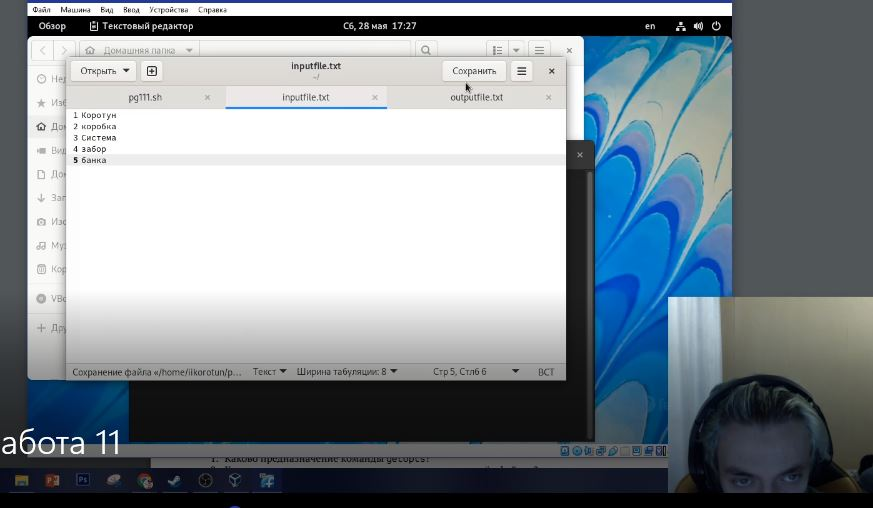
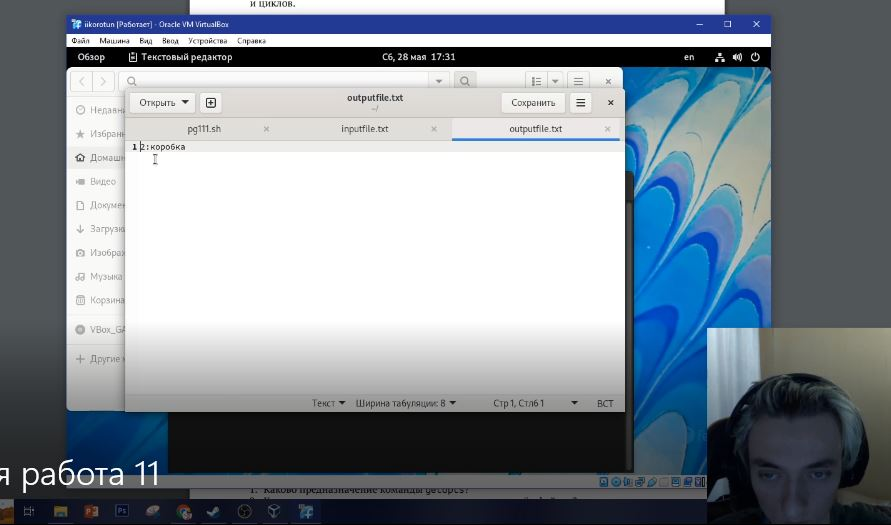
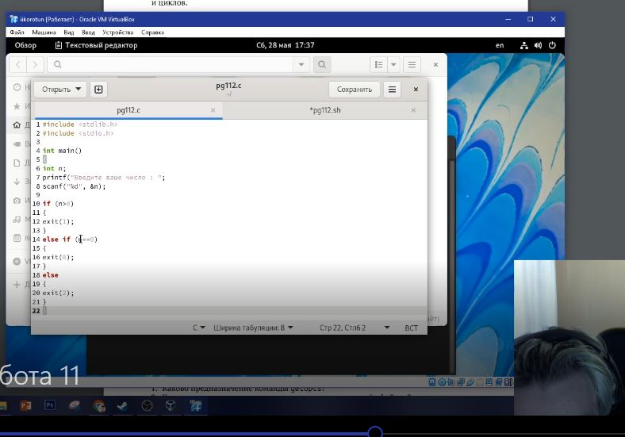
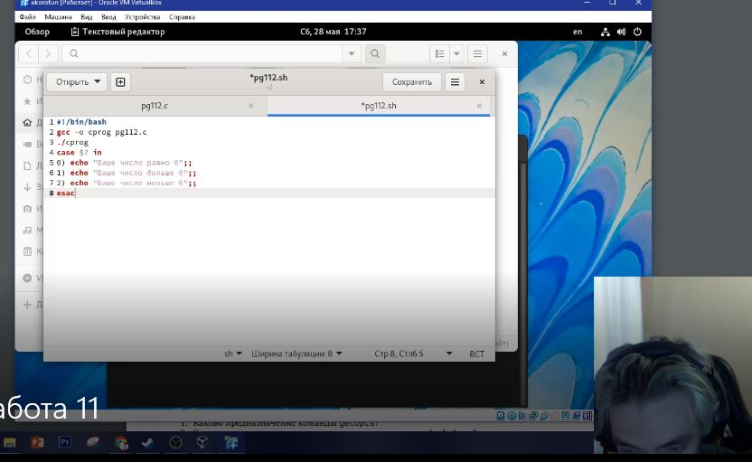
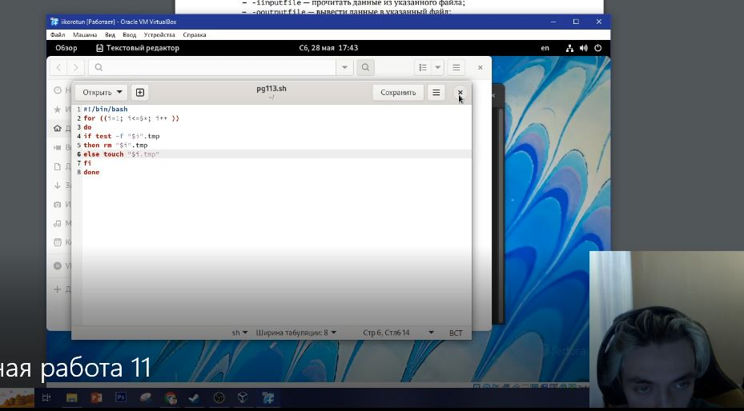
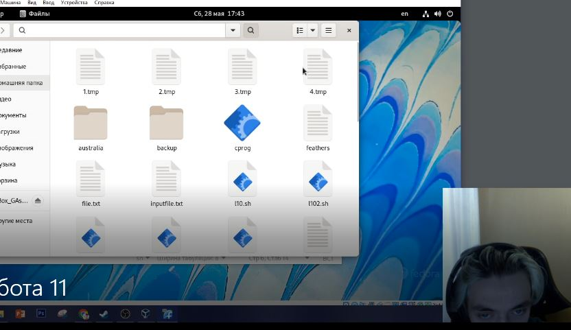
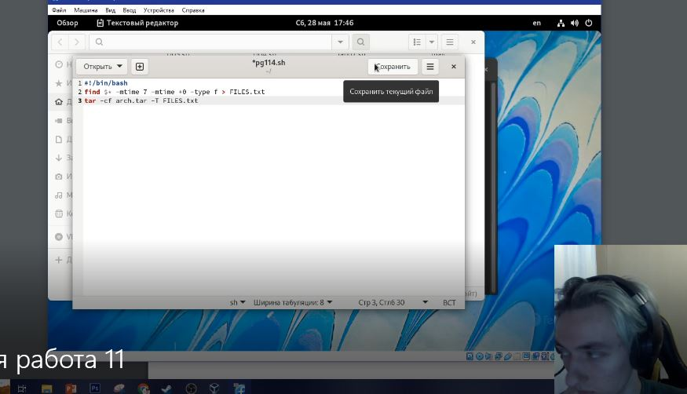
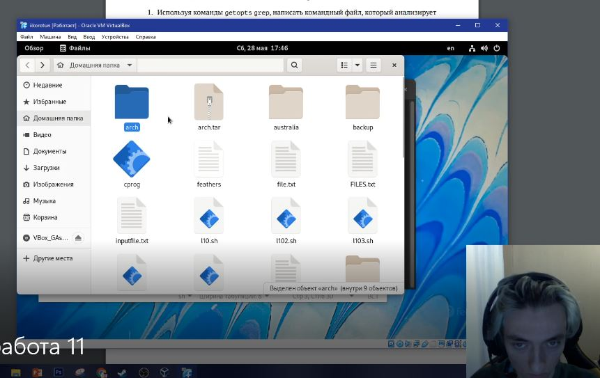

---
## Front matter
title: "Лабораторная работа №11"
subtitle: "Программирование в командном процессоре ОС UNIX. Ветвления и циклы"
author: "Коротун Илья Игоревич "

## Generic otions
lang: ru-RU
toc-title: "Содержание"

## Bibliography
bibliography: bib/cite.bib
csl: pandoc/csl/gost-r-7-0-5-2008-numeric.csl

## Pdf output format
toc: true # Table of contents
toc-depth: 2
lof: true # List of figures
lot: true # List of tables
fontsize: 12pt
linestretch: 1.5
papersize: a4
documentclass: scrreprt
## I18n polyglossia
polyglossia-lang:
  name: russian
  options:
	- spelling=modern
	- babelshorthands=true
polyglossia-otherlangs:
  name: english
## I18n babel
babel-lang: russian
babel-otherlangs: english
## Fonts
mainfont: PT Serif
romanfont: PT Serif
sansfont: PT Sans
monofont: PT Mono
mainfontoptions: Ligatures=TeX
romanfontoptions: Ligatures=TeX
sansfontoptions: Ligatures=TeX,Scale=MatchLowercase
monofontoptions: Scale=MatchLowercase,Scale=0.9
## Biblatex
biblatex: true
biblio-style: "gost-numeric"
biblatexoptions:
  - parentracker=true
  - backend=biber
  - hyperref=auto
  - language=auto
  - autolang=other*
  - citestyle=gost-numeric
## Pandoc-crossref LaTeX customization
figureTitle: "Рис."
tableTitle: "Таблица"
listingTitle: "Листинг"
lofTitle: "Список иллюстраций"
lotTitle: "Список таблиц"
lolTitle: "Листинги"
## Misc options
indent: true
header-includes:
  - \usepackage{indentfirst}
  - \usepackage{float} # keep figures where there are in the text
  - \floatplacement{figure}{H} # keep figures where there are in the text
---

# Цель работы
Изучить основы программирования в оболочке ОС UNIX. Научится писать более сложные командные файлы с использованием логических управляющих конструкций и циклов.

# Задание

1. Используя команды getopts grep, написать командный файл, который анализирует командную строку с ключами:

– -iinputfile — прочитать данные из указанного файла;

– -ooutputfile — вывести данные в указанный файл;

– -pшаблон — указать шаблон для поиска;

– -C — различать большие и малые буквы;

– -n — выдавать номера строк.

а затем ищет в указанном файле нужные строки, определяемые ключом -p.

2. Написать на языке Си программу, которая вводит число и определяет, является ли оно больше нуля, меньше нуля или равно нулю. Затем программа завершается с помощью функции exit(n), передавая информацию в о коде завершения в оболочку. Командный файл должен вызывать эту программу и, проанализировав с помощью команды $?, выдать сообщение о том, какое число было введено.

3. Написать командный файл, создающий указанное число файлов, пронумерованных последовательно от 1 до 𝑁 (например 1.tmp, 2.tmp, 3.tmp,4.tmp и т.д.). Число файлов, которые необходимо создать, передаётся в аргументы командной строки. Этот же командный файл должен уметь удалять все созданные им файлы (если они существуют).

4. Написать командный файл, который с помощью команды tar запаковывает в архив все файлы в указанной директории. Модифицировать его так, чтобы запаковывались только те файлы, которые были изменены менее недели тому назад (использовать команду find).

# Выполнение лабораторной работы

1. Используя команды getopts grep, написать командный файл, который анализирует командную строку с ключами:

– -iinputfile — прочитать данные из указанного файла;

– -ooutputfile — вывести данные в указанный файл;

– -pшаблон — указать шаблон для поиска;

– -C — различать большие и малые буквы;

– -n — выдавать номера строк.

а затем ищет в указанном файле нужные строки, определяемые ключом -p.

1.1 Написал командный файл

1.2 Заполнил inputfile.txt различными словами

1.3 Проверил работу

2. Написать на языке Си программу, которая вводит число и определяет, является ли оно больше нуля, меньше нуля или равно нулю. Затем программа завершается с помощью функции exit(n), передавая информацию в о коде завершения в оболочку. Командный файл должен вызывать эту программу и, проанализировав с помощью команды $?, выдать сообщение о том, какое число было введено.

2.1 Написал программу на языке Си

2.2 Написал командный файл

2.3 Проверил работу

3. Написать командный файл, создающий указанное число файлов, пронумерованных последовательно от 1 до 𝑁 (например 1.tmp, 2.tmp, 3.tmp,4.tmp и т.д.). Число файлов, которые необходимо создать, передаётся в аргументы командной строки. Этот же командный файл должен уметь удалять все созданные им файлы (если они существуют).

3.1 Написал командный файл

3.2 Проверил работу

4. Написать командный файл, который с помощью команды tar запаковывает в архив все файлы в указанной директории. Модифицировать его так, чтобы запаковывались только те файлы, которые были изменены менее недели тому назад (использовать команду find).

3.1 Написал командный файл

3.2 Проверил работу

# Выводы

Я изучил основы программирования в оболочке ОС UNIX. Научился писать более сложные командные файлы с использованием логических управляющих конструкций и циклов.

# Контрольные вопросы

1. Каково предназначение команды getopts?

Весьма необходимой при программировании является команда getopts, которая осуществляет синтаксический анализ командной строки, выделяя флаги, и используется
для объявления переменных.

2. Какое отношение метасимволы имеют к генерации имён файлов?

При генерации имен используют метасимволы:

*	произвольная (возможно пустая) последовательность символов;

?	один произвольный символ;

[...]	любой из символов, указанных в скобках перечислением и/или с указанием диапазона;

cat f*	выдаст все файлы каталога, начинающиеся с "f";

cat *f*	выдаст все файлы, содержащие "f";

cat program.?	выдаст файлы данного каталога с однобуквенными расширениями, скажем "program.c" и "program.o", но не выдаст "program.com";

cat [a-d]*	выдаст файлы, которые начинаются с "a", "b", "c", "d". Аналогичный эффект дадут и команды "cat [abcd]*" и "cat [bdac]*".

3. Какие операторы управления действиями вы знаете?

if, else, switch

4. Какие операторы используются для прерывания цикла?

Два несложных способа позволяют вам прерывать циклы в оболочке bash. Команда break завершает выполнение цикла, а команда continue завершает данную итерацию блока операторов.

5. Для чего нужны команды false и true?

Следующие две команды ОС UNIX используются только совместно с управляющими конструкциями языка программирования bash: это команда true, которая всегда возвращает код завершения, равный нулю (т.е. истина), и команда false, которая всегда возвращает код завершения, не равный нулю (т. е. ложь).

6. Что означает строка if test -f man$s/$i.$s, встреченная в командном файле?

Проверка условия -f man$s/$i.$s

7. Объясните различия между конструкциями while и until.

Цикл while выполняет тело цикла пока условие истинно.

Цикл until выполняет тело цикла пока условие ложно. Другими словами цикл until выполняется до тех пор пока условие не станет истинным.

